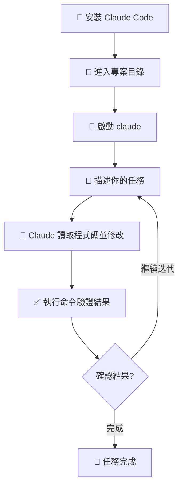

# Claude Code 快速上手

學習 Claude Code 使用

00

# Claude Code 快速上手

## 它最適合什麼人

如果你已經有一點點終端基礎，想把 AI 真正帶進本地專案開發裡，Claude Code 是非常值得上手的工具。

它尤其適合下面幾類人：

- 已經會一點命令列，想提升開發效率
- 在本地維護個人專案或公司專案
- 希望 AI 不只是“寫幾行程式碼”，而是真的幫你推進任務
- 想讓 AI 讀專案、改程式碼、跑命令、幫你驗證結果

## 開始使用前，你至少要知道這幾個概念

- **終端**：Claude Code 執行的地方
- **專案目錄**：你要先進入對應程式碼倉庫
- **依賴安裝**：很多專案第一次都要先 `npm install`
- **構建與執行**：修改之後往往要 `build` 或 `start`

如果這些概念完全陌生，建議先回到你網站原本 AI 程式設計課程裡的計算機基礎部分補一下。

## 一張圖看快速上手流程





## 最基本的使用步驟

### 1. 安裝

```
npm install -g @anthropic-ai/claude-code
```

安裝完成後，先確認命令已經可用：

```
claude --version
```

如果這裡能正常輸出版本號，說明 CLI 已經裝好了。  
如果提示找不到命令，通常是全域性 npm 路徑沒有加進環境變數。

### 1.5 第一次登入

第一次使用前，通常還需要登入你的 Claude 賬號：

```
claude
```

首次啟動時，Claude Code 會引導你完成登入或授權流程。  
這一步做完之後，後面進入專案目錄就可以直接開始用了。

### 2. 進入專案目錄

```
cd your-project
```

這裡非常關鍵。Claude Code 不是一個“脫離專案上下文的聊天框”，它會直接讀取你當前目錄下的程式碼、配置和檔案結構。

所以你要先確認兩件事：

- 當前目錄就是你真正要改的專案根目錄
- 這個專案已經能在本機正常安裝依賴和執行

比如前端專案，你通常至少要先做一次：

```
npm install
```

如果專案本身都還沒法執行，Claude Code 後面也很難幫你穩定推進任務。

## 如果你現在還沒有專案，怎麼讓 Claude Code 幫你從零開始

很多新手第一次用 Claude Code，不是接手一個現成倉庫，而是想直接讓它幫自己建立一個新專案。  
這種情況當然也可以，只是工作順序要稍微換一下。

### 先準備一個空目錄

比如你想做一個新的 React 專案，可以先手動建一個資料夾：

```
mkdir my-new-app
cd my-new-app
claude
```

這裡的重點是：  
即使你還沒有程式碼，也最好先進入一個明確的空目錄，再讓 Claude Code 開始工作。  
不要在桌面、下載目錄或者一個很雜亂的總目錄裡直接開幹。

### 第一句不要說“幫我做個專案”，而要說清楚技術棧

如果你只說：

```
幫我建立一個專案
```

Claude Code 很難判斷你到底要：

- React 還是 Vue
- Next.js 還是 Vite
- TypeScript 還是 JavaScript
- 要不要路由、資料庫、鑑權、部署配置

所以更好的說法是：

```
我想從零建立一個 Next.js + TypeScript 專案。
先告訴我你準備怎麼初始化專案、會生成哪些核心檔案、依賴怎麼安裝。
先不要開始執行。
```

### 推薦的新建專案節奏

從零建專案時，最穩妥的順序是：

1. 先明確專案型別和技術棧
2. 讓 Claude Code 給出初始化方案
3. 再讓它執行專案建立
4. 建立後讓它幫你檢查專案是否能跑起來
5. 最後再開始做具體功能

也就是說，不要把“建立專案”和“開發完整功能”一次性混在一個指令裡。

### 一個更穩的從零建站提示詞

```
我現在在一個空目錄裡，想從零建立一個 Next.js + TypeScript 專案。

先告訴我你建議的初始化方式：
- 準備使用什麼腳手架
- 會安裝哪些依賴
- 會生成哪些關鍵目錄

先不要執行。
確認後，再開始建立專案。
建立完成後，請啟動專案並告訴我是否執行成功。
```

這樣 Claude Code 的行為會清晰很多：

- 先規劃
- 再生成
- 再驗證

而不是一上來就建立一堆檔案，最後你自己都不知道它做了什麼。

### 新建工程時最常見的 3 個坑

#### 1. 沒有說清楚技術棧

“幫我做個部落格”這種說法太模糊。  
最好至少說清楚：

- 用什麼框架
- 用什麼語言
- 要不要 UI 庫
- 是否要資料庫

#### 2. 在錯誤目錄裡初始化

如果你當前目錄本來就有別的檔案，Claude Code 可能會把新專案初始化在一個不乾淨的地方。  
新建工程時，最好保證目錄是空的，或者至少是專門為這個專案建立的。

#### 3. 建立完不驗證

專案建立結束，不代表真的可用。  
你還需要讓它繼續做這一步：

```
請執行專案並檢查是否能正常啟動。
如果失敗，繼續幫我定位問題並修好。
```

### 最推薦的新手用法：先搭腳手架，再逐步加功能

如果你是第一次這樣做，建議把流程拆成兩段：

第一段：先把專案建立並跑起來  
第二段：再讓 Claude Code 繼續幫你做頁面、介面和功能

例如：

```
先幫我把 Next.js 專案建立好，並確認能啟動。
完成之後，我們再繼續做首頁和登入功能。
```

這樣成功率會明顯高很多，也更容易定位問題到底出在“初始化”還是“功能開發”。

### 3. 啟動 Claude Code

```
claude
```

進入之後，不要著急直接丟一個很大的需求。  
最穩妥的起步方式，是先讓它理解專案，再讓它提出方案，最後再執行。

## 10 分鐘完整上手流程

如果你是第一次真正用 Claude Code，可以直接照著下面這套流程走一遍。

### 第 1 步：確認你在正確專案裡

先在終端裡確認當前目錄沒錯：

```
pwd
ls
```

你應該能看到熟悉的專案檔案，比如 `package.json`、`src`、`app`、`README.md` 之類。

### 第 2 步：先讓它理解專案，而不是立刻改程式碼

啟動 `claude` 之後，第一句建議這樣問：

```
先幫我看看這個專案的整體結構。
告訴我主要目錄是做什麼的，首頁相關程式碼大概在哪些檔案裡。
先不要改程式碼。
```

這樣做的好處是：

- 你先驗證 Claude Code 有沒有讀對專案
- 它會先建立上下文，而不是盲改
- 你也能順便知道後面改動大機率會落在哪些檔案

### 第 3 步：讓它先出方案

當它已經理解專案後，再繼續：

```
我要給首頁加一個簡單的輪播圖。
先給我一個實現方案，告訴我準備修改哪些檔案、怎麼改。
先不要執行。
```

這裡的重點是“先方案、後執行”。  
對於新手來說，這一步非常值錢，因為你可以先判斷：

- 它理解的問題是不是你真正想做的
- 改動範圍會不會太大
- 它有沒有準備動到不該動的地方

### 第 4 步：確認之後再讓它執行

如果方案沒問題，再下執行指令：

```
可以開始改。
改完以後請執行構建檢查，並告訴我改了哪些檔案。
```

這時候 Claude Code 通常會開始：

1. 讀取相關檔案
2. 修改程式碼
3. 執行構建、測試或 lint
4. 彙報結果

### 第 5 步：你只看三件事

第一次使用，不需要把它每一步都盯死。  
你只需要重點看這三件事：

1. 它改了哪些檔案
2. 它有沒有真的跑驗證命令
3. 構建或測試是否透過

如果它說“已完成”，但沒提驗證結果，你可以繼續追問：

```
把你剛才執行的驗證命令和結果總結一下。
```

### 第 6 步：繼續小步迭代

第一次上手，不建議一口氣讓它做一整個複雜功能。  
更好的方式是繼續拆成一小步一小步：

```
接下來再幫我把這個輪播圖加上自動播放和左右切換按鈕。
先說說你準備怎麼改。
```

這樣你會更快建立起一種穩定協作節奏，而不是把 Claude Code 當成“一次性全包工具”。

## 一個最推薦的新手演練任務

如果你還沒有真實任務，最適合拿來練手的是這種小需求：

- 給首頁加一個 banner
- 修改一個按鈕文案和顏色
- 找出某個報錯來自哪個檔案
- 給某個頁面加一個簡單模組
- 讓它幫你解釋一個目錄結構

這類任務有幾個優點：

- 改動範圍小
- 容易驗證
- 出錯成本低
- 很適合建立你和 Claude Code 的協作習慣

## 第一次使用時，推薦直接複製的提示詞

你可以把下面這段幾乎原樣拿去用：

```
先幫我理解這個專案結構。
告訴我這個專案的主要目錄分別負責什麼，以及我要修改的功能大概在哪些檔案裡。

然後給我一個實現方案，先不要改程式碼。

確認方案後，再開始修改。
改完請執行構建或測試檢查，並告訴我最終改了哪些檔案、驗證是否透過。
```

這段提示詞的好處是，它天然把一次協作拆成了：

- 理解
- 規劃
- 執行
- 驗證

這也是 Claude Code 最適合的工作節奏。

## 啟動之後怎麼提問

最推薦的方式不是一句話把所有需求糊上去，而是按這個節奏來：

1. 先讓它理解專案
2. 再讓它提出方案
3. 然後再讓它執行

例如：

```
先看看這個專案的整體結構，告訴我首頁相關程式碼在哪些檔案裡。

然後給我一個給首頁增加輪播圖的實現方案，先別改程式碼。

確認方案後，再開始修改，並在最後執行構建檢查。
```

## 新手最容易犯的幾個錯

- 沒進入正確目錄就啟動 Claude Code
- 沒裝依賴就讓它直接跑專案
- 一上來就給一個很大的模糊需求
- 修改完不讓它驗證構建和測試
- 不寫 `CLAUDE.md`，每次都重複講專案約束

再補兩個經常被忽略的問題：

- 明明是想“先分析”，卻沒有明確說“先不要改程式碼”
- Claude Code 已經報構建失敗了，但自己沒去看失敗資訊，只看“它有沒有改完”

## 最穩妥的起步姿勢


## 小結

快速上手的關鍵，不是會多少命令，而是先掌握一個節奏：

- 先進專案
- 先理解再執行
- 改完要驗證
- 從小任務開始建立協作手感

只要你按這個節奏走，Claude Code 很快就會從“新玩具”變成“常用開發搭檔”。