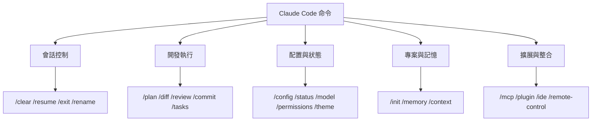
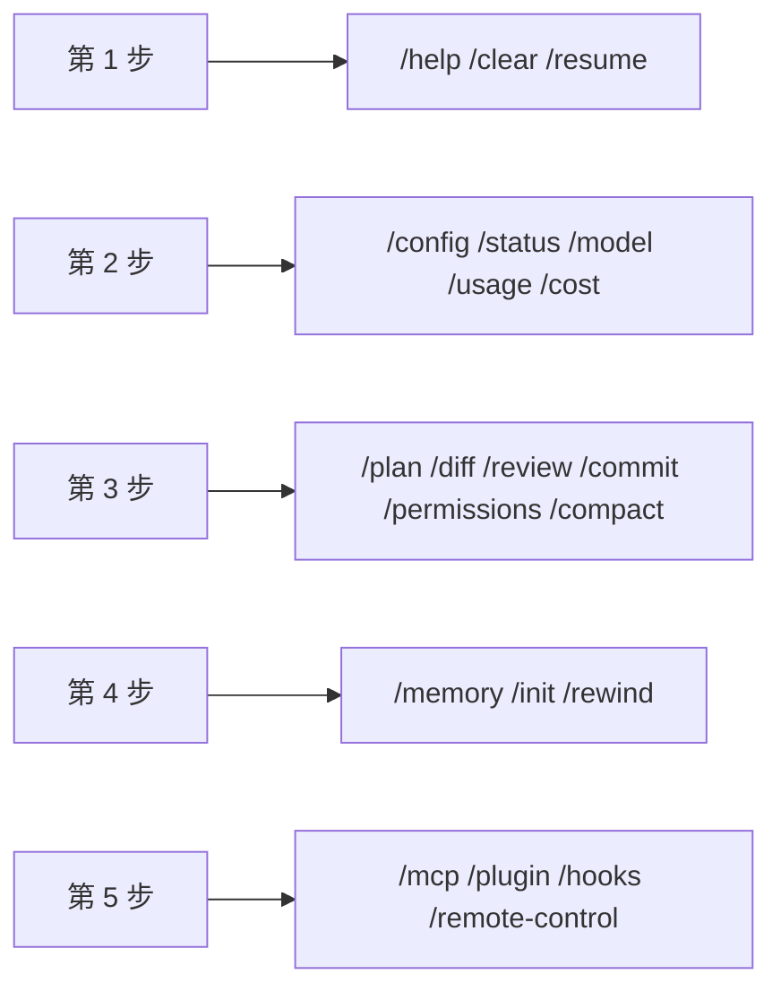

# Claude Code 常用命令

## 先記住一個最重要的動作

在 Claude Code 裡，直接輸入 `/`，就能看到當前可用的全部命令。  
繼續輸入 `/` 加上字母，還可以快速篩選命令。

官方文件也特別說明了一點：**並不是所有命令對每個使用者都可見**。  
有些命令會受到平臺、套餐、環境或終端能力的影響。

## 一張圖先建立命令體系





## 新手最值得先掌握的 17 個命令

如果你剛開始用 Claude Code，不需要一上來記住幾十個命令。  
先掌握這 17 個就夠用了：

| 命令 | 用途 | 建議 |
| --- | --- | --- |
| `/help` | 檢視幫助與可用命令 | 忘了命令先看它 |
| `/clear` | 清除當前對話歷史 | 討論跑偏時很好用 |
| `/config` | 開啟設定介面 | 改模型、主題、輸出風格 |
| `/status` | 檢視當前狀態 | 看版本、模型、賬戶、連線 |
| `/model` | 切換模型 | 想換能力檔位時使用 |
| `/usage` | 檢視套餐使用與速率限制狀態 | 關心額度和限流時 |
| `/cost` | 檢視 token 和費用統計 | 想控制成本時 |
| `/permissions` | 檢視或更新許可權 | 控制工具是否允許執行 |
| `/plan` | 進入計劃模式 | 大任務先規劃再執行 |
| `/diff` | 看當前改動差異 | 改完程式碼後非常有用 |
| `/review` | 讓 Claude 審查剛寫好的程式碼 | 提交前確保品質 |
| `/commit` | 自動生成訊息並提交 | 完成一輪開發的完美收尾 |
| `/memory` | 管理 `CLAUDE.md` 和記憶 | 專案長期約束都在這 |
| `/context` | 檢視上下文佔用情況 | 長對話後排查上下文問題 |
| `/resume` | 恢復之前會話 | 接著上次繼續做 |
| `/compact` | 壓縮對話上下文 | 長對話後很好用 |
| `/rewind` | 回退到之前的檢查點 | 改壞了時很有用 |
| `/hooks` | 檢視工具事件 hooks 配置 | 想做自動化增強時 |

## 1. 會話控制類命令

這類命令主要解決“當前這次會話怎麼管理”的問題。

### `/clear`

清除對話歷史並釋放上下文。  
官方文件裡還提到它有兩個別名：

- `/reset`
- `/new`

適合什麼時候用：

- 當前對話已經很亂
- 你想換個任務重新開始
- 上下文已經被舊問題汙染

### `/resume [session]`

恢復歷史會話。  
可以透過會話 ID、名稱來恢復，也可以開啟選擇器繼續。

### `/rename [name]`

給當前會話重新命名。  
如果不寫名字，Claude Code 也可以根據歷史對話自動生成名稱。

### `/exit`

退出 CLI。  
別名是 `/quit`。

## 2. 規劃、檢視和執行類命令

這類命令最貼近真實開發流程。

### `/plan [description]`

官方文件說明得很明確：它可以**直接從提示進入計劃模式**。  
你還可以順手帶一個描述，比如：

```
/plan fix the auth bug
```

這很適合：

- 改動跨多個檔案
- 你想先看方案，不想讓 Claude 立刻動程式碼
- 你希望任務先被拆解清楚

### `/diff`

開啟互動式差異檢視器。  
你可以用它看：

- 當前未提交的 Git 改動
- Claude 每一輪產生的差異

這比單純問“你改了什麼”可靠得多。

### `/review`

讓 Claude 以 Code Reviewer 的視角，重新審視剛剛寫好的程式碼。  
它會幫你檢查：
- 潛在的 Bug
- 邊界條件遺漏
- 效能或安全風險

在提交程式碼前執行一次，能大幅提高程式碼品質。

### `/commit [message]`

將當前未提交的改動進行 Git Commit。  
如果不加訊息，Claude 會根據改動自動幫你生成一段合適的 Commit Message。  
這通常作為一輪開發任務的最後一步。

### `/tasks`

列出並管理後臺任務。  
如果你讓 Claude 跑了較長時間的任務，這個命令會很有用。

### `/pr-comments [PR]`

獲取並顯示 GitHub Pull Request 評論。  
官方文件說明它依賴 `gh` CLI。

## 3. 配置與狀態類命令

這類命令解決“Claude Code 當前怎麼執行”的問題。

### `/config`

開啟設定介面。  
官方文件提到它可以調整：

- 主題
- 模型
- 輸出樣式
- 其他偏好設定

別名是 `/settings`。

### `/status`

開啟狀態介面，檢視：

- 版本
- 模型
- 賬戶
- 連線性

官方文件特別提到：**它在 Claude 正在響應時也可以工作，不需要等當前響應結束。**

### `/usage`

這個命令是你剛才特別點名要補的。  
官方文件給它的定義非常直接：

> 顯示計劃使用限制和速率限制狀態

它適合用在這些時候：

- 你懷疑自己快碰到套餐限制了
- 你想確認當前是不是被速率限制卡住
- 你連續高強度使用了一段時間，想看額度狀態

如果你經常重度使用 Claude Code，這個命令建議常備。

### `/cost`

官方文件裡寫的是：顯示令牌使用統計資訊。  
如果你比較關心成本，這個命令和 `/usage` 是配套的：

- `/usage` 更偏套餐限制和速率限制
- `/cost` 更偏 token 消耗和會話成本

### `/model [model]`

選擇或切換模型。  
對於支援的模型，還可以進一步調整工作量級別。

### `/effort [low|medium|high|max|auto]`

設定模型工作量級別。  
這個命令對進階使用者很重要，因為它會直接影響 Claude 的思考深度和響應成本。

### `/permissions`

檢視或更新許可權。  
如果你發現 Claude 總是在某些工具呼叫上被攔住，這個命令很關鍵。

### `/theme`

切換顏色主題。  
官方文件提到它支援：

- 淺色和深色變體
- 色盲友好主題
- 使用終端配色的 ANSI 主題

這不是核心生產力命令，但如果你長時間使用 Claude Code，調順介面體驗還是很值得的。

### `/vim`

在 Vim 和普通編輯模式之間切換。  
如果你平時終端裡本來就偏 Vim 操作，這個命令會比較實用。

## 4. 專案初始化與記憶類命令

### `/init`

官方文件裡寫得很清楚：  
它會使用 `CLAUDE.md` 指南來初始化專案。

這通常適合：

- 第一次把 Claude Code 引入某個專案
- 想系統化建立專案說明和工作約束

### `/memory`

這個命令非常重要。  
它可以讓你：

- 編輯 `CLAUDE.md`
- 啟用或禁用 auto-memory
- 檢視自動記憶體條目

你可以把它理解成 Claude Code 的“專案記憶管理入口”。

### `/context`

官方文件對它的描述是：

> 將當前上下文使用情況視覺化為彩色網格。顯示上下文密集型工具、記憶體膨脹和容量警告的最佳化建議

也就是說，它不是簡單告訴你“還剩多少 token”，而是幫助你看清：

- 當前上下文是不是已經很重了
- 哪些工具或歷史內容最占上下文
- 有沒有出現記憶膨脹
- 是否快接近容量邊界

這在長對話裡非常有用。


### 什麼時候最該用 `/context`

- 對話已經持續了很多輪
- 你感覺 Claude 開始“記不清前文”
- 響應質量下降，但你不知道是不是上下文太滿
- 你想判斷要不要執行 `/compact`

你可以把它理解成 Claude Code 的“上下文體檢命令”。

### `/compact [instructions]`

官方文件寫的是：壓縮對話，並且可以可選傳入焦點說明。  
這是長會話裡很實用的命令。

比如你可以這樣理解它：

- 對話太長了
- 上下文開始膨脹
- 你希望 Claude 保留重點、丟掉冗餘

這時就可以用 `/compact`，必要時順手加一句壓縮重點。

```
/compact 只保留和支付模組改動有關的上下文
```

## 5. 擴充套件與整合類命令

### `/mcp`

管理 MCP server 連線和 OAuth 身份驗證。

### `/plugin`

管理 Claude Code plugins。

### `/ide`

管理 IDE 整合並檢視狀態。

### `/remote-control`

使當前會話可以從 `claude.ai` 進行遠端控制。  
別名是 `/rc`。

如果你之前沒意識到 Claude Code 還有遠端橋接能力，這個命令就是最直接的入口之一。

### `/hooks`

官方文件對它的描述是：檢視工具事件的 hook 配置。  
如果你想做更進階的自動化，比如：

- 工具執行前後觸發指令碼
- 補自動檢查
- 接入自己的工程流程

這個命令就是很重要的入口。

## 6. 其他高頻但容易被忽略的命令

### `/copy [N]`

複製最近一次助手響應。  
如果你傳入數字 `N`，可以複製倒數第 N 次響應。

### `/export [filename]`

匯出當前對話為純文字。  
適合歸檔、覆盤和沉澱工作記錄。

### `/branch [name]`

為當前對話建立分支。  
別名是 `/fork`。

### `/doctor`

診斷 Claude Code 的安裝和設定。  
如果你懷疑環境有問題，這是優先順序很高的排查入口。

### `/rewind`

官方文件裡說明它可以：

- 把對話倒回到上一個點
- 把程式碼倒回到之前的狀態
- 或從選定訊息進行總結

別名是 `/checkpoint`。

這個命令特別適合：

- 某一輪改動效果不對
- 想回到一個更早的安全點
- 需要重新走某一段實現路線

## 還有一批很值得知道的命令

如果你已經過了新手期，這些命令也很值得逐步掌握：

| 命令 | 用途 |
| --- | --- |
| `/copy [N]` | 複製最近一次或第 N 次響應 |
| `/export [filename]` | 匯出當前對話 |
| `/branch [name]` | 為當前對話建立分支 |
| `/doctor` | 診斷安裝與配置問題 |
| `/context` | 視覺化上下文佔用與膨脹來源 |
| `/theme` | 調整顏色主題 |
| `/vim` | 切換 Vim 模式 |
| `/tasks` | 管理後臺任務 |
| `/pr-comments [PR]` | 拉取 GitHub PR 評論 |
| `/ide` | 檢視和管理 IDE 整合 |
| `/remote-control` | 啟用遠端控制 |

## 推薦你按這個順序掌握





## 一套很好用的命令組合

你平時完全可以這樣用：

```
/plan
先規劃這個需求，不要立刻改程式碼。

確認後開始修改。

/diff
看一下本輪改動。

/usage
確認一下當前使用限制狀態。

/memory
把這次沉澱下來的專案規則寫進 CLAUDE.md。
```

## 小結

官方命令很多，但你不需要一開始全會。  
更合理的學習路線是：

1. 先掌握會話控制
2. 再掌握配置、狀態、`/usage`、`/cost`
3. 再掌握 `/plan`、`/diff`、`/permissions`、`/compact`
4. 再掌握 `/memory`、`/rewind`
5. 最後再進入 `MCP`、`plugin`、`hooks`、`remote-control` 這類擴充套件能力

如果你記不住，就回到最開始那句話：

> 在 Claude Code 裡輸入 `/`，先看當前有哪些命令，再按場景選。