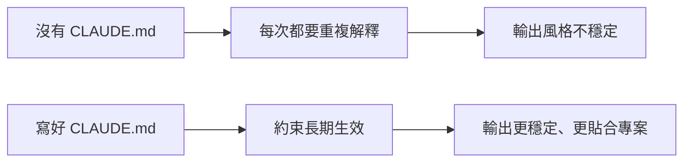

# 如何寫好 CLAUDE.md

## `CLAUDE.md` 是什麼

`CLAUDE.md` 可以理解成 Claude Code 的專案記憶檔案。  
它會告訴 Claude：

- 這個專案是幹什麼的
- 程式碼怎麼組織
- 團隊有哪些規範
- 哪些命令最常用
- 哪些事情不能做

寫得好的 `CLAUDE.md`，會顯著提升 Claude Code 的穩定性。

## 為什麼它這麼重要

因為很多“AI 不聽話”的問題，根本不是模型不夠聰明，而是系統沒有拿到清晰的專案約束。





## 最推薦寫進去的內容

### 1. 專案基本資訊

- 技術棧
- 目錄結構
- 關鍵模組

### 2. 開發規範

- 命名規則
- 元件風格
- 是否允許引入新依賴

### 3. 常用命令

- 安裝命令
- 開發命令
- 構建命令
- 測試命令

### 4. 特別約束

- 哪些目錄不要動
- 哪些檔案修改要謹慎
- 提交資訊風格

## 一個新手可直接用的模板

```
# 專案說明

- 這是一個 Vite + React + Tailwind 專案
- 核心目標是開發網頁版貪食蛇
- 遊戲邏輯放在 src/hooks/ 目錄
- UI 元件放在 src/components/ 目錄

# 開發規範

- 優先複用已有元件
- 不要隨意新增外部依賴（如需加入音效庫請先詢問）
- 變數命名使用 camelCase
- 修改後請確保 npm run dev 能夠正常執行

# 常用命令

- 安裝依賴：npm install
- 本地開發：npm run dev
- 生產構建：npm run build

# 注意事項

- 不要修改 public/ 裡的原始素材
- 涉及蛇的「碰撞與死亡判定」邏輯時，請先給我方案，不要直接修改程式碼
```

## 寫 `CLAUDE.md` 的一個原則

不要寫廢話，要寫真正會影響行為的內容。

差的寫法：

- 這是一個很棒的專案
- 請認真寫程式碼

好的寫法：

- 修改後必須執行 `npm run build`
- 不允許新增依賴，除非先說明理由
- 表單元件統一複用 `components/forms`

## 小結

一句話總結：

> `CLAUDE.md` 寫的不是介紹詞，而是 Claude Code 在這個專案裡的長期工作說明書。

寫得越具體、越貼近真實約束，Claude Code 的表現就越穩定。