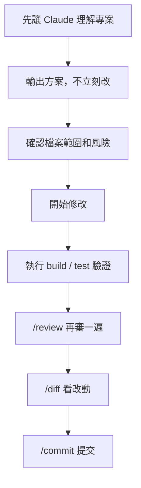
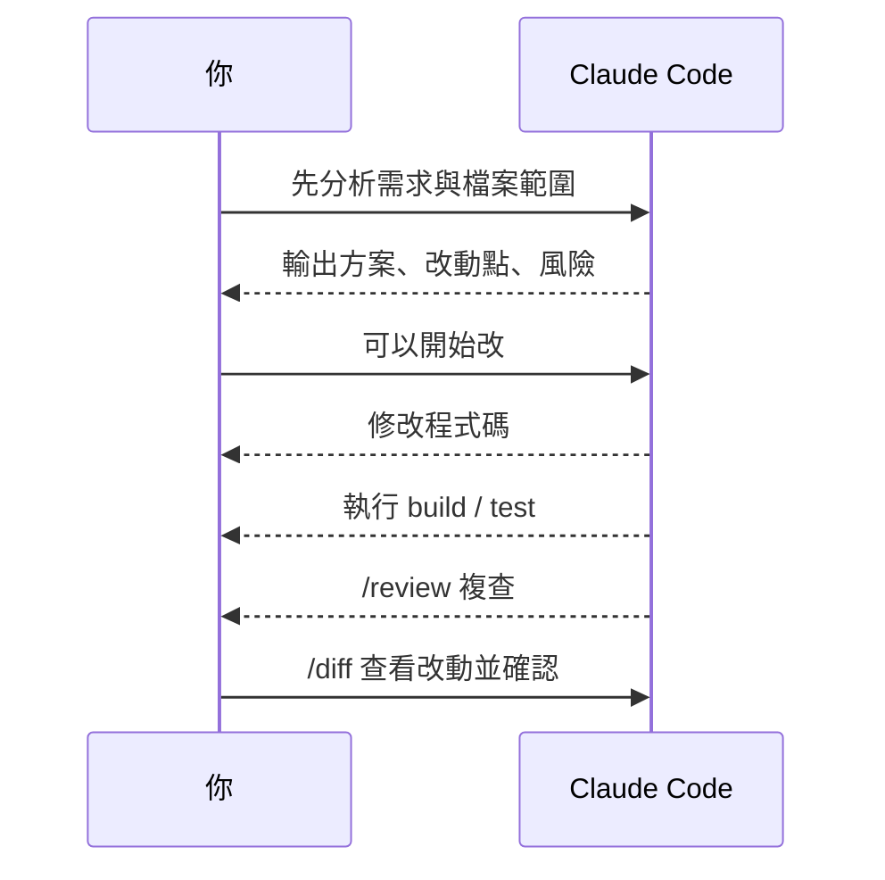
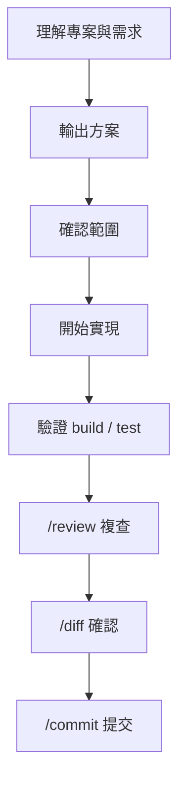

# Claude Code 進階使用經驗分享

學習 Claude Code 使用

00

# Claude Code 進階使用經驗分享

## 從“會用”到“用得順”，靠的是工作流

很多人剛開始用 Claude Code 時，會覺得它很強。  
但再往後走，真正拉開差距的不是“知道它能做什麼”，而是“你有沒有一套穩定工作流”。

新手最常見的狀態是：

- 想到什麼就問什麼
- 一上來就讓 Claude 直接改
- 改完也不驗證
- 每一輪都像重新開始

而進階使用者更像是在“帶著 Claude 按流程推進任務”。

## 先記住一個總原則

Claude Code 最適合扮演的角色，不是“替你一把梭寫完所有東西”，而是：

- 幫你快速理解專案
- 幫你拆方案
- 幫你執行重複性或高密度工作
- 幫你驗證和複查

也就是說，最順的用法通常不是：

> 直接把一個很大的目標扔給 Claude，然後等奇蹟出現

而是：

> 讓 Claude 先理解，再規劃，再執行，再驗證

## 一張圖看最推薦的進階工作流





## 這個流程為什麼好用

因為它同時解決了幾類常見問題：

- 一上來就亂改
- 改了但沒驗證
- 改動太散、自己都說不清
- 做完沒有程式碼審查視角
- 一個會話裡混著分析、實現、審查、提交，最後誰也分不清

也就是說，這不是“更麻煩”，而是“更穩定”。

## 一個很好用的任務模板

你可以直接這樣給 Claude Code 下任務：

```
先分析這個需求會涉及哪些檔案，給出實現方案和風險點，先不要改程式碼。

確認後再開始修改。修改完成後執行 build 和相關測試。

最後從 code review 角度再檢查一遍潛在問題。
```

這類提示詞的好處是，把任務拆成了：

- 理解
- 規劃
- 執行
- 驗證
- 複查

這比“幫我把這個功能做了”強很多。

## 工作流一：新功能開發

這是最常見、也最推薦長期使用的一套流程。

### 適用場景

- 新增頁面
- 增加一個介面
- 給現有模組加新能力
- 需要改多個檔案，但邊界還算清晰

### 推薦步驟

1. 先讓 Claude 理解相關模組
2. 輸出實現方案和涉及檔案
3. 確認後開始改程式碼
4. 跑構建和測試
5. 做一次 review
6. 檢視 diff 並提交

### 配套命令

- `/plan`
- `/diff`
- `/review`
- `/commit`

### 推薦提問方式

```
先看一下這個功能會影響哪些檔案，給出一個最小實現方案，先不要改程式碼。

我確認後你再開始改，改完執行 build 和相關測試，最後再 review 一遍。
```

### 對應流程圖





## 工作流二：Bug 修復

很多人修 bug 時容易直接讓 Claude 開改。  
但更穩的方式其實是“先定位，再修復，再復現驗證”。

### 適用場景

- 頁面報錯
- 介面異常
- 狀態錯亂
- 某個場景偶現 bug

### 推薦步驟

1. 讓 Claude 先複述問題和排查方向
2. 搜尋相關呼叫鏈和報錯位置
3. 給出 root cause 推斷
4. 先說修法，再動程式碼
5. 用最接近真實問題的方式驗證

### 推薦提問方式

```
先不要改程式碼，先幫我定位這個 bug 可能在哪幾層。

把最可能的根因、相關檔案和修復思路列出來。確認後再改。

改完後請儘量復現並驗證這個問題是否真的解決。
```

### 這一套為什麼比“直接修”更好

因為 bug 修復最怕兩件事：

- 修錯地方
- 修完沒驗證到真正問題

## 工作流三：重構與程式碼整理

這類任務最容易失控，因為目標往往不如“做功能”那麼具體。

### 適用場景

- 檔案太大想拆分
- 重複邏輯太多
- 命名和結構混亂
- 元件、服務、工具函式邊界不清

### 推薦步驟

1. 先讓 Claude 評估當前結構問題
2. 明確“這次只做哪一類重構”
3. 先列拆分方案
4. 分批改，不要一輪重構整個系統
5. 每批都驗證

### 推薦提問方式

```
先評估這個模組當前最主要的結構問題，只給我 2 到 3 個最值得做的重構點。

這次只做最小一輪，不要順手改太多無關內容。

改完後說明具體拆了哪些職責，並執行驗證。
```

### 重構任務裡最重要的一條

一定要限制範圍。  
否則 Claude 很容易“順手最佳化”出一大坨額外改動。

## 工作流四：陌生專案接手

這類場景特別適合 Claude Code，因為它非常擅長先幫你建立認知地圖。

### 適用場景

- 第一次接手某個倉庫
- 別人的專案臨時要你修點東西
- 公司老專案你不熟
- 想快速知道某個功能在哪實現

### 推薦步驟

1. 先讓 Claude 建專案地圖
2. 再鎖定和當前目標最相關的目錄與檔案
3. 再進入方案和修改

### 推薦提問方式

```
先幫我快速理解這個專案：

1. 技術棧是什麼
2. 主要目錄分別負責什麼
3. 這個需求最可能涉及哪些檔案

先不要改程式碼。
```

### 一個很好用的進階動作

讓 Claude 順手幫你沉澱 `CLAUDE.md`。  
這樣你第二次再回來，這個專案就沒那麼陌生了。

## 什麼時候該切到 Plan Mode

特別適合下面這些場景：

- 改動跨多個模組
- 涉及資料庫、許可權、介面聯動
- 你自己也沒想清楚具體實現
- 你想先讓 Claude 給出完整步驟
- 你擔心它沒想清楚就直接改程式碼

### 一個簡單判斷標準

如果你腦子裡都已經覺得“這個任務有點大”，那就先 `/plan`。  
Plan Mode 最大的價值不是更正式，而是幫你把“想法”變成“執行順序”。

## 進階使用者常用的命令組合

## 組合一：先規劃再實現

```
/plan
```

適合大任務開局。

## 組合二：做完先看改動

```
/diff
```

適合：

- 看 Claude 實際改了什麼
- 避免只聽它口頭總結

## 組合三：改完再複查

```
/review
```

適合：

- 提交前再看一遍 bug、風險和遺漏測試

## 組合四：長會話上下文治理

```
/context
/compact
```

適合：

- 對話已經很長
- 你感覺 Claude 開始“忘事”
- 想繼續當前任務，但不想完全開新會話

## 組合五：最終提交閉環

```
/diff
/review
/commit
```

這基本就是一次完整的收尾鏈路。

## 進階使用者的 6 個習慣

### 1. 大任務先規劃

不要讓 Claude 直接衝進去改。

### 2. 明確要求驗證

改完一定要讓它跑 `build`、`test` 或關鍵命令。

### 3. 經常寫 `CLAUDE.md`

把長期約束沉澱下來，別每次口述。

### 4. 會主動限制改動範圍

比如明確說：

- 先不要重構
- 只修這個 bug
- 不要順手改無關檔案
- 先最小實現

### 5. 經常看 `/diff`

不要只看 Claude 的總結，要看真實改動。

### 6. 把一次長任務拆成多輪

一輪只解決一個清晰目標，比一口氣做完整個需求更穩。

## 幾個非常常見的進階坑

## 1. 會話太長還硬聊

表現：

- Claude 開始答非所問
- 忘掉之前確認過的約束
- 修改越來越飄

解決：

- 用 `/context` 看佔用
- 用 `/compact`
- 必要時新開會話，並重新給目標

## 2. 沒有限定“先別改程式碼”

表現：

- 你本來想先討論方案
- Claude 直接開始改了

解決：

明確寫：

```
先不要改程式碼，只分析和出方案。
```

## 3. 驗證要求不具體

表現：

- Claude 說“已經完成”
- 但其實沒跑關鍵驗證

解決：

把驗證動作說具體：

- 執行 `npm run build`
- 執行相關測試
- 啟動本地頁面驗證
- 提供失敗輸出

## 4. 把 Claude 當成唯一判斷者

Claude 可以幫你推進任務，但最終是否提交、是否上線、是否接受方案，還是你來決定。  
進階工作流的重點不是“完全放手”，而是“讓 Claude 幫你更快形成可靠閉環”。

## 一套我最推薦的通用工作流

如果你不想記太多，先固定用這一套就夠了：





你每次都按這個節奏來，Claude Code 的穩定性會明顯提高。

## 小結

進階工作流的核心不是更復雜，而是更有節奏：

- 先理解
- 再規劃
- 再執行
- 然後驗證
- 最後複查和提交

當你形成這套習慣後，Claude Code 的價值會比“想到什麼就問什麼”高很多。  
它會從“一個很強的 AI 工具”，變成“一個真正融入開發流程的工程搭檔”。