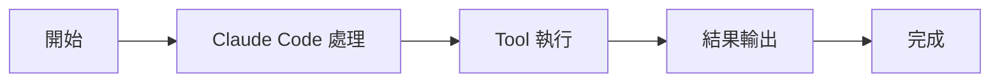

# 學習 Claude Code 源碼之前必看

快速入門

00

# 學習Claude原始碼之前必看

## 先把背景說清楚

你現在看到的這一整套 Claude Code 原始碼學習，研究物件並不是 Anthropic 官方主動開源釋出的完整倉庫。  
而是一份洩露出來的程式碼。

具體可以看這裡：

[剛剛，Claude Code 原始碼洩露了！](https://www.xuanyuancode.com/articles/0adb77f2-164a-4fb0-a9e1-33a5e14629f8)

這份程式碼之所以會流傳出來，核心背景是：

- Claude Code 本體並不開源
- 但其 npm 分發產物裡包含了可被追溯的 source map 資訊
- 有人據此還原出了大量 TypeScript 原始碼
- 最終形成了現在這份可供分析的原始碼映象

所以你要先建立一個正確認知：

> 我們現在研究的，不是官方 GitHub 開源專案，而是一份透過分發包線索逆出的原始碼快照。

## 為什麼這件事會引起這麼大關注

因為 Claude Code 代表的是當前 AI 程式設計工具裡非常重要的一類產品形態：

- 命令列智慧體
- 工具呼叫型 Agent
- 多輪工程任務執行系統
- 帶許可權、狀態、MCP、LSP、外掛、遠端會話的完整執行時

平時大家只能“用”它，卻很難真正看到它內部怎麼設計。  
而這份原始碼映象，第一次讓很多人能夠從實現層去看 Claude Code 的真實結構。

## 一張圖看清這份程式碼的來源路徑

## 這份程式碼適合拿來做什麼

最適合的用途有三類：

1. 學習 Claude Code 的整體架構
2. 研究 AI 程式設計 Agent 的工程實現方式
3. 借鑑它的模組劃分、工具協議、許可權系統和執行時設計

也就是說，我們更關注的是：

- 它為什麼強
- 它怎麼組織系統
- 它的能力是如何拼裝出來的

而不是把它當成一個普通開源專案去直接復刻。

## 這份程式碼不適合拿來做什麼

也要把邊界說清楚。

這份原始碼映象並不適合你做下面這些事：

- 指望它百分之百完整可執行
- 指望它等價於官方最新線上版本
- 指望它包含所有私有服務和後端依賴
- 指望它天然適合作為生產專案二次釋出

因為它本質上仍然是一份還原出來的程式碼快照，不是官方釋出的完整開發倉庫。

## 研究這份原始碼，正確姿勢是什麼

最推薦的姿勢不是“逐檔案掃過去”，而是：

1. 先看主幹骨架
2. 再看核心迴圈
3. 再看工具、上下文、許可權
4. 最後看 MCP、LSP、外掛、遠端、多 Agent

這也是為什麼我把這個專題設計成一整套循序漸進的教程，而不是簡單扔幾個程式碼片段。

## 這份原始碼我是怎麼拿到的

關於這份原始碼的來龍去脈、背景說明，以及更完整的上下文，我站內已經單獨寫過一篇文章，建議你先看：

[剛剛，Claude Code 原始碼洩露了！](https://www.xuanyuancode.com/articles/0adb77f2-164a-4fb0-a9e1-33a5e14629f8)

你可以把那篇文章理解成“事件背景介紹”，而當前這個專題則是“系統原始碼拆解課程”。

## 如果你也想拿到這份原始碼

我不建議在這裡直接堆下載連結。  
更穩妥的方式是透過公眾號獲取，我會在公眾號裡統一維護下載說明和後續更新。

### 獲取方式

1. 先關注公眾號
2. 傳送關鍵詞：`Claude`
3. 按自動回覆獲取下載方式

如果後續關鍵詞或獲取方式有調整，以公眾號最新自動回覆為準。

## 公眾號二維碼

下面這個二維碼可以直接掃碼關注：

## 為什麼我建議你先關注再下載

原因很簡單：

- 這類內容後續可能會有補充說明
- 我會持續更新學習路線和分析文章
- 有些問題需要結合上下文講，不適合只丟一個壓縮包

所以更好的方式不是“拿到原始碼就結束”，而是跟著專題把它真正吃透。

## 學這個專題前，你最好先有這些預備知識

如果你完全零基礎，建議你至少先補下面幾項：

- 終端與命令列
- 檔案路徑與目錄
- Git 基礎
- TypeScript / React 基本閱讀能力
- AI Agent 的基本概念

否則你在看 `main.tsx`、`QueryEngine.ts`、`Tool.ts` 這些檔案時，會比較容易卡住。

## 小結

這篇文章你只需要記住三件事：

1. 這不是官方開源倉庫，而是一份基於分發產物線索還原出來的原始碼映象
2. 最有價值的學習方式是把它當成 Agent 系統架構樣本來研究
3. 想獲取原始碼，可以關注公眾號後傳送關鍵詞 `Claude原始碼`

接下來再進入後面的正文，你會更清楚自己在看什麼、為什麼值得看。