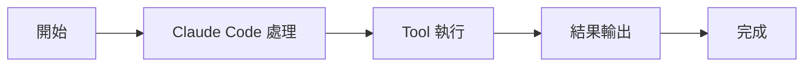

# Claude Code 源碼核心概念一覽

快速入門

00

# Claude Code 原始碼核心概念一覽

## 為什麼要先看概念

很多人第一次看 Claude Code 原始碼時，會被一堆詞反覆轟炸：

- QueryEngine
- Tool
- AppState
- Plan Mode
- MCP
- LSP
- Skills
- Agent

如果這些詞沒有先建立基本認知，後面看原始碼會非常容易迷路。

所以這篇文章的目標不是深入講實現，而是先給你一張“核心概念地圖”。

## 一張圖先看整體關係

## 1. QueryEngine

這是 Claude Code 的核心引擎。  
你可以把它理解成整個任務迴圈的大腦排程器。

它負責：

- 接收使用者輸入
- 組織訊息歷史
- 呼叫模型
- 處理工具呼叫
- 把結果迴流到下一輪

一句話理解：

> QueryEngine 決定一項任務如何一輪一輪推進下去。

## 2. Tool

Tool 就是 Claude Code 讓模型“真正動手”的方式。  
Claude 不只是輸出文字，還可以透過 Tool：

- 讀檔案
- 改檔案
- 跑命令
- 訪問外部資源
- 進入 Plan Mode

一句話理解：

> Tool 是 Claude Code 的執行介面層。

## 3. AppState

AppState 是終端介面的執行時狀態中心。  
它記錄的不是某一個小元件狀態，而是整個會話當前發生了什麼，比如：

- 當前模式
- 工具許可權
- 任務列表
- 遠端連線狀態
- 外掛狀態

一句話理解：

> AppState 決定當前這個終端會話“現在處於什麼狀態”。

## 4. Context

Context 指的是 Claude Code 在每輪任務裡給模型補充的環境資訊。  
典型內容包括：

- Git 狀態
- 當前分支
- `CLAUDE.md`
- 當前日期
- 專案記憶

一句話理解：

> Context 解釋了 Claude Code 為什麼看起來“懂你的專案”。

## 5. Plan Mode

Plan Mode 是 Claude Code 裡一個非常重要的概念。  
它的作用不是直接改程式碼，而是先讓 Claude：

- 做規劃
- 輸出方案
- 等待批准

一句話理解：

> Plan Mode 是自動執行前的規劃與審批閘門。

## 6. MCP

MCP 是 Claude Code 接入外部能力的重要方式之一。  
透過 MCP，它可以接入：

- 外部工具
- 外部資源
- 外部命令

一句話理解：

> MCP 讓 Claude Code 不只依賴內建能力，而能接入外部世界。

## 7. LSP

LSP 是語言伺服器協議。  
在 Claude Code 裡，它主要幫助系統獲取更結構化的程式碼語義能力，比如：

- 診斷
- 語言服務反饋
- 更接近程式碼結構的資訊

一句話理解：

> LSP 讓 Claude Code 不只是按文字看程式碼，而是能借助語言工具鏈理解程式碼。

## 8. Skills

Skills 可以理解成任務經驗和工作方法的封裝。  
它不是工具本身，而更像：

- 額外知識
- 額外流程
- 特定任務的工作說明

一句話理解：

> Skills 讓 Claude Code 在某類任務上更像“有經驗的人”。

## 9. Agent

Agent 在 Claude Code 裡不是空泛概念，而是實際能力物件。  
它意味著 Claude Code 不一定只有一個主執行緒助手，還可能：

- 派生子 Agent
- 分配子任務
- 彙總結果

一句話理解：

> Agent 是 Claude Code 走向多角色協作的重要標誌。

## 10. Prompt / System Prompt

很多人看原始碼時會看到 `customSystemPrompt`、`appendSystemPrompt` 這些欄位。  
這說明 Claude Code 的提示詞不是一段死文字，而是動態裝配出來的。

一句話理解：

> Prompt 系統決定 Claude Code 這一輪“該怎麼思考、遵守什麼規則”。

## 這些概念之間怎麼配合

## 閱讀原始碼時最常見的誤區

### 誤區 1：把 Claude Code 看成一個聊天殼子

不對。它更像一個帶執行時、工具系統和狀態系統的終端 Agent。

### 誤區 2：把 Tool 看成普通外掛

不對。Tool 是被嚴格建模過的執行介面。

### 誤區 3：把 Prompt 當成唯一核心

也不對。Prompt 很重要，但真正讓 Claude Code 強起來的是：

- Prompt
- Context
- Tool
- QueryEngine
- 許可權和狀態系統

共同作用。

## 小結

看 Claude Code 原始碼前，你至少要先記住這幾個翻譯：

- `QueryEngine` = 核心任務引擎
- `Tool` = 執行介面
- `Context` = 專案上下文
- `AppState` = 會話狀態中心
- `Plan Mode` = 規劃審批模式
- `MCP / LSP` = 外部擴充套件能力
- `Skills / Agent` = 經驗封裝與協作能力

理解了這些詞，後面的原始碼文章就會容易很多。