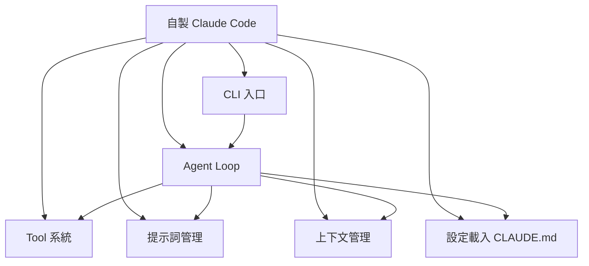

# 自己做一個 Claude Code 需要哪些模組

架構總覽

00

# 如果你想自己做一個 Claude Code，需要哪些模組

## 先說結論：別從“聊天 + 幾個工具”開始想

很多人研究 Claude Code 原始碼之後，第一反應是：  
“我是不是也能自己做一個類似的系統？”

可以，但前提是你要先放棄一個誤區：

> 不要把它理解成“模型 + function calling + terminal UI”。

從原始碼看，一個像樣的 Claude Code，至少需要一整套執行時模組。

## 先看最小完整架構圖

## 模組 1：入口與互動層

你至少需要一個明確的執行宿主：

- 命令列
- TUI
- IDE 外掛
- Web UI

Claude Code 選的是終端 + React Ink。  
這不是唯一選擇，但你必須先有一個穩定的互動外殼。

## 模組 2：會話主迴圈

這一層對應 Claude Code 的 `QueryEngine.ts`。  
沒有它，你就只有零散 API 呼叫，無法形成真正任務閉環。

主迴圈至少要負責：

- 訊息歷史
- 模型呼叫
- 工具呼叫
- 結果迴流
- 中斷與預算
- 會話狀態延續

## 模組 3：統一工具協議

這層對應 `Tool.ts`。  
如果沒有統一工具協議，系統很快會出現：

- 每個工具輸入格式不一致
- 許可權難統一
- UI 渲染難統一
- 擴充套件能力難接

所以工具協議幾乎是底層地基。

## 模組 4：上下文裝配系統

這是很多人最容易忽略的部分。  
你不僅要有模型，還要決定模型在每輪開始前看見什麼：

- Git 狀態
- 專案規則
- memory 檔案
- 當前日期
- 當前模式

Claude Code 的“懂專案”，很大程度就來自這層。

## 模組 5：許可權與審批系統

一旦工具開始執行真實動作，許可權系統就必須上線。  
否則它根本不適合進入工程現場。

## 模組 6：檔案與 Shell 基礎設施

如果你想做的是“工程助手”，這兩類工具幾乎不可缺：

- 檔案讀寫編輯
- Shell / 命令執行

因為沒有它們，系統就很難完成真正閉環。

## 模組 7：狀態與任務系統

只要你支援：

- 多輪會話
- 長命令
- 後臺任務
- 多 Agent
- 遠端會話

你就一定需要統一狀態中心。  
這正是很多 demo 產品在往真實產品過渡時最容易垮掉的地方。

## 模組 8：擴充套件系統

當基礎能力穩定後，你還會自然想要：

- 外掛
- MCP
- LSP
- Skills
- 自定義 Agent

這就是平臺化起點。

## 一個更現實的分階段路線

如果你真想自己做，別試圖一步復刻 Claude Code。  
更現實的路線是：

1. 先做單會話主迴圈
2. 再做檔案和 Shell 工具
3. 再補上下文和許可權
4. 再補任務狀態系統
5. 最後才考慮 MCP、遠端、多 Agent

## 小結

如果你想自己做一個 Claude Code，最該先學到的不是某個神奇 prompt，而是這套模組化思路：

> 先有執行時，再有工具；先有上下文與許可權，再談自動化上限；先把單執行緒跑穩，再擴到平臺化能力。

這也是 Claude Code 原始碼真正值得借鑑的地方。