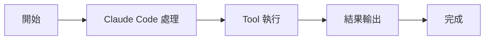

# Claude Code 核心引擎

核心機制

00

# 核心迴圈解析：QueryEngine 如何驅動一次任務完成

## `QueryEngine` 為什麼是核心中的核心

如果只能選一個檔案代表 Claude Code 的靈魂，那大機率就是 `QueryEngine.ts`。

因為它負責的不是某個區域性能力，而是整個任務生命週期：

- 接收使用者輸入
- 組裝上下文
- 驅動模型呼叫
- 處理中間工具執行
- 維護會話狀態
- 把任務一直推進到結束

這就是典型的 Agent 主迴圈。





## 它管理的是“會話”，不是“一次請求”

原始碼中的註釋已經把定位寫得很明確：

> One QueryEngine per conversation.

這句話很關鍵。  
說明 `QueryEngine` 不是一次性 request handler，而是一個圍繞會話長期存在的物件。

因此它會保留很多跨輪次狀態，例如：

- `mutableMessages`
- `permissionDenials`
- `readFileState`
- `totalUsage`
- 發現過的 skill 名稱
- 已載入的 memory 路徑

這也是 Claude Code 能連續工作的基礎。

### 對應原始碼片段

```
export class QueryEngine {
  private mutableMessages: Message[]
  private abortController: AbortController
  private permissionDenials: SDKPermissionDenial[]
  private totalUsage: NonNullableUsage
  private readFileState: FileStateCache
  private discoveredSkillNames = new Set<string>()
  private loadedNestedMemoryPaths = new Set<string>()
}
```

只看成員變數就能看出，它明顯是“會話物件”：

- 有訊息歷史
- 有許可權拒絕記憶
- 有 usage 累計
- 有檔案快取
- 有 skill / memory 發現狀態

這就決定了它天然跨輪次存在。

## 這裡最容易被忽略的一點

很多人會把主迴圈理解成“while 模型沒結束就繼續”。  
但 Claude Code 裡的主迴圈遠不止如此，它還要同時處理：

- 會話歷史的追加與標準化
- 工具呼叫前後的許可權判斷
- 部分輸出和最終輸出的區分
- usage、成本和預算更新
- 中斷、恢復、壓縮等執行時邊界

所以 `QueryEngine` 更像“編排層”，而不是簡單迴圈。

## `submitMessage()` 是真正的任務入口

使用者每提交一次訊息，最終都會進入 `submitMessage()`。  
這裡可以把一次任務粗略拆成下面幾段：

1. 讀取當前配置和狀態
2. 設定工作目錄與 session 環境
3. 包裝工具許可權判斷邏輯
4. 準備系統提示詞與上下文
5. 呼叫底層 query 流程與模型互動
6. 在模型輸出過程中處理工具呼叫和訊息追加
7. 統計 usage、成本、邊界狀態

所以 `submitMessage()` 本質上就是“啟動一輪 agent run”。

### 對應原始碼片段

```
async *submitMessage(
  prompt: string | ContentBlockParam[],
  options?: { uuid?: string; isMeta?: boolean },
): AsyncGenerator<SDKMessage, void, unknown> {
  const {
    cwd,
    commands,
    tools,
    mcpClients,
    verbose = false,
    thinkingConfig,
    maxTurns,
    maxBudgetUsd,
  } = this.config

  this.discoveredSkillNames.clear()
  setCwd(cwd)
  const persistSession = !isSessionPersistenceDisabled()
}
```

這段程式碼很能說明 `submitMessage()` 的定位：

- 它不是隻接收 `prompt`
- 它會同時讀取 tools、commands、mcpClients、budget、thinking 等執行時資源
- 它一開始就會處理 cwd 和 session 級狀態

所以它本質上是在開啟一次完整任務，而不是發一個普通 API 請求。


## 它不是隻管模型，還要管工具呼叫結果迴流

這類系統最關鍵的一點，是模型和工具之間必須形成閉環。

Claude Code 裡這條閉環大致是：

1. 模型根據系統提示與歷史訊息作出決策
2. 決策可能包含工具呼叫
3. 工具呼叫前先經過許可權判斷
4. 工具執行後把結果轉成訊息
5. 這些訊息再次進入會話歷史
6. 模型根據新結果繼續下一輪

也就是說，`QueryEngine` 不是簡單地“把工具借給模型”，而是在負責整個閉環編排。

## 這條閉環為什麼重要

因為只有形成閉環，系統才具備真正的糾錯能力。

舉個最簡單的例子：

1. 模型先猜某個 bug 在 `api.ts`
2. 讀取檔案後發現判斷不成立
3. 再搜尋相關呼叫點
4. 最後才定位到真實問題

如果沒有“工具結果迴流再決策”的迴圈，這種過程根本不可能發生。

## 為什麼它要持有這麼多上下文物件

`QueryEngineConfig` 裡能看到它依賴非常多資源：

- tools
- commands
- mcpClients
- agents
- getAppState / setAppState
- readFileCache
- thinkingConfig
- budget 限制
- customSystemPrompt

這說明它不是一個純函式式的執行器，而是會話執行時的排程中心。

換句話說，Claude Code 的大部分高階能力，最終都會在這裡匯流。

### 對應原始碼片段

```
export type QueryEngineConfig = {
  cwd: string
  tools: Tools
  commands: Command[]
  mcpClients: MCPServerConnection[]
  agents: AgentDefinition[]
  canUseTool: CanUseToolFn
  getAppState: () => AppState
  setAppState: (f: (prev: AppState) => AppState) => void
  readFileCache: FileStateCache
  customSystemPrompt?: string
  appendSystemPrompt?: string
  thinkingConfig?: ThinkingConfig
  maxTurns?: number
  maxBudgetUsd?: number
}
```

`QueryEngineConfig` 幾乎可以被看成 Claude Code 主迴圈的依賴總表。  
它把模型迴圈真正依賴的外部世界，都顯式列出來了。

## 從架構關係上看它處在什麼位置


## 它處理的不只是成功路徑

原始碼裡還能看到很多防護性邏輯：

- `abortController`
- `orphanedPermission`
- `snipReplay`
- usage 統計
- API 錯誤分類
- permission denial 跟蹤

這說明 Claude Code 的主迴圈不是理想化 demo，而是一個必須應對長會話、中斷、失敗、壓縮、恢復等現實問題的工程實現。

## 一次任務結束後，哪些狀態還會留下來

這是會話型 Agent 和一次性指令碼最大的區別之一。  
任務完成後，至少還有這些東西會保留在會話裡：

- 訊息歷史
- 已知許可權拒絕資訊
- 檔案讀取快取
- usage 統計
- 某些 memory / skill 發現狀態

這也是為什麼下一輪任務能“接著上輪繼續聊”。

## 一個更準確的心智模型

理解 `QueryEngine`，最好的方式不是把它看成“請求處理器”，而是把它看成：

> Claude Code 會話級執行時中的任務編排器。

它向上連線使用者輸入和 REPL，向下連線模型、工具、許可權、上下文與狀態系統。

## 小結

如果說 `main.tsx` 決定“這次會話怎麼啟動”，那 `QueryEngine.ts` 決定的就是：

> 這次任務接下來到底怎樣一步一步做完。

所以真正理解 Claude Code，繞不過 `QueryEngine`。