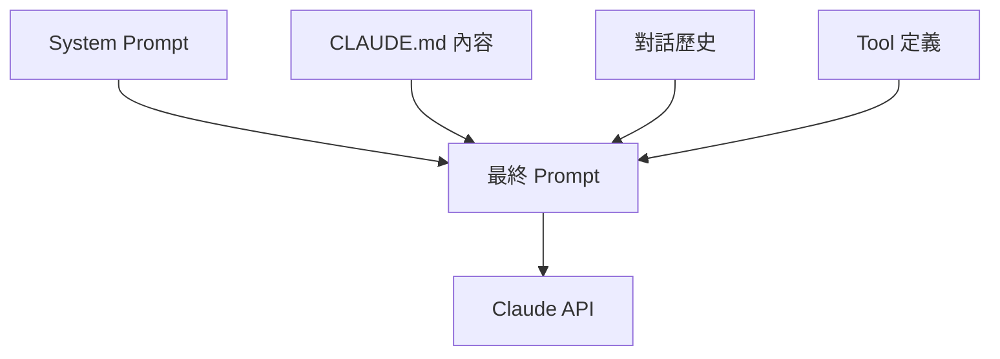
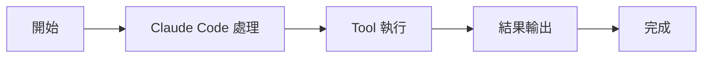

# Claude Code 的提示詞工程

核心機制

00

# Claude Code 的提示詞工程

## 不要把 Claude Code 的 prompt 理解成“一大段總提示詞”

很多人第一次研究 Claude Code，都會先找那段“終極 system prompt”。  
但原始碼裡真正存在的，不是一條 prompt，而是一整套**分層裝配的提示詞系統**。

Claude Code 至少同時存在這幾類 prompt：

- 會話級 system prompt
- 執行時動態追加的 prompt section
- 工具級 prompt
- 專項子系統 prompt
- 多 Agent / teammate 模式下的附加 prompt

也就是說，Claude Code 的 prompt 工程不是“寫一段厲害的話”，而是“把不同職責的提示詞放到不同層，再按執行時狀態拼起來”。

## 一張圖看懂 Claude Code 的提示詞體系





## 第一層：主會話的 System Prompt

Claude Code 最核心的 prompt 入口在 [`constants/prompts.ts`](../../../../../../Downloads/claude-code-src/constants/prompts.ts)。

原始碼裡最醒目的一段是：

```
function getSimpleIntroSection(outputStyleConfig: OutputStyleConfig | null): string {
  return `
You are an interactive agent that helps users ${
  outputStyleConfig !== null
    ? 'according to your "Output Style" below, which describes how you should respond to user queries.'
    : 'with software engineering tasks.'
} Use the instructions below and the tools available to you to assist the user.

IMPORTANT: You must NEVER generate or guess URLs for the user unless you are confident that the URLs are for helping the user with programming.`
}
```

這段話定義了 Claude Code 的基礎身份：  
它不是純聊天機器人，而是一個**帶工具、帶任務目標、面向軟體工程的互動式 Agent**。

### 中文翻譯

> 你是一個互動式智慧體，負責幫助使用者完成軟體工程任務。請結合下面的指令和可用工具來協助使用者。  
> 重要：除非你能確定某個 URL 確實是在幫助使用者完成程式設計任務，否則絕不能為使用者憑空生成或猜測 URL。

### 這段 prompt 的作用

- 先確定“身份”
- 再確定“任務域”是軟體工程
- 再強調“工具可用”
- 最後給出安全邊界

這類 prompt 屬於 Claude Code 的**總綱提示詞**。

## 第二層：System Prompt 不是固定字串，而是動態分段拼裝

Claude Code 並沒有把所有系統提示詞寫死成一個超長模板。  
它會把許多 section 動態拼起來：

```
const dynamicSections = [
  systemPromptSection('session_guidance', () =>
    getSessionSpecificGuidanceSection(enabledTools, skillToolCommands),
  ),
  systemPromptSection('memory', () => loadMemoryPrompt()),
  systemPromptSection('env_info_simple', () =>
    computeSimpleEnvInfo(model, additionalWorkingDirectories),
  ),
  systemPromptSection('language', () =>
    getLanguageSection(settings.language),
  ),
  systemPromptSection('output_style', () =>
    getOutputStyleSection(outputStyleConfig),
  ),
  DANGEROUS_uncachedSystemPromptSection(
    'mcp_instructions',
    () => isMcpInstructionsDeltaEnabled() ? null : getMcpInstructionsSection(mcpClients),
    'MCP servers connect/disconnect between turns',
  ),
]
```

這說明 Claude Code 的 system prompt 至少由這些部分組成：

- 會話指導
- Memory 記憶
- 環境資訊
- 語言偏好
- 輸出風格
- MCP 指令

## 動態裝配流程圖





### 中文解釋

這意味著 Claude Code 在做的不是：

> 把一段固定 system prompt 塞給模型

而是在做：

> 根據當前會話狀態，拼裝出當前這一輪最合適的 system prompt

這也是它比很多“複製一段提示詞”的 AI 工具更工程化的原因。

## 第三層：使用者可以替換或追加 System Prompt

在 [`main.tsx`](../../../../../../Downloads/claude-code-src/main.tsx) 裡，CLI 直接暴露了 prompt 定製入口：

```
addOption(new Option('--system-prompt <prompt>', 'System prompt to use for the session').argParser(String))
addOption(new Option('--append-system-prompt <prompt>', 'Append a system prompt to the default system prompt').argParser(String))
```

而在 [`utils/queryContext.ts`](../../../../../../Downloads/claude-code-src/utils/queryContext.ts) 裡，系統又進一步把這兩種語義分開處理：

```
// customSystemPrompt replaces the default system prompt entirely.
// appendSystemPrompt appends extra text after the default system prompt.
```

### 中文翻譯

> `customSystemPrompt` 會完全替換預設系統提示詞。  
> `appendSystemPrompt` 會在預設系統提示詞後面追加額外內容。

### 為什麼這點很重要

很多產品只有“覆蓋 prompt”這一種模式，但 Claude Code 區分了兩類需求：

- **replace**：我要完全換掉預設系統行為
- **append**：我要保留預設能力，只在末尾增加約束

這是一種很典型的工程設計。  
因為絕大多數真實需求並不是“推翻預設 prompt”，而是“在預設 prompt 上疊加額外規則”。

## 第四層：Teammate 模式還會自動追加額外 prompt

在多 Agent 協作模式下，Claude Code 還會給 teammate 附加專屬說明。

[`main.tsx`](../../../../../../Downloads/claude-code-src/main.tsx) 裡有這樣一段：

```
if (isAgentSwarmsEnabled() && storedTeammateOpts?.agentId && storedTeammateOpts?.agentName && storedTeammateOpts?.teamName) {
  const addendum = getTeammatePromptAddendum().TEAMMATE_SYSTEM_PROMPT_ADDENDUM;
  appendSystemPrompt = appendSystemPrompt ? `${appendSystemPrompt}\n\n${addendum}` : addendum;
}
```

而真實追加內容定義在 [`utils/swarm/teammatePromptAddendum.ts`](../../../../../../Downloads/claude-code-src/utils/swarm/teammatePromptAddendum.ts)：

```
export const TEAMMATE_SYSTEM_PROMPT_ADDENDUM = `
# Agent Teammate Communication

IMPORTANT: You are running as an agent in a team. To communicate with anyone on your team:
- Use the SendMessage tool with \`to: "<name>"\` to send messages to specific teammates
- Use the SendMessage tool with \`to: "*"\` sparingly for team-wide broadcasts

Just writing a response in text is not visible to others on your team - you MUST use the SendMessage tool.
`
```

### 中文翻譯

> 你正在以團隊成員 Agent 的身份執行。  
> 如果你要和團隊中的其他成員溝通：
>
> - 使用 `SendMessage` 工具，並把 `to` 指向具體成員名字
> - 只有在必要時才使用 `to: "*"` 進行全員廣播
>
> 僅僅輸出普通文字，團隊裡的其他成員是看不到的。  
> 你必須使用 `SendMessage` 工具。

### 這段 prompt 的本質

這不是“知識型提示詞”，而是**角色切換提示詞**。  
它的目標不是讓模型更懂程式碼，而是讓模型理解：

- 自己當前處於什麼身份
- 自己的可見性邊界是什麼
- 自己和其他 Agent 的溝通方式是什麼

## 第五層：工具本身也帶 prompt

Claude Code 的很多工具不是隻有 schema，沒有語言說明。  
它們本身就帶 prompt，用來指導模型“什麼時候用、怎麼用、不要怎麼用”。

這也是 Claude Code 很重要的一層提示詞工程。

## 1. Read 工具的 prompt

[`tools/FileReadTool/prompt.ts`](../../../../../../Downloads/claude-code-src/tools/FileReadTool/prompt.ts)：

```
return `Reads a file from the local filesystem. You can access any file directly by using this tool.
Assume this tool is able to read all files on the machine. If the User provides a path to a file assume that path is valid.

Usage:
- The file_path parameter must be an absolute path, not a relative path
- By default, it reads up to 2000 lines starting from the beginning of the file
- This tool can only read files, not directories. To read a directory, use an ls command via the Bash tool.
- You will regularly be asked to read screenshots. If the user provides a path to a screenshot, ALWAYS use this tool to view the file at the path.`
```

### 中文翻譯

> 這個工具用於讀取本地檔案系統中的檔案。你可以直接使用它訪問任意檔案。  
> 如果使用者給了一個檔案路徑，可以預設認為這個路徑是有效的。
>
> 使用規則：
>
> - `file_path` 引數必須是絕對路徑，不能是相對路徑
> - 預設最多從檔案開頭讀取 2000 行
> - 這個工具只能讀檔案，不能讀目錄；如果要讀目錄，請透過 Bash 工具執行 `ls`
> - 使用者經常會要求你讀取截圖；只要使用者給了截圖路徑，就必須使用這個工具來檢視

### 這類工具 prompt 的價值

它並不是在告訴模型“Read 工具存在”。  
它是在告訴模型：

- 引數該怎麼填
- 哪些輸入是非法的
- 什麼時候該用別的工具
- 多模態檔案應該怎麼讀

這會直接影響模型的工具選擇質量。

## 2. Bash 工具的 prompt

[`tools/BashTool/prompt.ts`](../../../../../../Downloads/claude-code-src/tools/BashTool/prompt.ts) 非常長，因為它承擔了大量 Shell 行為約束。

其中一段很關鍵：

```
Do NOT use the Bash tool to run commands when a relevant dedicated tool is provided.
```

### 中文翻譯

> 當已經提供了更合適的專用工具時，不要用 Bash 工具去執行命令。

這句話看起來簡單，但影響非常大。  
它實際上是在控制模型的**工具路由策略**：

- 讀檔案優先 `Read`
- 搜尋優先 `Grep`
- glob 匹配優先 `Glob`
- 只有沒有專用工具時才退回到 Bash

也就是說，工具 prompt 不只是文件，它其實在參與“策略控制”。

## 3. ExitPlanMode 工具的 prompt

Plan Mode 也有自己的 prompt 約束。  
這類 prompt 的目標不是教模型寫程式碼，而是規範什麼時候可以結束規劃、什麼時候應該交還使用者確認。

這說明 Claude Code 的提示詞工程並不是只服務於“主對話”，而是深入到了工具生命週期裡。

## 第六層：專項子系統也會用 prompt

Claude Code 裡還有很多不直接暴露給使用者的 prompt，它們服務於專項任務。

典型例子包括：

- `/init` 初始化專案說明
- 記憶篩選與記憶生成
- 工具結果總結
- prompt suggestion
- 子 Agent 預設提示詞

這些 prompt 不一定總在主對話裡顯式出現，但它們會在旁路流程中持續工作。

## 1. `/init` 的 prompt

`/init` 並不是隨便生成一個 `CLAUDE.md`。  
它通常會帶一套專門的初始化 prompt，讓模型去總結：

- 專案結構
- 執行方式
- 常用命令
- 編碼規範
- 協作約束

所以它本質上是一個“專案 onboarding prompt”。

## 2. Tool Summary / Prompt Suggestion

Claude Code 裡還有一些 prompt 用於：

- 把工具呼叫結果壓縮成更短總結
- 給出 prompt 建議
- 幫助後續輪次減少冗餘上下文

這些 prompt 更偏系統內部排程，不一定出現在普通使用者視角里，但對整體體驗很關鍵。

## 提示詞系統在架構中的位置


## 最後一句話總結

Claude Code 的提示詞工程，本質上不是“寫一個超強 system prompt”。  
它真正厲害的地方是：

- 把 prompt 分層
- 把 prompt 模組化
- 把 prompt 和工具、角色、子系統、執行時狀態結合起來

所以從原始碼視角看，Claude Code 的 prompt 系統更像一個**提示詞執行時**，而不是一段靜態文案。