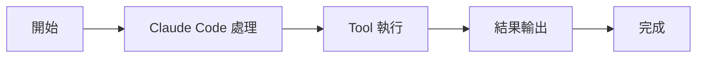

# Tool 工具系統

核心機制

00

# 工具系統解析：Tool 抽象與 tools 登錄檔

## Claude Code 的執行力來自工具，不只來自模型

很多人討論 AI 程式設計工具時，容易把注意力全部放在模型上。  
但從 Claude Code 原始碼來看，真正讓它“能幹活”的，是模型外面的工具系統。

如果沒有工具，Claude Code 再強也只是會分析程式碼。  
有了工具，它才能真正讀檔案、改檔案、跑命令、接 MCP、問使用者、開子任務。





## `Tool.ts` 負責定義統一協議

`Tool.ts` 不是某個具體工具實現，而是全系統的工具抽象層。

這裡最重要的價值有兩個：

- 統一工具的輸入、輸出、上下文和許可權語義
- 給所有工具提供相同的執行契約

檔案裡能看到很多關鍵型別：

- `ToolInputJSONSchema`
- `ToolUseContext`
- `ToolPermissionContext`
- 各類進度與狀態型別

這些型別說明 Claude Code 設計工具時，不是把工具當命令快捷方式，而是把它們當系統級能力物件。

### 對應原始碼片段

```
export type ToolInputJSONSchema = {
  [x: string]: unknown
  type: 'object'
  properties?: {
    [x: string]: unknown
  }
}
```

這段定義雖然短，但非常關鍵。  
它說明 Claude Code 的工具不是隨便塞一段文字描述，而是要求：

- 輸入結構明確
- 引數可列舉
- 工具契約可被系統理解

這正是工具化系統和隨意 prompt 技巧的區別。

## `Tool.ts` 真正定義的是一套執行契約

從這些型別可以反推出，Claude Code 對工具的預期非常清晰：

- 工具要有明確輸入 schema
- 工具要能拿到統一上下文
- 工具要能被許可權系統約束
- 工具執行過程要能反饋進度
- 工具結果要能回到訊息流裡

這套契約是後面所有能力擴充套件的基礎。

## `ToolUseContext` 很能說明問題

`ToolUseContext` 裡掛了大量執行時資源，例如：

- 當前工具集合
- 命令集合
- MCP client 與 resource
- AppState 讀寫方法
- 通知能力
- 中斷控制
- 訊息歷史
- 檔案讀取限制
- attribution / fileHistory 更新器

這意味著一個工具並不是孤立執行的，它是執行在完整會話上下文裡的。

### 對應原始碼片段

```
export type ToolUseContext = {
  options: {
    commands: Command[]
    debug: boolean
    mainLoopModel: string
    tools: Tools
    verbose: boolean
    thinkingConfig: ThinkingConfig
    mcpClients: MCPServerConnection[]
    mcpResources: Record<string, ServerResource[]>
  }
  abortController: AbortController
  readFileState: FileStateCache
  getAppState(): AppState
  setAppState(f: (prev: AppState) => AppState): void
  messages: Message[]
}
```

這段型別直接說明：  
一個工具執行時，實際上是被放進完整執行時裡的，而不是孤立呼叫一個小函式。


## `tools.ts` 是系統的工具目錄

如果說 `Tool.ts` 定義的是協議，那 `tools.ts` 定義的就是“這次系統到底有哪些工具”。

從登錄檔裡能看到 Claude Code 的能力面相當寬：

- 檔案工具：讀、寫、編輯、Notebook
- 終端工具：Bash、PowerShell
- 搜尋工具：Glob、Grep
- 網路工具：WebFetch、WebSearch、WebBrowser
- 互動工具：AskUserQuestion
- 管理工具：Todo、Task、Plan、Worktree
- 整合工具：MCP、LSP、ToolSearch
- 智慧體工具：Agent、Team、SendMessage

這已經明顯不是“幾個簡單 function calling 工具”的規模了。

### 對應原始碼片段

```
export function getAllBaseTools(): Tools {
  return [
    AgentTool,
    TaskOutputTool,
    BashTool,
    ...(hasEmbeddedSearchTools() ? [] : [GlobTool, GrepTool]),
    ExitPlanModeV2Tool,
    FileReadTool,
    FileEditTool,
    FileWriteTool,
    WebFetchTool,
    TodoWriteTool,
    WebSearchTool,
    AskUserQuestionTool,
    SkillTool,
    EnterPlanModeTool,
    ...(isEnvTruthy(process.env.ENABLE_LSP_TOOL) ? [LSPTool] : []),
    ListMcpResourcesTool,
    ReadMcpResourceTool,
  ]
}
```

這裡最值得注意的是兩點：

- Claude Code 的能力面非常寬，不止讀寫檔案和 Bash
- 工具集不是死的，會受環境變數和 feature 條件影響

## 這些工具大致可以分成 4 組

### 1. 基礎執行工具

- FileRead
- FileEdit
- FileWrite
- Bash
- Glob
- Grep

### 2. 會話控制工具

- AskUserQuestion
- TodoWrite
- EnterPlanMode
- ExitPlanMode

### 3. 擴充套件接入工具

- ListMcpResources
- ReadMcpResource
- LSPTool
- ToolSearchTool

### 4. 協作與任務工具

- AgentTool
- SendMessageTool
- TaskCreate / Get / Update / List
- TeamCreate / TeamDelete

## 工具不是全量暴露，而是動態篩選

`tools.ts` 裡能看到很多 feature gate、環境判斷和許可權過濾邏輯。

這說明工具系統有兩個重要特徵：

1. 工具集是可配置、可裁剪的
2. 模型看到的工具集不一定等於程式碼裡存在的工具集

也就是說，Claude Code 在“給模型什麼能力”這件事上非常剋制。

### 對應原始碼片段

```
export function filterToolsByDenyRules<
  T extends {
    name: string
    mcpInfo?: { serverName: string; toolName: string }
  },
>(tools: readonly T[], permissionContext: ToolPermissionContext): T[] {
  return tools.filter(tool => !getDenyRuleForTool(permissionContext, tool))
}
```

這段程式碼很重要，因為它說明安全不是隻在執行時介入。  
有些工具會在模型看到它們之前，就先被許可權規則過濾掉。


## 這裡體現了 Claude Code 的工程哲學

從工具系統設計上，你能讀出幾個非常明顯的工程取向：

- **能力統一封裝**：先抽象協議，再接入具體能力
- **許可權前置**：不是執行時再補安全，而是能力暴露階段就開始約束
- **按環境啟用**：不同構建、不同平臺、不同 feature 下工具集不同
- **擴充套件優先**：MCP、LSP、Team、Workflow 都能接進這套協議

這也是它後面能不斷長出新能力的前提。

## 為什麼統一工具協議特別重要

因為一旦協議穩定，新增能力的方式就會變得非常可預測：

1. 新能力實現自己的 Tool
2. 接入統一上下文和許可權體系
3. 註冊到工具目錄
4. 在合適條件下暴露給模型

這比給模型單獨塞一堆特例能力，要穩定得多。

## 小結

Claude Code 的工具系統可以概括成一句話：

> 用統一的 Tool 協議，把檔案系統、終端、搜尋、外部整合和智慧體能力包裝成模型可呼叫、可控、可擴充套件的執行層。

理解了這層，你就能明白它為什麼不是“聊天 + 外掛”的簡單組合，而是一個真正可操作的工程代理。