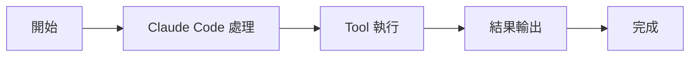

# Slash Commands 命令系統

核心機制

00

# 命令系統解析：Slash Commands 是怎麼工作的

## 命令系統和工具系統不是一回事

Claude Code 裡有兩套很容易混淆的機制：

- **工具系統**：給模型呼叫
- **命令系統**：給使用者顯式輸入

比如 `/config`、`/mcp`、`/review`、`/plugin` 這類東西，不是讓模型在主迴圈裡隨便呼叫的，而是使用者主動觸發的控制入口。





## `commands.ts` 是聚合中心

`commands.ts` 的體量很大，原因很簡單：  
它把系統內的各類命令都彙總起來了。

從匯入列表就能看出 Claude Code 的命令能力非常豐富，覆蓋：

- 配置和環境
- 登入和會話
- 審查和 diff
- MCP 和外掛
- model、usage、status、cost
- plan、permissions、hooks、files
- 遠端模式、mobile、chrome、branch、skills

這說明命令系統不是邊角料，而是 Claude Code 的控制面。

### 對應原始碼片段

```
import config from './commands/config/index.js'
import { context, contextNonInteractive } from './commands/context/index.js'
import diff from './commands/diff/index.js'
import mcp from './commands/mcp/index.js'
import review, { ultrareview } from './commands/review.js'
import skills from './commands/skills/index.js'
import status from './commands/status/index.js'
import tasks from './commands/tasks/index.js'
import plugin from './commands/plugin/index.js'
import plan from './commands/plan/index.js'
import files from './commands/files/index.js'
```

這裡最直觀的資訊就是：  
Claude Code 的命令系統已經形成了非常完整的產品控制面，而不是零散幾個輔助命令。

## 命令系統在整體架構裡的位置


## 使用者為什麼需要命令系統

如果一切都交給模型自動決定，系統會很強，但也會失去明確控制。  
命令系統的價值就在這裡：

- 有些操作適合人顯式觸發
- 有些配置不應該靠自然語言猜
- 有些管理動作需要確定性流程

例如：

- 我想切模型
- 我想看狀態
- 我想管理外掛
- 我想進入某個特殊模式

這些都更適合用命令表達。

## 為什麼成熟產品一定會保留命令面

因為很多動作的目標不是“讓模型推理”，而是“讓系統進入明確狀態”。  
例如：

- 開啟某個模式
- 檢視某類統計
- 管理外掛市場
- 配置許可權或 hooks

這些事情本來就是控制面任務，不適合交給自然語言去猜。

## 命令層其實也是一種“能力組織方式”

從架構上看，命令系統做了兩件事：

1. 給使用者提供顯式控制介面
2. 幫助系統把龐雜能力按主題歸類組織

這也是為什麼你會看到 `commands.ts` 裡既有基礎命令，也有大量 feature-gated 的高階命令。

換句話說，命令系統不只是執行器，還是整個產品功能地圖的一部分。

## 和工具系統的關係怎麼理解

一個很實用的理解方式是：

- 命令是“人直接作業系統”的入口
- 工具是“模型代替人作業系統”的入口

兩者共享同一個底層世界：

- 同樣受配置影響
- 同樣受 feature gate 影響
- 同樣可能讀寫狀態
- 同樣會和 AppState、services、外部整合發生互動

只是使用者不同。

## 小結

Claude Code 不是隻有“智慧自動化”，它同時保留了強大的顯式控制面。  
`commands.ts` 的存在說明這套系統非常清楚一件事：

> 好的工程助手，不應該只會自動幹活，還要讓使用者能明確地接管、切換和管理整個執行環境。