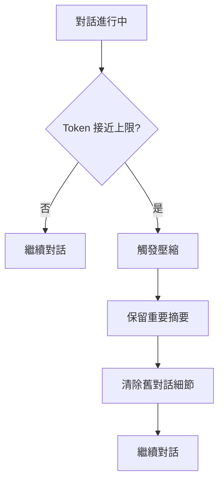

# 上下文壓縮管理

核心機制

00

# 上下文壓縮管理

很多人第一次接觸 Claude Code，都會以為它的“長上下文”能力主要來自模型本身。  
但從原始碼看，真正撐住長任務的，不只是上下文視窗，而是一整套分級壓縮機制。

Claude Code 並不是等訊息塞滿之後，簡單做一次摘要。它在主查詢鏈路裡準備了多層處理：

- 工具結果預算裁剪
- `snip` 細粒度裁剪
- `microcompact` 微壓縮
- `context collapse` 摺疊檢視
- `autocompact` 自動摘要壓縮
- `reactive compact` 出錯後的兜底壓縮

這意味著 Claude Code 的“上下文管理”本質上是一個多階段管線，而不是單點能力。





## 為什麼 Claude Code 必須做壓縮

Claude Code 的任務不是一次問答，而是持續執行工程任務：

- 讀取多個檔案
- 搜尋程式碼庫
- 執行 Bash 命令
- 寫檔案和補丁
- 呼叫子 Agent
- 與 MCP / LSP 交換結果

這些行為會不斷把新訊息和工具結果追加進會話歷史。  
如果沒有壓縮，模型很快就會被舊訊息、長工具輸出和附件塞滿。

Anthropic 在系統提示詞裡甚至直接提醒了這一點：

```
function getSystemRemindersSection(): string {
  return `- The conversation has unlimited context through automatic summarization.`
}
```

對應中文可以理解成：

> 這段對話會透過自動摘要獲得“近似無限”的上下文。

更明確的一句還出現在 `getSimpleSystemSection()` 裡：

```
`The system will automatically compress prior messages in your conversation as it approaches context limits.`
```

中文就是：

> 當對話接近上下文限制時，系統會自動壓縮更早的訊息。

所以從產品承諾到執行時實現，Claude Code 都把“自動壓縮”當成基礎設施，而不是補丁邏輯。

## 主入口在 `query.ts`

真正的壓縮主鏈在 `/Users/xuanyuan/Downloads/claude-code-src/query.ts`。

從原始碼順序可以看出，它不是隻做一次 `compact()`，而是多層串聯：

```
messagesForQuery = await applyToolResultBudget(...)

const snipResult = snipModule!.snipCompactIfNeeded(messagesForQuery)
messagesForQuery = snipResult.messages

const microcompactResult = await deps.microcompact(
  messagesForQuery,
  toolUseContext,
  querySource,
)
messagesForQuery = microcompactResult.messages

const collapseResult = await contextCollapse.applyCollapsesIfNeeded(
  messagesForQuery,
  toolUseContext,
  querySource,
)
messagesForQuery = collapseResult.messages

const { compactionResult } = await deps.autocompact(
  messagesForQuery,
  toolUseContext,
  ...
)
```

這裡最值得注意的，不是函式名本身，而是它們的執行順序：

1. 先裁掉過大的工具結果
2. 再做 `snip`
3. 再做 `microcompact`
4. 再投影 `context collapse`
5. 最後才嘗試 `autocompact`

也就是說，Claude Code 並不急著把舊歷史粗暴壓成一段摘要，而是優先嚐試保留更多細節。

## 第 1 層：工具結果預算裁剪

最先執行的是 `applyToolResultBudget(...)`。

```
messagesForQuery = await applyToolResultBudget(
  messagesForQuery,
  toolUseContext.contentReplacementState,
  ...,
  new Set(
    toolUseContext.options.tools
      .filter(t => !Number.isFinite(t.maxResultSizeChars))
      .map(t => t.name),
  ),
)
```

這一層的目標很直接：  
**在進入真正的上下文壓縮之前，先把明顯過大的工具結果做替換或裁剪。**

這很重要，因為很多時候佔空間的不是使用者訊息，而是：

- `BashTool` 打出來的大段終端輸出
- 搜尋工具返回的長結果
- 檔案讀取工具讀到的大檔案片段

如果這類結果不先處理，後面的壓縮就會被低價值大文字拖累。

## 第 2 層：`snip`

原始碼註釋已經把它的定位寫得很清楚：

```
// Apply snip before microcompact (both may run — they are not mutually exclusive).
```

這句話說明兩件事：

1. `snip` 和 `microcompact` 不是互斥關係
2. `snip` 更靠前，屬於更輕量的區域性瘦身

對應程式碼：

```
const snipResult = snipModule!.snipCompactIfNeeded(messagesForQuery)
messagesForQuery = snipResult.messages
snipTokensFreed = snipResult.tokensFreed
if (snipResult.boundaryMessage) {
  yield snipResult.boundaryMessage
}
```

從返回值也能看出它的作用：

- 產出新的訊息陣列
- 記錄釋放了多少 token
- 必要時生成邊界訊息

你可以把 `snip` 理解成：

> 在不破壞主要會話結構的前提下，先對低價值部分做區域性裁剪。

## 第 3 層：`microcompact`

`microcompact` 比 `snip` 更進一步，但還沒有進入“整段歷史總結”的階段。

原始碼裡有一句很關鍵的註釋：

```
// Apply microcompact before autocompact
```

而且前面還有一句更有資訊量：

```
// cached MC operates purely by tool_use_id
```

這說明 `microcompact` 很大一部分設計目標，是圍繞工具呼叫記錄做細粒度壓縮，尤其適合：

- 工具呼叫鏈很多
- 某些工具結果內容很長
- 但工具呼叫本身的結構資訊仍然值得保留

它和 `snip` 的區別可以粗略理解為：

- `snip`：先削掉一部分內容
- `microcompact`：對區域性訊息塊做更結構化的微壓縮


這一層體現了 Claude Code 一個很強的工程判斷：

> 只要還能保留結構化上下文，就不要急著把它們全變成一段摘要。

## 第 4 層：`context collapse`

這是原始碼裡很容易被忽視，但實際上非常聰明的一層。

原始碼註釋原文非常值得看：

```
// Project the collapsed context view and maybe commit more collapses.
// Runs BEFORE autocompact so that if collapse gets us under the
// autocompact threshold, autocompact is a no-op and we keep granular
// context instead of a single summary.
```

對應中文意思是：

> 在進入自動壓縮前，先投影一個摺疊後的上下文檢視。  
> 如果摺疊之後已經回到閾值以下，那麼自動壓縮就不需要執行，這樣就能保留更細粒度的上下文，而不是把它們合成一段大摘要。

對應呼叫：

```
const collapseResult = await contextCollapse.applyCollapsesIfNeeded(
  messagesForQuery,
  toolUseContext,
  querySource,
)
messagesForQuery = collapseResult.messages
```

這裡的關鍵思想不是“刪除歷史”，而是“重新投影檢視”。  
也就是說，底層日誌未必被徹底抹掉，但當前餵給模型的檢視被摺疊了。

這和後面 `sessionStorage.ts` 裡的 `contextCollapseCommits`、`contextCollapseSnapshot` 正好對上：

```
const contextCollapseCommits: ContextCollapseCommitEntry[] = []
let contextCollapseSnapshot: ContextCollapseSnapshotEntry | undefined
```

這說明 Claude Code 對 collapse 的處理，不只是臨時記憶體操作，而是有提交記錄和快照概念的。

## 第 5 層：`autocompact`

真正大家通常理解的“自動摘要壓縮”，在原始碼裡對應 `deps.autocompact(...)`。

```
const { compactionResult, consecutiveFailures } = await deps.autocompact(
  messagesForQuery,
  toolUseContext,
  {
    systemPrompt,
    userContext,
    systemContext,
    toolUseContext,
    forkContextMessages: messagesForQuery,
  },
  querySource,
  tracking,
  snipTokensFreed,
)
```

如果成功，會返回 `compactionResult`，然後馬上構建壓縮後的訊息鏈：

```
const postCompactMessages = buildPostCompactMessages(compactionResult)

for (const message of postCompactMessages) {
  yield message
}

messagesForQuery = postCompactMessages
```

這一步有幾個關鍵點：

- 不只是生成摘要，還會重建 post-compact 訊息序列
- 壓縮結果會真正回寫進當前對話執行鏈
- 後續模型請求會基於壓縮後的訊息繼續進行

換句話說，`autocompact` 不是旁路日誌，而是會改變主迴圈繼續執行時看到的上下文。

## 第 6 層：`reactive compact`

如果前面的主動壓縮還不夠，Claude Code 還有一條兜底鏈路：`reactive compact`。

這段邏輯在 `query.ts` 的流式返回後半段：

```
if ((isWithheld413 || isWithheldMedia) && reactiveCompact) {
  const compacted = await reactiveCompact.tryReactiveCompact({
    hasAttempted: hasAttemptedReactiveCompact,
    querySource,
    aborted: toolUseContext.abortController.signal.aborted,
    messages: messagesForQuery,
    cacheSafeParams: {
      systemPrompt,
      userContext,
      systemContext,
      toolUseContext,
      forkContextMessages: messagesForQuery,
    },
  })
}
```

這裡處理兩種常見失敗：

- `prompt too long`
- 媒體內容過大，例如圖片 / PDF / 多圖輸入

也就是說，`reactive compact` 不是日常首選路徑，而是：

> 當真實 API 呼叫已經報錯時，再用一次恢復性壓縮把任務救回來。


這一點很能體現 Claude Code 的工程成熟度。  
它不是假設“主動壓縮一定成功”，而是把失敗恢復也納入主迴圈設計。

## `compact_boundary` 才是壓縮真正落盤的邊界

壓縮不僅發生在記憶體裡，還會影響會話持久化和恢復。

`QueryEngine.ts` 裡有專門的 `compact_boundary` 處理邏輯：

```
if (
  persistSession &&
  message.type === 'system' &&
  message.subtype === 'compact_boundary'
) {
  const tailUuid = message.compactMetadata?.preservedSegment?.tailUuid
  ...
}
```

同時在回放時它也被當作一種需要確認的系統訊息：

```
(msg.type === 'system' && msg.subtype === 'compact_boundary')
```

這說明 `compact_boundary` 的作用不是展示 UI 提示，而是：

- 標記一次壓縮在會話鏈條中的邊界
- 告訴 transcript 哪一段歷史已經被總結
- 給恢復邏輯一個重新拼接 preserved segment 的錨點

## `sessionStorage.ts` 裡為什麼這麼複雜

如果只做“摘要替換”，會話恢復其實很簡單。  
但 Claude Code 不是這樣，所以 `sessionStorage.ts` 裡有很多專門處理壓縮邊界和保留段的邏輯。

最典型的是這段註釋：

```
/**
 * Splice the preserved segment back into the chain after compaction.
 */
```

以及 `applyPreservedSegmentRelinks(...)` 裡的這段解釋：

```
// Only the LAST seg-boundary is relinked — earlier segs were summarized
// into it.
```

它表達的是一個很重要的設計：

1. 壓縮後不是所有舊訊息都消失
2. 有些片段會被保留
3. 會話恢復時要把這些片段重新接回鏈上

這也是為什麼 Claude Code 的上下文壓縮，不是普通聊天產品裡那種“把前文總結成一段文字”那麼簡單。

## 它其實是“分級壓縮”，不是“統一摘要”

現在可以把整套機制總結成一個更準確的圖：


這是一個明顯的“層層升級”設計：

- 能區域性處理，就不做全域性摘要
- 能摺疊檢視，就不立即合併成摘要
- 主動壓縮失敗後，再走恢復性壓縮

這種分級處理的目標很明確：  
**儘量延後資訊損失，儘量保留結構，最後才犧牲細節。**

## 它還和 Prompt Cache 有關係

在 `constants/prompts.ts` 裡有一個很關鍵的常量：

```
export const SYSTEM_PROMPT_DYNAMIC_BOUNDARY =
  '__SYSTEM_PROMPT_DYNAMIC_BOUNDARY__'
```

原始碼註釋說得很直白：

```
 * Everything BEFORE this marker in the system prompt array can use scope: 'global'.
 * Everything AFTER contains user/session-specific content and should not be cached.
```

中文就是：

> 這個邊界之前的 system prompt 可以進入全域性快取；之後的部分是使用者或會話相關內容，不應該快取。

這和上下文壓縮放在一起看，會更容易理解 Claude Code 的總體策略：

- 靜態 system prompt 儘量快取
- 動態上下文儘量分層壓縮
- 歷史訊息透過 boundary 與 snapshot 管理

所以它不是單純在“縮訊息”，而是在同時管理：

- token 成本
- 上下文可持續性
- prompt cache 命中
- resume 恢復正確性

## 使用者真正感知到的效果是什麼

這套機制最終會帶來幾個實際體驗：

1. 長任務不會因為讀了太多檔案立刻崩掉
2. 對話可以持續很多輪，而不是越來越遲鈍
3. Claude Code 在超限時有自救能力
4. `/resume` 恢復出來的會話仍然能接上前文
5. 它會優先保留結構，而不是一上來就把歷史壓成一坨摘要

## 最後一句話總結

Claude Code 的上下文壓縮，不是“接近上限時做一次摘要”這麼簡單。  
從原始碼看，它更像一套分層記憶體管理系統：

- 前面幾層儘量區域性瘦身
- 中間一層儘量摺疊檢視保留結構
- 後面才做全域性摘要
- 再後面還有真實報錯後的恢復壓縮

所以如果你把 Claude Code 當成“模型 + 工具”來看，會低估它。  
真正讓它能持續完成複雜工程任務的，是這種執行時級別的上下文管理能力。