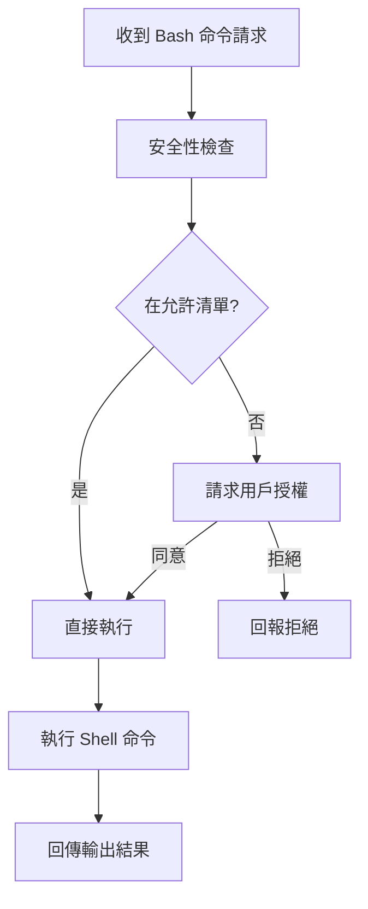

# Bash 工具為什麼這麼關鍵

核心機制

00

# Claude Code 的 Bash 工具為什麼這麼關鍵

## 如果只能保留一個執行工具，很多時候就是 Bash

Claude Code 的工具很多，但從真實開發工作流看，**BashTool 幾乎是最關鍵的執行工具之一**。

因為它把 Claude Code 從“能改程式碼”推進到了“能操作開發環境”。

沒有 Bash，它能做的更多是靜態修改；  
有了 Bash，它才能：

- 跑測試
- 看構建結果
- 搜尋系統資訊
- 呼叫專案指令碼
- 和 Git、包管理器、構建鏈路打通

## 原始碼裡為什麼這部分這麼重

只看 `BashTool.tsx` 的匯入規模就能知道，這不是一個簡單的 `child_process.exec` 包裝：

```
import { backgroundExistingForegroundTask, markTaskNotified, registerForeground, spawnShellTask, unregisterForeground } from '../../tasks/LocalShellTask/LocalShellTask.js';
import { parseForSecurity } from '../../utils/bash/ast.js';
import { splitCommand_DEPRECATED, splitCommandWithOperators } from '../../utils/bash/commands.js';
import { exec } from '../../utils/Shell.js';
import { SandboxManager } from '../../utils/sandbox/sandbox-adapter.js';
import { checkReadOnlyConstraints } from './readOnlyValidation.js';
import { shouldUseSandbox } from './shouldUseSandbox.js';
```

這段匯入列表已經說明 BashTool 至少同時關心：

- 任務前後臺管理
- 命令解析
- 安全分析
- 實際執行
- 沙箱策略
- 只讀約束

所以 BashTool 是一套“命令執行子系統”，而不是一個薄薄工具。

## 先看整體鏈路


## 它為什麼要先判斷命令語義

BashTool 裡有一段很關鍵的邏輯：判斷命令到底是搜尋、讀取還是其他行為。

```
export function isSearchOrReadBashCommand(command: string): {
  isSearch: boolean;
  isRead: boolean;
  isList: boolean;
} {
  let partsWithOperators: string[];
  try {
    partsWithOperators = splitCommandWithOperators(command);
  } catch {
    return {
      isSearch: false,
      isRead: false,
      isList: false
    };
  }
  ...
}
```

這段程式碼的意義非常大。  
它說明 Claude Code 不是把 Bash 命令一股腦都當成“黑盒執行”，而是試圖理解命令的語義型別。

這樣做能帶來很多收益：

- UI 呈現更合理
- 只讀命令可以更安全地自動放行
- 搜尋/讀取結果可以摺疊顯示
- 後續策略判斷更細

## BashTool 在 Claude Code 裡承擔了什麼角色

可以把它理解為“開發環境操作匯流排”。





沒有 BashTool，Claude Code 很難跨過“看程式碼”和“驗證程式碼”之間的鴻溝。

## 為什麼這裡必須有嚴格安全控制

Shell 最大的問題是能力太強。  
一旦不受控，它可以直接變成風險入口。

所以在 Claude Code 裡，BashTool 會額外關心：

- 命令是否只讀
- 路徑是否合法
- 是否使用沙箱
- 是否需要許可權確認
- 是否適合後臺執行

這也是為什麼 BashTool 相關程式碼明顯比普通工具重得多。

## 它和任務系統是繫結的

從匯入可見，BashTool 和 `LocalShellTask` 深度耦合。  
這意味著它不是“同步跑個命令然後結束”，而是可以進入任務系統，參與：

- 前後臺切換
- 進度展示
- 結果通知
- 中斷與恢復感知

這才符合真實開發中的長命令場景，比如：

- `npm run build`
- `pytest`
- `cargo test`
- `pnpm lint`

## 真實工程意義

很多 AI 程式設計產品卡在一個地方：  
它們會改程式碼，但不會驗證環境。

BashTool 的存在，正是 Claude Code 把自己從“程式碼生成器”推向“工程執行器”的關鍵一步。

## 小結

Claude Code 的 BashTool 之所以關鍵，不是因為“它可以執行命令”，而是因為它把命令執行變成了一個：

- 有語義分類
- 有許可權約束
- 有任務管理
- 有 UI 呈現
- 能迴流主迴圈

的正式系統能力。