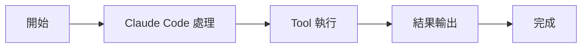

# AgentTool：子 Agent 調度器

Tools 工具組

00

# AgentTool：子 Agent 排程器

## 這個工具到底解決什麼問題

`AgentTool` 是 Claude Code 最有代表性的工具之一。  
它解決的不是“讀檔案”或者“跑命令”這種單點能力，而是：

> 當主執行緒模型覺得一個任務太大、太雜、太適合並行時，如何把一部分工作拆給另一個 Agent 去做。

這也是 Claude Code 和普通程式碼助手的核心分水嶺之一。  
很多 AI 工具只有一個主執行緒模型一直往下跑，而 Claude Code 明確支援：

- 研究型子任務
- 後臺執行
- 多 Agent 協作
- 本地 / 遠端子 Agent

## 先看它的輸入長什麼樣

`tools/AgentTool/AgentTool.tsx` 一上來就把核心引數暴露出來了：

```
const baseInputSchema = z.object({
  description: z.string().describe('A short (3-5 word) description of the task'),
  prompt: z.string().describe('The task for the agent to perform'),
  subagent_type: z.string().optional(),
  model: z.enum(['sonnet', 'opus', 'haiku']).optional(),
  run_in_background: z.boolean().optional(),
})
```

這幾個欄位已經很說明它的定位：

- `description`：給子任務一個簡短標題
- `prompt`：真正交給子 Agent 的工作內容
- `subagent_type`：選擇專門型別的 Agent
- `model`：必要時換模型
- `run_in_background`：放後臺跑

也就是說，`AgentTool` 本質上是一個**任務派發器**。

## 它在工具池裡的位置非常特殊

在 Claude Code 的總工具池裡，它被放在最前面：

```
export function getAllBaseTools(): Tools {
  return [
    AgentTool,
    TaskOutputTool,
    BashTool,
    ...
  ]
}
```

這不一定代表“最常呼叫”，但說明 Anthropic 把它視為第一層核心能力。  
因為一旦有了 `AgentTool`，其他工具就不再只是“主執行緒自己用”，而是可以被子 Agent 繼續呼叫。

## 一張圖看它在系統裡的位置





## 它不是“再開一個模型”這麼簡單

看 `AgentTool.tsx` 的匯入就能看出來，這個工具背後其實串著很多子系統：

```
import { enhanceSystemPromptWithEnvDetails, getSystemPrompt } from '../../constants/prompts.js'
import { assembleToolPool } from '../../tools.js'
import { runAgent } from './runAgent.js'
import { registerAsyncAgent } from '../../tasks/LocalAgentTask/LocalAgentTask.js'
import { registerRemoteAgentTask } from '../../tasks/RemoteAgentTask/RemoteAgentTask.js'
```

這意味著 `AgentTool` 至少做了 4 件事：

1. 重新生成子 Agent 的 system prompt
2. 重新裁剪一套工具池
3. 決定是本地任務還是遠端任務
4. 把子 Agent 掛到任務系統裡

所以它的真實含義更接近：

> 用 Claude Code 的執行時框架，再啟動一個受控的、帶任務上下文的工作執行緒

## 子 Agent 為什麼不會變成“失控副本”

這個問題很關鍵。  
如果只是簡單 fork 一個模型，系統很快就會失控。

Claude Code 透過幾層機制約束它：

- 子 Agent 有自己的輸入 schema
- 子 Agent 會重新組裝 prompt
- 子 Agent 的工具池是單獨過濾的
- 子 Agent 會被掛進任務系統，支援狀態、輸出、停止、通知

所以 `AgentTool` 不是一個“自由分身器”，而是一個**受控派單器**。

## 呼叫鏈可以再細一點


## 它和 Task 系統是強繫結的

Claude Code 不是讓子 Agent 偷偷在後臺跑，而是把它們做成了正式任務：

- 可檢視輸出
- 可後臺執行
- 可停止
- 可恢復

這就是為什麼 `AgentTool` 後面緊跟著就是 `TaskOutputTool`。  
兩者天然是一組：

- `AgentTool` 負責派活
- `TaskOutputTool` 負責取結果

## 真實使用路徑是什麼

你可以把一個典型路徑理解成這樣：

1. 主執行緒發現“這個問題需要深入查某個子系統”
2. 主執行緒呼叫 `AgentTool`
3. 子 Agent 自己去搜尋、讀檔案、推理、執行
4. 子 Agent 給出壓縮後的結論
5. 主執行緒拿這個結論繼續向前推進

這和“主執行緒自己執行所有搜尋”相比，最大的優勢是：

- 減少主上下文汙染
- 容易並行
- 更適合做重研究、重排查類任務

## 最容易誤解它的地方

### 誤解一：AgentTool 就是多輪聊天

不是。  
它是明確的工具呼叫，帶 schema、任務生命週期和結果回注。

### 誤解二：子 Agent 和主執行緒完全一樣

也不是。  
子 Agent 的 prompt、工具池、執行模式都可能不同。

### 誤解三：AgentTool 只是“更高階的 prompt”

不夠準確。  
它更像“把另一個 Agent 作為正式執行時物件掛進系統”。

## 它和相鄰工具的關係


- 和 `TaskOutputTool` 配合：讀取子 Agent 輸出
- 和 `SendMessageTool` 配合：多 Agent 模式下互相通訊
- 和 `BashTool`、`Read`、`Edit` 配合：子 Agent 自己繼續完成任務
- 和 `SkillTool` 配合：某些 skill 會在獨立子 Agent 中執行

## 小結

如果你只能記住一句話：

> `AgentTool` 不是單個工具能力，而是 Claude Code 把“任務拆分 + 子 Agent 執行 + 任務生命週期管理”封裝成了一個正式工具。

它是 Claude Code 從“會調工具的模型”升級成“多工 Agent 系統”的關鍵節點。