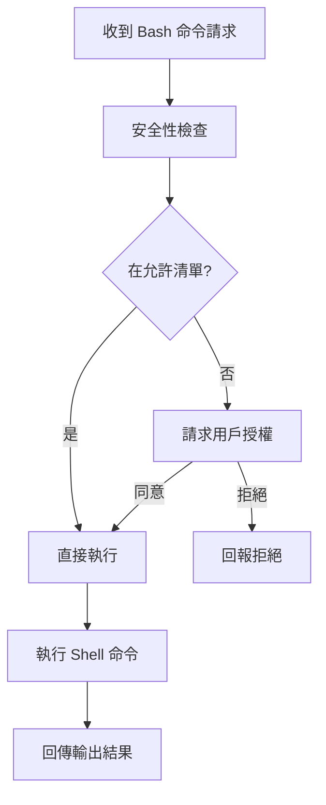
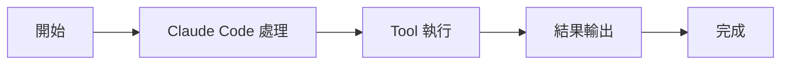

# BashTool：Shell 執行器

Tools 工具組

00

# BashTool：Shell 執行器

## 這個工具為什麼是核心中的核心

如果說 `Read`、`Edit`、`Write` 是 Claude Code 的精細手術刀，  
那 `BashTool` 就是它的重型工程機械。

它讓 Claude Code 真正接入開發環境：

- 跑測試
- 跑構建
- 看 Git 狀態
- 呼叫編譯器、包管理器、指令碼
- 啟動開發服務
- 執行系統命令

沒有 `BashTool`，Claude Code 頂多是一個“懂程式碼的文字編輯器”；  
有了它，Claude Code 才真正變成“能操作本地工程環境的 Agent”。

## 先看它依賴了多少子模組

`tools/BashTool/BashTool.tsx` 的匯入非常誇張，這本身就是一個訊號：  
它絕不是簡單 `exec()` 一下就結束。

```
import { parseForSecurity } from '../../utils/bash/ast.js'
import { bashToolHasPermission } from './bashPermissions.js'
import { shouldUseSandbox } from './shouldUseSandbox.js'
import { exec } from '../../utils/Shell.js'
import { spawnShellTask } from '../../tasks/LocalShellTask/LocalShellTask.js'
import { trackGitOperations } from '../shared/gitOperationTracking.js'
```

這些名字已經說明了它的結構：

- 命令解析
- 許可權判斷
- sandbox 決策
- shell 執行
- 後臺任務
- Git 行為跟蹤

## 它不是“萬能入口”，而是受約束的執行器

Claude Code 的 prompt 明確要求：

> 當有專用工具時，不要優先用 Bash

所以 `BashTool` 雖然能力很強，但系統並不希望模型無腦全走 Bash。  
這也是 Anthropic 工程化思路里很重要的一點：

- 結構化工具優先
- Bash 作為兜底的系統執行層

## 它會主動理解命令型別

原始碼裡直接維護了幾組命令語義分類：

```
const BASH_SEARCH_COMMANDS = new Set(['find', 'grep', 'rg', 'ag', 'ack', 'locate'])
const BASH_READ_COMMANDS = new Set(['cat', 'head', 'tail', 'less', 'more'])
const BASH_LIST_COMMANDS = new Set(['ls', 'tree', 'du'])
```

這說明 `BashTool` 不只是“執行字串”，它還會試圖識別：

- 這是搜尋命令
- 這是讀取命令
- 這是目錄檢視命令

這樣做的目的主要有兩個：

1. 改善 UI 展示和摘要
2. 讓系統對命令列為有更細的理解

## 一張圖看 BashTool 的執行鏈





## 安全檢查不是裝飾，而是主幹邏輯

`BashTool` 裡這條匯入非常關鍵：

```
import { parseForSecurity } from '../../utils/bash/ast.js'
```

這意味著系統並不滿足於“拿到命令字串就跑”，而是先做語法級理解。  
配合 `bashPermissions.ts`、`destructiveCommandWarning.ts`、`readOnlyValidation.ts` 這些模組，Claude Code 其實在做一件事：

> 儘量把 Shell 執行變成一種可被審計和約束的行為

這也是為什麼 Claude Code 在工程上比“AI 幫你跑終端”那種粗糙做法強很多。

## 它和 sandbox 的關係

另一個核心匯入是：

```
import { shouldUseSandbox } from './shouldUseSandbox.js'
```

這說明 BashTool 在執行前會判斷：

- 當前命令是否適合沙箱
- 當前環境是否必須沙箱
- 是否需要申請更高許可權

也就是說，Claude Code 不是統一地“都放進沙箱”或“都裸跑”，而是動態決策。

## 前臺任務和後臺任務是兩套路徑

`BashTool` 不僅能同步執行，也能把任務放到後臺。

原始碼裡直接接入了任務系統：

```
import { spawnShellTask } from '../../tasks/LocalShellTask/LocalShellTask.js'
```

這意味著 Claude Code 執行一個耗時命令時，並不一定要卡死在當前輪。  
它可以：

- 放後臺繼續跑
- 後面再透過 `TaskOutputTool` 讀取結果
- 必要時用 `TaskStopTool` 停掉

這就是為什麼 Claude Code 在長任務場景裡會比普通終端 Agent 順很多。

## 一張圖看它和任務系統的關係





## 一個典型的真實使用路徑

比如修一個 bug，Claude Code 常見的 Bash 路徑會是：

1. `git status`
2. `rg`/`grep` 或其他命令排查
3. 跑測試
4. 跑構建
5. 看失敗輸出
6. 再修一輪

你會發現它很少是“隨便跑個命令”，而是處在一個完整工程流程裡。  
所以 `BashTool` 的真正角色是：

> 把 Claude Code 接到真實工程流水線

## 最容易誤解它的地方

### 誤解一：BashTool 就是越多用越強

不是。  
如果有 `Read`、`Edit`、`Glob`、`Grep` 這些專用工具，系統更希望優先用它們。

### 誤解二：BashTool 只是執行層，不涉及產品邏輯

不對。  
它直接連線了：

- 許可權系統
- 任務系統
- UI 展示
- Git 跟蹤
- sandbox 策略

### 誤解三：BashTool 的價值只是“能跑命令”

更準確的說法是：

> 它把“執行命令”變成了一個受控、可觀察、可回放、可中斷的執行時能力。

## 它和相鄰工具的關係


- 和 `Read` / `Edit` / `Write`：結構化檔案操作優先
- 和 `TaskOutputTool`：後臺 shell 任務讀結果
- 和 `TaskStopTool`：後臺 shell 任務停止
- 和 Git / build / test：構成真實開發閉環

## 小結

如果只能用一句話總結：

> `BashTool` 是 Claude Code 接入真實本地開發環境的橋樑，但它不是裸執行器，而是被許可權、sandbox、任務系統和產品邏輯一起包住的受控執行層。