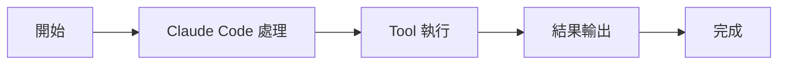
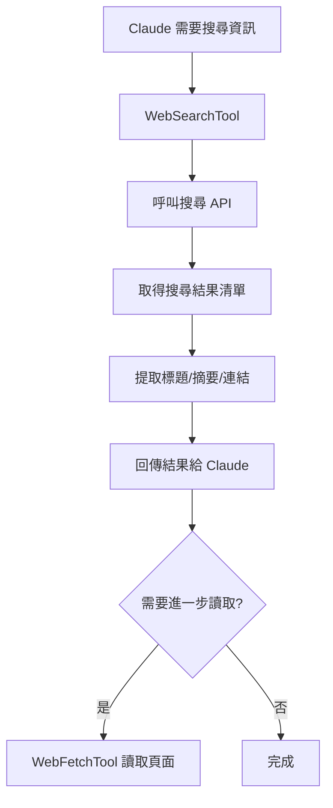

# WebFetchTool：抓取網頁

Tools 工具組

00

# WebFetchTool：抓取網頁

## 這個工具到底做什麼

`WebFetchTool` 負責抓取一個**已經知道 URL 的網頁**，把網頁內容轉成 Claude Code 更容易處理的文字，再根據傳入的 `prompt` 提煉結果。

它和 `WebSearchTool` 的分工非常明確：

- `WebSearchTool`：幫模型去網上找結果
- `WebFetchTool`：拿著確定的 URL 去讀具體頁面

所以你可以把它理解成：

> Claude Code 的“網頁閱讀器 + 小模型摘要器”

而不是“聯網搜尋工具”。

## 它的輸入為什麼只有兩個欄位

`tools/WebFetchTool/WebFetchTool.ts`：

```
const inputSchema = z.strictObject({
  url: z.string().url().describe('The URL to fetch content from'),
  prompt: z.string().describe('The prompt to run on the fetched content'),
})
```

這兩個欄位剛好對應了它的兩步工作：

1. 先把網頁內容抓回來
2. 再根據 `prompt` 提煉想要的資訊

所以 `WebFetchTool` 並不是“單純下載網頁”，而是把“抓取”和“閱讀”合併成一個完整動作。

## 一張圖看它的完整鏈路





## 它不是直接把網頁全文塞回主模型

這是 `WebFetchTool` 最值得注意的設計點。

在 `tools/WebFetchTool/utils.ts` 和 `prompt.ts` 裡，可以看到它會把抓到的網頁內容交給一個次級模型處理：

```
import { queryHaiku } from '../../services/api/claude.js'
import { makeSecondaryModelPrompt } from './prompt.js'
```

而 `prompt.ts` 裡定義了這一步的提示詞拼裝：

```
export function makeSecondaryModelPrompt(
  markdownContent: string,
  prompt: string,
  isPreapprovedDomain: boolean,
): string {
  return `
Web page content:
---
${markdownContent}
---

${prompt}
`
}
```

這說明它的真實工作方式是：

1. 抓網頁
2. 轉成 markdown
3. 把 markdown 和使用者/模型給的提問一起交給一個更小更快的模型
4. 只把提煉後的結果回給主迴圈

這和“把整頁 HTML 全塞進主上下文”相比，節省了很多上下文。

## 這也是它和瀏覽器工具最大的不同

`WebFetchTool` 不是瀏覽器。  
它更像一個**面向內容提取的遠端閱讀器**。

它不擅長：

- 登入態頁面互動
- 點選、表單、動態操作
- 複雜 JS 頁面行為模擬

而它擅長的是：

- 文件頁
- 部落格文章
- 公網說明頁
- 某個 URL 的結構化摘要

所以 Anthropic 在 prompt 裡還專門提醒：

```
IMPORTANT: WebFetch WILL FAIL for authenticated or private URLs.
If so, look for a specialized MCP tool that provides authenticated access.
```

### 中文理解

如果這是一個登入態頁面、私有文件或者受許可權保護的站點，`WebFetchTool` 很可能失敗。  
這時更應該找 MCP 工具，或者走別的受認證能力。

## 許可權系統不是按“整個網際網路”放行，而是按域名做

`WebFetchTool` 有一段很關鍵的許可權邏輯：

```
function webFetchToolInputToPermissionRuleContent(input) {
  const { url } = parsedInput.data
  const hostname = new URL(url).hostname
  return `domain:${hostname}`
}
```

後面的 `checkPermissions()` 會圍繞這個 `domain:hostname` 去判斷：

- `deny`
- `ask`
- `allow`

這說明 Claude Code 並不是簡單地說“允許聯網/不允許聯網”，而是把網頁抓取許可權進一步細化到了**域名級別**。

## 一張圖看許可權判斷


這套設計非常像一個真正產品化的安全模型。

## 它對“預批准域名”有特殊最佳化

原始碼裡有兩個非常重要的函式：

```
import { isPreapprovedHost } from './preapproved.js'
import { isPreapprovedUrl } from './utils.js'
```

這意味著某些被系統認可的域名，會走更順暢的抓取路徑。  
而且 `makeSecondaryModelPrompt()` 裡也會根據是不是預批准域名，生成不同的摘要約束。

對於普通域名，它會額外強調：

- 引用要短
- 不要大段複述原文
- 不要越界討論法律問題
- 不要生成歌詞等敏感長引用

這本質上是在做版權和內容風險控制。

## 它還內建了快取機制

在 `utils.ts` 裡可以看到：

```
const CACHE_TTL_MS = 15 * 60 * 1000
const MAX_CACHE_SIZE_BYTES = 50 * 1024 * 1024

const URL_CACHE = new LRUCache<string, CacheEntry>({
  maxSize: MAX_CACHE_SIZE_BYTES,
  ttl: CACHE_TTL_MS,
})
```

這說明 `WebFetchTool` 會快取最近抓取過的網頁內容。  
這樣做的好處是：

- 同一 URL 重複抓取更快
- 減少網路開銷
- 減少重複模型處理

它甚至還單獨維護了域名預檢查快取：

```
const DOMAIN_CHECK_CACHE = new LRUCache<string, true>({
  max: 128,
  ttl: 5 * 60 * 1000,
})
```

這類細節非常像成熟產品，而不是 demo 工具。

## 它對 URL 安全做了很多約束

在 `validateURL()` 裡，程式碼並不只是“能 parse 就行”，還會限制：

- URL 長度
- 是否包含使用者名稱/密碼
- 是否看起來像公開域名

原始碼裡還能看到這一句：

```
const MAX_URL_LENGTH = 2000
```

以及對內部、異常或不適合抓取目標的前置過濾。  
這說明 Anthropic 很清楚：網頁抓取是一個容易變成安全通道的能力，所以必須加邊界。

## 重定向處理也很謹慎

`WebFetchTool` 並不會對任何跨域重定向都自動跟隨。  
原始碼裡會檢查重定向是否安全：

```
export function isPermittedRedirect(
  originalUrl: string,
  redirectUrl: string,
): boolean
```

允許的大致是：

- 同域跳轉
- `www.` 的增刪
- 路徑變化

而如果跳到了不同 host，它不會偷偷繼續抓，而是返回一個明確結果，讓主執行緒重新決定。

在 `WebFetchTool.ts` 裡有這段非常典型的邏輯：

```
if ('type' in response && response.type === 'redirect') {
  const message = `REDIRECT DETECTED: The URL redirects to a different host. ...`
}
```

這說明它把“跨域重定向”視為一個需要顯式處理的安全事件，而不是普通網路細節。

## 它還區分文字和二進位制內容

`utils.ts` 裡有：

```
import {
  isBinaryContentType,
  persistBinaryContent,
} from '../../utils/mcpOutputStorage.js'
```

這說明 `WebFetchTool` 抓到的內容不一定總是 HTML 文字。  
如果是二進位制響應，它會走持久化處理，而不是硬塞成文字。

這再次說明它的實現目標不是“隨便下載東西”，而是“在產品約束下安全處理網頁內容”。

## 典型使用路徑

一個很常見的鏈路是：

1. 主執行緒先用 `WebSearchTool` 搜某個主題
2. 選中其中一條結果 URL
3. 再呼叫 `WebFetchTool`
4. 用 prompt 指定“提取我真正關心的資訊”
5. 把摘要結果帶回主執行緒


## 它和 `WebSearchTool` 的關係

這個區別必須記清楚：

- `WebSearchTool` 負責“找答案來源”
- `WebFetchTool` 負責“讀具體頁面”

你可以把它們理解成：





很多聯網任務實際上會同時使用這兩個工具。

## 最容易誤解它的地方

### 誤解一：它就是一個 HTTP GET

不對。  
它還做了：

- 許可權判斷
- 域名檢查
- HTML 轉 markdown
- 小模型摘要
- 快取
- 重定向安全處理

### 誤解二：它能代替瀏覽器

也不對。  
它更適合靜態或可直接抓取的內容頁，不適合複雜登入態和互動頁面。

### 誤解三：它和 WebSearchTool 差不多

不是一個層級。  
一個負責搜，一個負責讀。

## 小結

如果用一句話概括：

> `WebFetchTool` 是 Claude Code 的“定向網頁讀取器”，它把 URL 抓取、內容清洗、小模型摘要、域名許可權和安全控制整合成了一個正式的只讀工具。

它真正厲害的地方，不是“能聯網”，而是：

> 能在聯網的同時，把風險、上下文和結果規模都控制住。