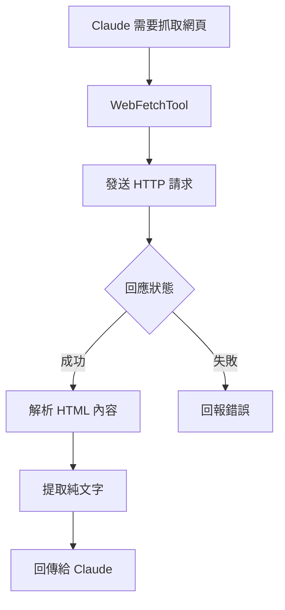

# WebSearchTool：聯網搜尋

Tools 工具組

00

# WebSearchTool：聯網搜尋

## 這個工具到底做什麼

`WebSearchTool` 負責讓 Claude Code 查詢網際網路的最新資訊。  
它解決的核心問題不是“開啟某個網頁”，而是：

> 當主執行緒需要知道當前世界上最近發生了什麼、某個產品最新文件是什麼、某個問題有哪些公開資料時，如何安全地發起聯網搜尋。

所以它和 `WebFetchTool` 的區別一定要先記清：

- `WebSearchTool`：找資訊源
- `WebFetchTool`：讀指定頁面

在真實使用裡，這兩個工具經常是一前一後配合。

## 它的 schema 很簡單，但能力很強

`tools/WebSearchTool/WebSearchTool.ts`：

```
const inputSchema = z.strictObject({
  query: z.string().min(2).describe('The search query to use'),
  allowed_domains: z.array(z.string()).optional(),
  blocked_domains: z.array(z.string()).optional(),
})
```

看起來只有 3 個欄位，但已經涵蓋了最關鍵的搜尋控制：

- 搜什麼
- 只搜哪些域名
- 排除哪些域名

這意味著 Claude Code 的聯網搜尋不是“隨便搜一下”，而是支援受約束的搜尋。

## 它不是 Bash 調搜尋引擎，而是接 Anthropic 的 Web Search 能力

原始碼裡最關鍵的一段是這部分工具 schema 構造：

```
function makeToolSchema(input: Input): BetaWebSearchTool20250305 {
  return {
    type: 'web_search_20250305',
    name: 'web_search',
    allowed_domains: input.allowed_domains,
    blocked_domains: input.blocked_domains,
    max_uses: 8,
  }
}
```

這說明 `WebSearchTool` 不是自己去模擬瀏覽器，也不是 shell 調第三方搜尋介面。  
它實際上是把官方的 Web Search server tool 接進了 Claude Code 的工具系統。

換句話說，它做的是：

> 由 Claude Code 主執行緒觸發，再由底層支援 Web Search 的模型能力去執行搜尋

## 一張圖看搜尋鏈路


## 它的核心呼叫方式很值得研究

`call()` 裡這段程式碼最能說明它的本質：

```
const queryStream = queryModelWithStreaming({
  messages: [userMessage],
  systemPrompt: asSystemPrompt([
    'You are an assistant for performing a web search tool use',
  ]),
  tools: [],
  options: {
    extraToolSchemas: [toolSchema],
    querySource: 'web_search_tool',
    ...
  },
})
```

這裡有幾個關鍵點：

1. 它自己重新發起了一次模型呼叫
2. 這次呼叫的目的不是普通回答，而是執行搜尋
3. 搜尋工具是透過 `extraToolSchemas` 注入進去的

這說明 `WebSearchTool` 其實是一個**包裝型工具**：

- 外層是 Claude Code 的標準工具
- 內層再發起一次支援 web search 的模型請求

## 它為什麼不是直接把結果返回，而是要先解析內容塊

原始碼裡有一段非常關鍵的解析邏輯：

```
function makeOutputFromSearchResponse(
  result: BetaContentBlock[],
  query: string,
  durationSeconds: number,
): Output
```

註釋寫得很直白：返回內容不是一個單純陣列，而是一串混合塊：

- `server_tool_use`
- `web_search_tool_result`
- `text`
- citation 相關塊

所以 `WebSearchTool` 的一個核心工作就是：

> 把底層返回的搜尋結果塊重新整理成 Claude Code 更容易消費的結構

## 它的輸出其實是“搜尋結果 + 說明文字”的混合體

輸出 schema 裡有一段非常重要：

```
results: z
  .array(z.union([searchResultSchema(), z.string()]))
  .describe('Search results and/or text commentary from the model')
```

這意味著返回結果不是純搜尋命中列表，而可能同時包含：

- 一組搜尋 hits
- 一段文字說明

換句話說，`WebSearchTool` 並不是只把連結丟回來，而是允許模型在搜尋結果外再補一些中間解釋。

## 這也是它比普通搜尋 API 更像 Agent 工具的地方

普通搜尋 API 常常返回：

- 標題
- URL
- 摘要

而 Claude Code 的 `WebSearchTool` 還會處理：

- 工具呼叫塊
- 文字解釋塊
- 引用與來源要求

這讓它更適合直接接入主迴圈，而不是隻當一個資料來源。

## prompt 裡對“來源”要求非常嚴格

`tools/WebSearchTool/prompt.ts`：

```
CRITICAL REQUIREMENT - You MUST follow this:
  - After answering the user's question, you MUST include a "Sources:" section at the end of your response
  - In the Sources section, list all relevant URLs from the search results as markdown hyperlinks
```

這說明 Anthropic 對這個工具的產品要求很明確：

- 只要用了聯網搜尋
- 最終回答裡就應該帶來源

這對可信度和可驗證性非常重要。

## 一張圖看它和回答生成的關係


從產品角度看，這也是 Claude Code 比“模型偷偷搜一下然後不告訴你來源”更成熟的地方。

## 它還會強制提醒“用當前年份搜尋”

`getWebSearchPrompt()` 裡還有一條很有意思的約束：

```
IMPORTANT - Use the correct year in search queries:
  - The current month is ${currentMonthYear}. You MUST use this year when searching for recent information
```

這說明 Anthropic 已經意識到一個非常真實的問題：

> 如果模型搜“latest React docs”卻沒帶當前年份，很可能召回到舊內容

所以 prompt 明確要求它在搜“最新資訊”時帶上當前年份。  
這是一個很典型的產品化修補動作。

## 它並不是在所有環境裡都能開

`isEnabled()` 裡可以看到它會檢查 provider 和 model：

```
if (provider === 'firstParty') return true
if (provider === 'vertex') {
  const supportsWebSearch =
    model.includes('claude-opus-4') ||
    model.includes('claude-sonnet-4') ||
    model.includes('claude-haiku-4')
  return supportsWebSearch
}
if (provider === 'foundry') return true
return false
```

這說明 `WebSearchTool` 不是“所有 Claude Code 執行環境都能用”的固定能力。  
它會受到：

- API provider
- 模型能力
- 平臺支援情況

的共同影響。

這也是為什麼這類工具要單獨做 `isEnabled()`。

## 它的許可權模型和 WebFetch 不一樣

`WebSearchTool` 的許可權邏輯更粗一點：

```
async checkPermissions(_input): Promise<PermissionResult> {
  return {
    behavior: 'passthrough',
    message: 'WebSearchTool requires permission.',
    suggestions: [
      {
        type: 'addRules',
        rules: [{ toolName: WEB_SEARCH_TOOL_NAME }],
        behavior: 'allow',
        destination: 'localSettings',
      },
    ],
  }
}
```

這說明它更偏“工具級許可權”，不像 `WebFetchTool` 細化到域名級規則。  
原因也很好理解：

- `WebSearchTool` 處理的是泛化搜尋
- `WebFetchTool` 處理的是具體 URL 訪問

後者在安全邊界上天然更細。

## 它和 `WebFetchTool` 是最經典的一前一後組合

這兩者的配合關係幾乎可以畫成固定模板：





這個鏈路特別適合：

- 最新文件查詢
- 新聞或最近公告
- 對比多個資料來源
- 從搜尋命中裡繼續深挖單個頁面

## 一次典型使用路徑

比如使用者問：

> Claude Code 官方命令頁最近怎麼寫 `/usage` 的？

主執行緒常見路徑會是：

1. `WebSearchTool` 搜官方文件或特定域名
2. 找到命令文件頁
3. 再交給 `WebFetchTool` 抓正文
4. 最後組織回答並附上來源

這就是為什麼 `WebSearchTool` 更像“找入口”，而不是“直接完成研究”。

## 最容易誤解它的地方

### 誤解一：WebSearchTool 就是搜尋引擎 API 包裝

不完全對。  
它還包括：

- 模型發起的 server tool 呼叫
- 內容塊解析
- 來源約束
- 環境與 provider 判定

### 誤解二：有了 WebSearchTool 就不需要 WebFetchTool

也不對。  
搜尋結果通常只是入口，真正看正文往往還得 `WebFetchTool`。

### 誤解三：它總能搜到最新內容

它只是提供聯網搜尋能力，不等於結果一定完美。  
所以 Anthropic 還專門在 prompt 裡要求：

- 使用當前年份
- 回答時列來源

這些都是為了降低“搜到舊資料”或“說不清來源”的風險。

## 小結

如果用一句話總結：

> `WebSearchTool` 是 Claude Code 的聯網檢索入口，它透過官方 web search schema 發起搜尋，再把底層搜尋結果塊整理成主迴圈可消費的結構化結果。

它真正重要的地方，不只是“能搜”，而是：

> 能把搜尋結果、來源約束、模型環境和後續網頁深讀串成一條完整的聯網工作流。