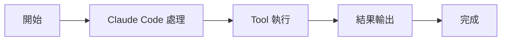

# TodoWriteTool：待辦清單

Tools 工具組

00

# TodoWriteTool：待辦清單

## 它不是普通 checklist，而是會話內任務外顯

`TodoWriteTool` 是 Claude Code 經典的輕量任務管理工具。  
它的作用不是替代正式任務系統，而是讓模型在當前會話裡把工作拆成一串可見的 todo。

你可以把它理解成：

- `TodoWriteTool`：輕量、會話內、快速追蹤
- `TaskCreateTool` 系列：結構化、正式任務系統

## 關鍵原始碼

`tools/TodoWriteTool/TodoWriteTool.ts`：

```
const inputSchema = z.strictObject({
  todos: TodoListSchema().describe('The updated todo list'),
})
```

而真正的狀態寫回是：

```
context.setAppState(prev => ({
  ...prev,
  todos: {
    ...prev.todos,
    [todoKey]: newTodos,
  },
}))
```

這說明它本質上是一個 **AppState 寫入工具**。

## 呼叫鏈





## 實現重點

它有兩個很有意思的設計：

1. 所有 todo 都完成時，會直接把列表清空
2. 如果結束的是一個 3 項以上的複雜任務，而且沒有驗證步驟，會提醒生成 verification nudge

原始碼裡這段很關鍵：

```
if (
  allDone &&
  todos.length >= 3 &&
  !todos.some(t => /verif/i.test(t.content))
) {
  verificationNudgeNeeded = true
}
```

這說明它並不只是“寫清單”，還會在任務收尾時推動更嚴謹的驗證。

## 一次典型使用路徑

1. 使用者給一箇中等複雜任務
2. 模型先寫 3-5 個 todo
3. 每做完一項就更新狀態
4. 最後一項關閉時，如果沒有驗證，會被提醒補驗證

## 它和相鄰工具的關係


## 小結

`TodoWriteTool` 的價值是：

> 用最低成本把模型當前計劃顯式化，並把“做完就清單消失、複雜任務別忘驗證”這種流程約束接進會話狀態。