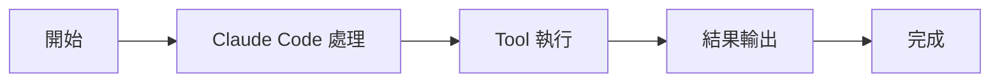
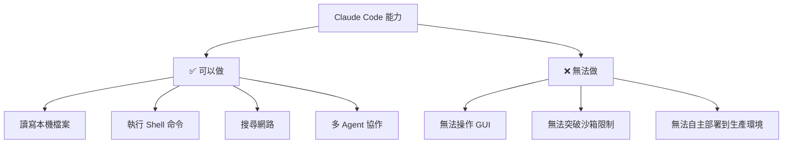

# AskUserQuestionTool：向用戶提問

Tools 工具組

00

# AskUserQuestionTool：向使用者提問

## 這個工具為什麼比“直接問一句話”更高階

很多人第一次看到 `AskUserQuestionTool`，會覺得它不就是“向使用者提問”嗎？  
但在 Claude Code 裡，它其實解決的是一個更深的問題：

> 當模型執行到一半需要補資訊時，如何把“提問”做成正式、結構化、可互動的系統能力，而不是隨手打一句自然語言。

這對於 Agent 產品特別重要，因為它關係到：

- 需求澄清
- 多選決策
- 方案比較
- Plan Mode 中的資訊補全

## 原始碼先看 schema

`tools/AskUserQuestionTool/AskUserQuestionTool.tsx`：

```
const inputSchema = z.strictObject({
  questions: z.array(questionSchema()).min(1).max(4),
  answers: z.record(z.string(), z.string()).optional(),
  annotations: annotationsSchema(),
  metadata: z.object({ source: z.string().optional() }).optional(),
})
```

而單個問題本身也有非常完整的結構：

```
const questionSchema = z.object({
  question: z.string(),
  header: z.string(),
  options: z.array(questionOptionSchema()).min(2).max(4),
  multiSelect: z.boolean().default(false),
})
```

這說明它不是普通聊天，而是一個正式的**表單式互動工具**。

## 它甚至支援選項預覽

`tools/AskUserQuestionTool/prompt.ts` 裡專門定義了 preview 機制：

```
Use the optional `preview` field on options when presenting concrete artifacts that users need to visually compare:
- ASCII mockups of UI layouts or components
- Code snippets showing different implementations
- Diagram variations
```

這很有意思，因為它意味著這個工具並不只是問選擇題，而是已經能支援：

- 方案 A / 方案 B 對比
- UI 草圖對比
- 配置示例對比
- 程式碼實現對比

也就是說，Anthropic 把“互動式澄清”做成了一個產品層能力。

## 一張圖看它在執行流程裡的位置





## 它和 Plan Mode 的關係尤其重要

prompt 檔案裡有一段非常關鍵：

```
Plan mode note: In plan mode, use this tool to clarify requirements or choose between approaches BEFORE finalizing your plan.
Do NOT use this tool to ask "Is my plan ready?" or "Should I proceed?" - use ExitPlanMode for plan approval.
```

### 中文含義

- 在 Plan Mode 裡，如果你還缺需求資訊，先用這個工具補齊
- 但如果你已經寫完計劃，想問“計劃行不行”，那不該再用它
- 這時應該交給 `ExitPlanModeTool`

這段 prompt 很有代表性，因為它說明：

> `AskUserQuestionTool` 不只是問問題，它還承擔工具職責邊界的一部分

## 它會嚴格約束問題結構

原始碼裡還有一個很重要的唯一性校驗：

```
const UNIQUENESS_REFINE = {
  message: 'Question texts must be unique, option labels must be unique within each question'
}
```

也就是說，Claude Code 不允許它胡亂生成重複問題、重複選項。  
這和隨便輸出一段聊天文字完全不同。

Anthropic 很明顯是把這類提問當成“正式使用者互動”，而不是附屬對話。

## 一次典型使用路徑

比如 Claude 在實現功能時發現有兩個方案都成立：

1. 它不應該自己拍腦袋決定
2. 它會用 `AskUserQuestionTool` 把選項列出來
3. 使用者選完後，答案會迴流到主執行緒
4. Claude 再按選中的方向繼續執行

這條路徑和普通聊天最大的不同是：

- 結果可結構化
- 選項可解釋
- 還能附帶 preview

## 一張圖看它和相鄰工具的邊界





也就是說：

- `AskUserQuestionTool`：我還缺資訊，繼續問
- `ExitPlanModeTool`：計劃已經完成，請你審批

這兩個工具不能混用。

## 它為什麼對 Agent 產品特別重要

如果沒有這個工具，模型在遇到歧義時只有兩個糟糕選擇：

1. 自己瞎猜
2. 在自然語言裡隨便問一句

而 Claude Code 的做法是第三種：

> 把提問做成正式互動協議

這會讓系統在幾個方面明顯更穩定：

- 提問更簡潔
- 使用者選擇更清晰
- 後續執行更可控
- 統計與產品迭代更容易

## 最容易誤解它的地方

### 誤解一：這只是個 UI 小工具

不是。  
它實際上是 Claude Code 的“使用者協同介面”。

### 誤解二：所有需要問使用者的事都該用它

也不對。  
計劃審批、許可權申請、某些系統確認有其他專門機制。

### 誤解三：它只是單選題

並不是。  
它支援多問題、多選、註釋、preview。

## 小結

如果你想抓住它的本質，可以記這句話：

> `AskUserQuestionTool` 把“執行中的需求澄清”做成了結構化的產品互動能力，它不是普通聊天問句，而是 Claude Code 主迴圈中的正式協作介面。