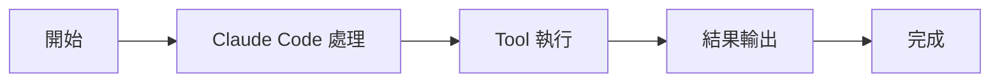

# SkillTool：執行 Skills

Tools 工具組

00

# SkillTool：執行 Skills

## 它不是命令別名，而是技能執行時

很多人第一次看到 `/commit`、`/verify`、`/update-config` 這類 skill，會以為它們只是更長 prompt 的快捷方式。  
但從原始碼看，`SkillTool` 明顯比“文字別名”複雜得多。

它負責的是：

- 找到 skill 對應的 command
- 解析引數
- 處理本地 skill 和 MCP skill
- 必要時 fork 一個子 Agent 去跑

所以更準確的說法是：

> `SkillTool` 是 Claude Code 的技能執行器。

## 關鍵原始碼

`tools/SkillTool/SkillTool.ts`：

```
import {
  builtInCommandNames,
  findCommand,
  getCommands,
} from 'src/commands.js'
import { runAgent } from '../AgentTool/runAgent.js'
```

檔案裡還有一段很關鍵：

```
async function executeForkedSkill(
  command: Command & { type: 'prompt' },
  ...
): Promise<ToolResult<Output>> {
  ...
}
```

這說明 skill 執行並不總在當前執行緒內完成，複雜 skill 可以 fork。

## 呼叫鏈





## 它還相容 MCP skills

原始碼裡專門有一段：

```
async function getAllCommands(context: ToolUseContext): Promise<Command[]> {
  const mcpSkills = context
    .getAppState()
    .mcp.commands.filter(
      cmd => cmd.type === 'prompt' && cmd.loadedFrom === 'mcp',
    )
  ...
}
```

這說明 `SkillTool` 並不只執行本地技能，還能把 MCP 側暴露出來的 prompt skills 統一納入排程。

## 一次典型使用路徑

1. 使用者輸入 `/commit`
2. `SkillTool` 找到這個 skill 的 command
3. skill prompt 被展開
4. 必要時 fork 子 Agent 跑完整流程
5. 結果回到主執行緒

## 它和相鄰工具的關係


## 小結

`SkillTool` 代表 Claude Code 走向平臺化的一步：

> 它把“技能”從普通 prompt 文字提升成了可被系統排程、可 fork、可統計、可擴充套件的正式能力單元。