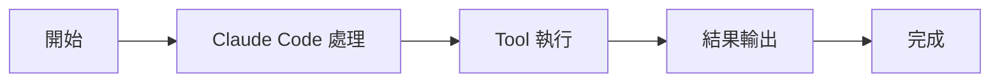

# TaskCreateTool：建立任務

Tools 工具組

00

# TaskCreateTool：建立任務

## 它把待辦項升級成正式任務物件

`TaskCreateTool` 不是簡單往列表裡插一行文字，而是把一個工作項建立成正式任務物件：

- 有 `id`
- 有 `subject`
- 有 `description`
- 有狀態
- 可被後續更新、阻塞、歸屬

這說明 Claude Code 的任務系統已經不是展示層小功能，而是真正的執行時物件系統。

## 關鍵原始碼

```
const taskId = await createTask(getTaskListId(), {
  subject,
  description,
  activeForm,
  status: 'pending',
  owner: undefined,
  blocks: [],
  blockedBy: [],
  metadata,
})
```

隨後它還會執行 hook：

```
const generator = executeTaskCreatedHooks(...)
```

## 呼叫鏈





## 小結

`TaskCreateTool` 代表的是 Claude Code 從“todo 文字”到“正式任務物件”的那一步。