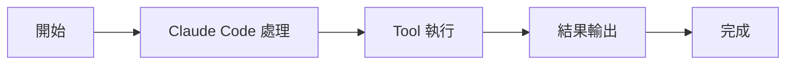

# TaskGetTool：讀取任務

Tools 工具組

00

# TaskGetTool：讀取任務

## 它是任務系統裡的單點查詢入口

`TaskGetTool` 的職責很純粹：按 ID 讀取單個任務。  
但它的重要性在於，它讓主執行緒可以在複雜任務流裡隨時檢查某個任務當前的真實狀態，而不是隻看 UI 記憶。

## 關鍵原始碼

```
const task = await getTask(taskListId, taskId)
```

返回內容除了標題和狀態，還包括：

- `description`
- `blocks`
- `blockedBy`

這說明它查詢的不是“列表項”，而是帶依賴關係的任務物件。

## 呼叫鏈





## 小結

`TaskGetTool` 讓任務系統具備了正式物件查詢能力，而不是隻能看列表摘要。