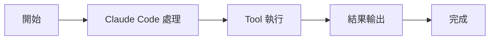

# TaskUpdateTool：更新任務

Tools 工具組

00

# TaskUpdateTool：更新任務

## 它是任務系統的主寫入口

`TaskUpdateTool` 負責修改任務物件本身。  
如果說 `TaskCreateTool` 是建立節點，那 `TaskUpdateTool` 就是任務流真正推進的主幹工具。

## 關鍵原始碼

它支援更新的欄位非常多：

```
const inputSchema = z.strictObject({
  taskId: z.string(),
  subject: z.string().optional(),
  description: z.string().optional(),
  activeForm: z.string().optional(),
  status: TaskUpdateStatusSchema.optional(),
  addBlocks: z.array(z.string()).optional(),
  addBlockedBy: z.array(z.string()).optional(),
  owner: z.string().optional(),
  metadata: z.record(z.string(), z.unknown()).optional(),
})
```

這說明它不只是“改狀態”，而是整個任務物件的維護入口。

## 呼叫鏈





## 小結

`TaskUpdateTool` 是 Claude Code 正式任務系統裡最像“狀態機推進器”的工具。