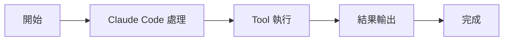

# TaskStopTool：停止任務

Tools 工具組

00

# TaskStopTool：停止任務

## 它負責中斷後臺執行，不是刪除任務記錄

`TaskStopTool` 的目標很明確：  
停止一個正在執行的後臺任務。

這通常對應兩類來源：

- `BashTool` 啟動的後臺 shell
- `AgentTool` 啟動的後臺 agent

## 關鍵原始碼

```
const result = await stopTask(id, {
  getAppState,
  setAppState,
})
```

在此之前它會先校驗：

- 任務存在
- 任務當前確實是 `running`

## 呼叫鏈





## 小結

`TaskStopTool` 給 Claude Code 的後臺執行鏈補上了“中斷”能力，這是正式任務系統不可缺的一環。