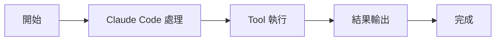

# SendMessageTool：Agent 通訊

Tools 工具組

00

# SendMessageTool：Agent 通訊

## 它是多 Agent 模式下的通訊匯流排

在 Claude Code 的多 Agent 體系裡，普通文字不會自動被其他 teammate 看見。  
所以如果一個 Agent 想通知另一個 Agent、廣播訊息、回覆審批，它必須走 `SendMessageTool`。

這意味著這個工具不是輔助功能，而是多 Agent 系統真正成立的基礎設施。

## 關鍵原始碼

`tools/SendMessageTool/SendMessageTool.ts`：

```
const inputSchema = z.object({
  to: z.string(),
  summary: z.string().optional(),
  message: z.union([z.string(), StructuredMessage()]),
})
```

而 `StructuredMessage` 又支援幾類特殊訊息：

```
type: 'shutdown_request'
type: 'shutdown_response'
type: 'plan_approval_response'
```

這說明它不只是發文字，而是已經支援**協議化訊息**。

## 呼叫鏈





## 它支援的不只是 teammate 名稱

原始碼註釋裡寫得很清楚，`to` 還可能是：

- `*` 廣播
- `uds:<socket-path>`
- `bridge:<session-id>`

這說明 Claude Code 的訊息路由已經不止本地單程序 teammate，而是擴充套件到了 bridge / peer 模式。

## 小結

`SendMessageTool` 的本質是：

> 把多 Agent 協作裡的訊息傳遞做成正式協議，而不是靠模型輸出文字碰運氣。