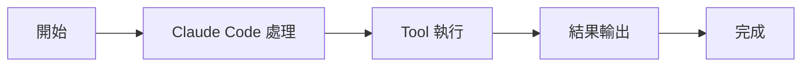

# 權限與安全機制

深入研究

00

# 許可權與安全機制解析：為什麼 Claude Code 不會無腦亂跑

## 真正可用的工程代理，必須先解決安全問題

一旦一個 AI 系統能讀寫檔案、執行命令、訪問外部資源，安全問題就不再是附屬功能，而是主功能的一部分。

Claude Code 在這件事上明顯下了很大功夫。  
從 `ToolPermissionContext`、許可權請求元件、規則過濾邏輯都能看出來，它不是事後補丁式安全，而是架構級安全。

## 許可權不是單點判斷，而是多層控制

從原始碼結構看，Claude Code 的許可權體系至少有幾層：

- 當前 permission mode
- always allow / deny / ask 規則
- 工具級過濾
- 特定場景下自動拒絕或避免彈窗
- 對危險規則的剝離

也就是說，系統不是隻有“執行前問一下”這麼簡單。

## 許可權系統在架構裡分佈得很散，但目標很集中

你會在多個位置看到許可權相關程式碼：

- `ToolPermissionContext`
- 各類 permission request 元件
- 工具過濾邏輯
- 某些自動模式與避免彈窗邏輯

雖然實現分散，但目標始終一致：

> 在不犧牲自動化價值的前提下，把危險動作控制在可接受範圍內。

## 有些工具甚至不會先暴露給模型

這是很關鍵的一點。  
`tools.ts` 中的過濾邏輯說明，某些工具會在模型看到它們之前就先被剔除。

這意味著安全策略不只是執行時攔截，還包括：

- 能力暴露控制
- 工具可見性控制
- 環境級可用性控制

這比單純在工具執行時做確認要更穩。

## 許可權系統為什麼這麼重要

因為 Claude Code 的風險不是“說錯一句話”，而是“做錯一個動作”。  
例如：

- 在錯誤目錄寫檔案
- 執行危險命令
- 修改不該動的工作區
- 在後臺任務裡越權訪問

所以越強的工具系統，越需要強的許可權系統配套。

## 為什麼這套機制對多 Agent 場景更重要

一旦系統支援子 Agent、後臺任務、遠端連線，許可權問題會立刻變複雜：

- 誰可以彈許可權框
- 誰只能自動拒絕
- 哪些動作能在後臺執行
- 哪些規則必須前置生效

Claude Code 對這些問題明顯有預判，所以許可權上下文設計得比較完整。

## 它的設計目標不是完全自動，而是“可控自動”

從這些程式碼能看出，Claude Code 的目標並不是把使用者完全踢出流程。  
更準確地說，它追求的是：

- 能自動推進任務
- 但關鍵動作要可約束
- 在不同模式和上下文下，許可權策略能靈活調整

這就是一個真正工程產品的思路，而不是實驗性 demo 的思路。

## 小結

Claude Code 不會無腦亂跑，不是因為模型天然謹慎，而是因為系統在工具暴露、呼叫審批、模式控制和規則匹配上都做了大量設計。

這也是為什麼它能把“Agent 執行動作”真正帶進工程工作流裡。