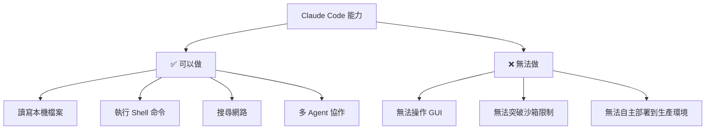

# Claude Code 的邊界與局限

深入研究

00

# 從原始碼看 Claude Code 的產品邊界與侷限

## 看原始碼不只是為了讚歎，也要看邊界

Claude Code 很強，但研究一個系統如果只看它“做到了什麼”，很容易失真。  
更有價值的做法，是同時看它：

- 為什麼強
- 為什麼要這麼複雜
- 它的邊界和代價是什麼

## 第一條邊界：它依然高度依賴工具與上下文

從原始碼能看到，Claude Code 的很多能力來自：

- 工具系統
- 上下文注入
- 許可權與狀態管理
- MCP / LSP / 外掛擴充套件

這說明它的強，不是憑模型裸奔得來的。  
反過來說，如果這些配套能力缺位，它的表現也會明顯下降。

也就是說，它不是“換個模型就能複製”。

## 第二條邊界：複雜度非常高

只看幾個核心檔案你就能感受到：

- `main.tsx` 極重
- `commands.ts` 極長
- `AppState` 很複雜
- Bash / 許可權 / 遠端能力都有大量細節

這說明 Claude Code 的代價之一，就是系統複雜度很高。  
高複雜度帶來的問題包括：

- 維護成本高
- 心智負擔重
- 功能之間更容易相互影響

## 第三條邊界：安全不是可選項，而是持續負擔

越強的工具，越需要強的許可權治理。  
這點在 Claude Code 上尤其明顯，因為它要面對：

- 檔案修改
- Shell 執行
- 遠端控制
- 多 Agent 任務

也就是說，Claude Code 的一個長期成本，就是必須不斷維護安全邊界。

## 第四條邊界：不是所有問題都值得交給它

從架構上看，Claude Code 很適合：

- 工程任務拆解
- 跨檔案理解和修改
- 在專案上下文中持續推進工作

但它未必適合：

- 極簡單的一次性問答
- 完全沒有可執行環境的純討論
- 缺乏明確邊界的開放式探索

也就是說，Claude Code 強在“工程閉環”，不一定強在所有互動形態。

## 第五條邊界：產品能力和組織能力繫結得很深

像下面這些能力都說明 Claude Code 並不輕：

- Remote Session
- MCP
- LSP
- Plugins
- Skills
- Plan Mode
- Multi-Agent

這意味著它不只是一個技術產品，更像一個長期演化的平臺。  
平臺的好處是上限高，代價是決策和維護都更重。

## 這也是為什麼它很難被“快速復刻”

很多人看到 Claude Code，會覺得“無非就是模型 + tools”。  
但從原始碼看，這種判斷明顯低估了它。

真正難的不是把工具接進去，而是把下面這些同時做穩：

- 工具協議統一
- 上下文治理
- 許可權系統
- 狀態系統
- 遠端和任務能力
- UI 與審批流程

## 小結

從原始碼看，Claude Code 的產品邊界可以總結成一句話：

> 它強在工程閉環與平臺化能力，但代價是系統複雜度、安全治理負擔和執行時裝配成本都非常高。

這也是理解它時必須同時看到的另一面。