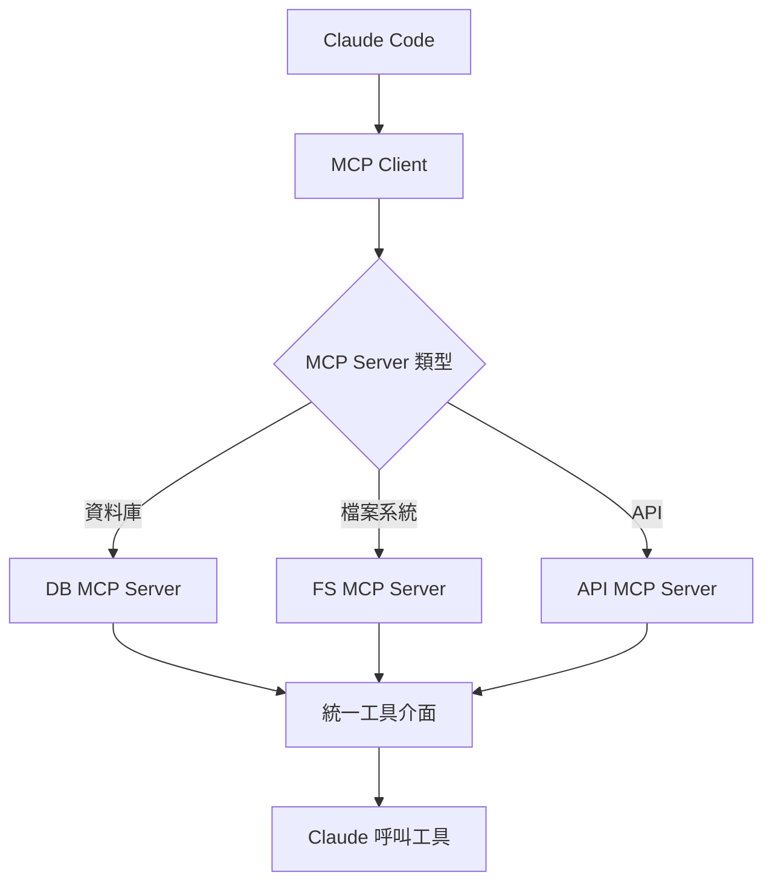

# MCP 與 LSP 整合

擴充套件能力

00

# MCP 與 LSP 整合

## 先記住一句話

如果說 Claude Code 的內建工具解決的是“我自己會什麼”，  
那 MCP 解決的就是“我還能接入誰”。

很多人第一次接觸 MCP，會把它理解成“外掛協議”。

這個理解不能算錯，但太淺了。  
從 Claude Code 原始碼來看，MCP 更像一層 **外部能力接入匯流排**：

- 外部工具可以接進來
- 外部資源可以接進來
- 外部 prompts 可以接進來
- 外部 skills 也可以接進來

真正重要的不是“又多了幾個工具”，而是 **Claude Code 的能力邊界可以在執行時被重新擴充套件**。

## Claude Code 裡的 MCP，不只是調一個 server

從原始碼看，Claude Code 對 MCP 做的事情遠比“連上一個 server”多。

`services/mcp/client.ts` 負責的是完整的 MCP 客戶端層，裡面至少覆蓋了這些事：

- 不同傳輸方式的連線
- OAuth 和認證重新整理
- tools/list 拉取
- resources/list 拉取
- prompts/list 拉取
- 工具呼叫時的重試和互動
- 資源工具注入
- MCP skills 拉取

也就是說，Claude Code 不是把 MCP 當成一個外圍外掛，而是直接把它放進主執行時裡。

## Claude Code 支援哪些 MCP 連線方式

原始碼裡的配置型別能看到，Claude Code 支援不止一種 MCP 連線方式：

- `stdio`
- `sse`
- `http`
- `ws`
- 還有給 IDE 和內部場景預留的幾種特殊型別

對普通使用者來說，可以簡單理解成三大類：

1. 本地子程序 MCP  
   比如你在本機啟動一個 MCP server，Claude Code 透過標準輸入輸出跟它通訊。
2. 遠端 HTTP MCP  
   Claude Code 直接去連一個遠端 MCP 服務。
3. 遠端 WebSocket MCP  
   更適合持續連線、持續互動的場景。

這點很關鍵。  
它說明 MCP 在 Claude Code 裡不是“只支援本地玩具 server”，而是從一開始就按真實接入場景設計的。

## MCP 接入後，最核心的一步是什麼

最核心的一步是：**標準化。**

MCP server 暴露出來的原始能力，Claude Code 不會直接丟給模型。  
它會先做一次“翻譯”。

比如在 `fetchToolsForClient()` 裡，Claude Code 會先請求：

- `tools/list`

然後把每個 MCP 工具包裝成統一的 `Tool` 結構。  
這一步之後，MCP 工具和內建工具在執行時裡就基本站到同一個層面了。

你可以把這一步理解成：

> Claude Code 先把“外部世界的能力”，翻譯成“自己執行時能理解的能力”。

這就是為什麼模型眼裡，很多 MCP 工具和內建工具看起來沒有本質區別。

## 它接進來的不只是工具

很多文章講 MCP，只講工具呼叫。  
但 Claude Code 原始碼裡更有意思的一點是：它明顯把 MCP 看成了 **多種能力的統一入口**。

除了 `tools/list`，它還會拉：

- `resources/list`
- `prompts/list`

而且當伺服器支援 resources 時，Claude Code 還會額外把兩個內建橋接工具塞進當前工具集：

- `ListMcpResourcesTool`
- `ReadMcpResourceTool`

這兩個工具的意義很大，因為它們把“資源”也變成了模型能主動訪問的物件。

簡單說：

- 工具：可以執行動作
- 資源：可以讀取外部資料
- prompts：可以提供外部提示模板

這比“外掛提供幾個 API”要高階得多。

## ListMcpResourcesTool 和 ReadMcpResourceTool 在幹什麼

這是原始碼裡一個很值得講的細節。

Claude Code 沒有讓模型直接跟 `resources/list`、`resources/read` 協議打交道，  
而是自己做了一層橋接。

### ListMcpResourcesTool

它負責列出當前所有已連線 MCP server 暴露出來的資源。  
如果你指定了某個 server，就只列那個 server 的資源。

它的作用很像：

- 先看都有什麼可讀資源
- 再決定下一步讀哪個

### ReadMcpResourceTool

它負責真正讀取指定資源。

這個工具有個很工程化的細節：  
如果資源內容是二進位制 blob，它不會把一大坨 base64 直接塞回上下文，而是先落盤，再把路徑和說明返回。

這說明 Claude Code 在設計 MCP 時，不只是為了“協議打通”，還在認真處理上下文大小和結果可用性問題。

## MCP 能力不是固定的，它會動態重新整理

這是 Claude Code 裡很有料的一個實現點。

很多人以為：

- 啟動時連上 MCP
- 拉一遍工具
- 後面就結束了

但 Claude Code 不是這樣。

在 `useManageMCPConnections.ts` 裡，它專門監聽：

- `tools/list_changed`
- `prompts/list_changed`
- `resources/list_changed`

一旦 MCP server 說“我的能力變了”，Claude Code 就會重新整理本地快取，把新的工具、prompts、resources 重新拉進來。

更進一步，在 `query.ts` 裡，主迴圈每輪之間還會執行一次 `refreshTools()`，這樣**新接入的 MCP server 可以在下一輪立刻變成可用工具**。

這意味著什麼？

這意味著 Claude Code 的能力圖譜不是啟動時寫死的，  
而是**會隨著 MCP server 狀態變化而動態更新**。

這比“靜態外掛列表”強很多。

## MCP Skills 為什麼值得單獨講

在 Claude Code 原始碼裡，MCP skills 也屬於 MCP 生態的一部分。

但它和本地 skills 有一個重要區別：

> MCP skills 被明確當成遠端且不可信內容來處理。

在 `loadSkillsDir.ts` 裡有一句非常關鍵的註釋：

- MCP skills are remote and untrusted
- never execute inline shell commands

這句話的意思很直白：

- 本地 skill 裡的某些動態能力可以展開執行
- 但 MCP skill 不行

為什麼？

因為本地 skill 是你機器上的內容，  
MCP skill 則可能來自遠端 server。

Claude Code 在這裡明顯做了安全邊界區分。

所以如果你要一句話理解：

> Claude Code 不是簡單地“支援 MCP skills”，而是支援它，同時明確降低它的信任級別。

這是很成熟的執行時思路。

## MCP 還有一個容易被忽略的點：使用者互動是協議化的

原始碼裡還有 `Elicitation` 相關邏輯。

它解決的問題是：  
如果 MCP server 在執行過程中需要使用者補充資訊，怎麼辦？

比如：

- 需要登入授權
- 需要確認某個操作
- 需要補一個引數

Claude Code 沒有把這些情況寫成一堆 server-specific if/else，  
而是讓 MCP server 透過協議提出互動請求，客戶端統一接管。

所以從產品體驗上看，你會覺得：

- 明明是外部 server
- 但互動過程還是很像 Claude Code 自己的一部分

這背後就是協議化帶來的好處。

## 那 LSP 在這裡扮演什麼角色

LSP 這一條線沒有 MCP 那麼“開放生態”，但也很重要。

MCP 更像是：

- 讓 Claude Code 接入外部系統
- 接入外部資源
- 接入外部工具

LSP 更像是：

- 讓 Claude Code 接入語言伺服器
- 拿到診斷、符號、引用、語義資訊

也可以簡單理解成：

- **MCP 是向外擴能力**
- **LSP 是向內補語義**

## Claude Code 為什麼這麼重視 MCP

因為做 Agent 到最後，真正限制能力上限的，往往不是模型本身，而是：

- 能不能接公司內部系統
- 能不能接外部知識和資源
- 能不能把新能力無縫注入當前會話

MCP 正好解決的就是這件事。

它讓 Claude Code 從“我會這些內建能力”變成：

> 我可以在執行時把更多能力接進來，而且還能用統一方式交給模型使用。

這就是 Claude Code 走向平臺化最明顯的標誌之一。

## 小結

理解 Claude Code 裡的 MCP，最重要的是抓住這 4 句話：

1. MCP 接進來的不只是工具，還有資源、prompts 和 skills。
2. Claude Code 會把這些外部能力統一翻譯成自己的執行時物件。
3. MCP 能力不是靜態的，server 變了，會話能力也會動態重新整理。
4. Claude Code 對 MCP 不是“能接就接”，而是帶著許可權、快取、互動和安全邊界去接。

最後用一句最簡單的話收住：

- **MCP**：把外部世界接進 Claude Code
- **LSP**：把語言智慧接進 Claude Code