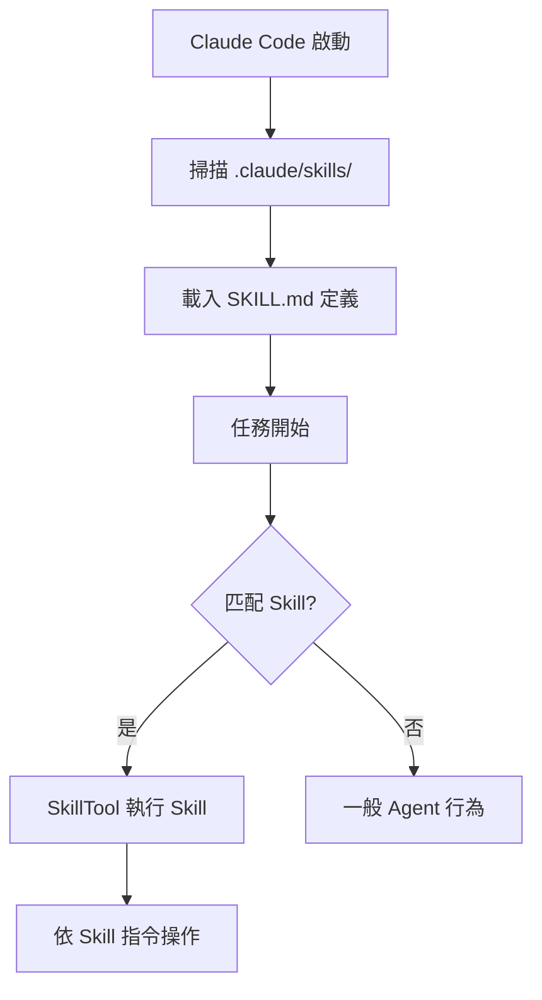

# 插件、Skills 與 Agent

擴充套件能力

00

# 外掛、Skills 與 Agent 派生：Claude Code 如何走向平臺化

## 一個成熟系統不會只靠內建功能成長

如果 Claude Code 只依靠官方內建能力，那它最多是一個很強的產品。  
但從原始碼目錄看，它已經在向另一個方向演化：**平臺化**。

最明顯的訊號有三類：

- 外掛系統
- Skills 系統
- Agent / Team / 子任務能力

## 外掛：把能力裝配交給生態

原始碼裡能看到不少和外掛有關的模組：

- 外掛載入
- 命令注入
- 外掛技能
- 市場與安裝管理
- 外掛錯誤與重新整理機制

這說明外掛不是“外掛指令碼”，而是被正式納入會話能力圖譜裡的。

## 外掛、Skills、Agent 三者不是並列替代關係

它們解決的問題並不一樣：

- 外掛解決“系統如何長出新能力”
- Skills 解決“經驗如何被複用”
- Agent 派生解決“任務如何被分工”

把這三條線放在一起看，平臺化方向就非常明顯。

## Skills：把經驗和流程顯式化

Skills 的意義很容易被誤解。  
它不只是“額外說明文件”，更像是把一些專業經驗、約束和工作流包裝成可注入的能力單元。

這樣做的價值是：

- 把某類任務經驗固化下來
- 減少每次臨時寫 prompt 的成本
- 讓系統在特定領域更穩定

## Skills 為什麼對 AI 程式設計很關鍵

因為很多開發場景的問題，不是模型“不會寫程式碼”，而是模型：

- 不知道團隊習慣
- 不知道該遵循什麼流程
- 不知道某類任務的最佳實踐

Skills 正好在補這部分。

從產品角度看，這相當於把“提示詞工程”進一步產品化了。

## Agent 派生：把單執行緒助手變成協作系統

工具目錄裡能看到很多和 Agent、Team、SendMessage、Task 相關的模組。  
這意味著 Claude Code 正在往多角色、多工協作方向延伸。

這類能力的本質，是把原本只能序列完成的任務拆成：

- 領導執行緒
- 子 Agent
- 獨立任務
- 訊息傳遞

一旦走到這一步，系統的形態就不再只是“一個助手”，而更像“一個協作型 Agent 平臺”。

## 為什麼說這是平臺化，而不是功能堆砌

判斷一個系統是不是平臺化，關鍵不在於功能多不多，而在於：

- 能力能不能被擴充套件
- 經驗能不能被複用
- 任務能不能被分派
- 外部生態能不能接入

Claude Code 在這幾個方向上都已經有了明顯結構，所以它的演化方向很清晰。

## 小結

外掛、Skills 與 Agent 派生這三條線放在一起看，會得到一個非常明確的判斷：

> Claude Code 正在從“強大的 AI 程式設計工具”逐步變成“可擴充套件的工程智慧體平臺”。

這也是為什麼它的原始碼研究價值遠大於一個普通 CLI 工具。