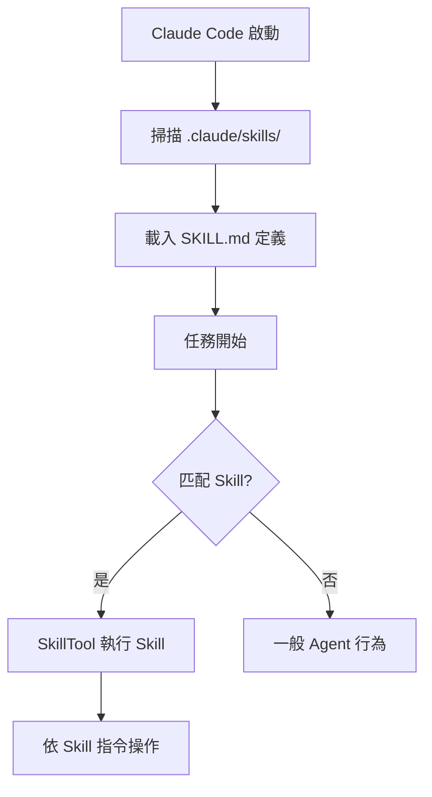
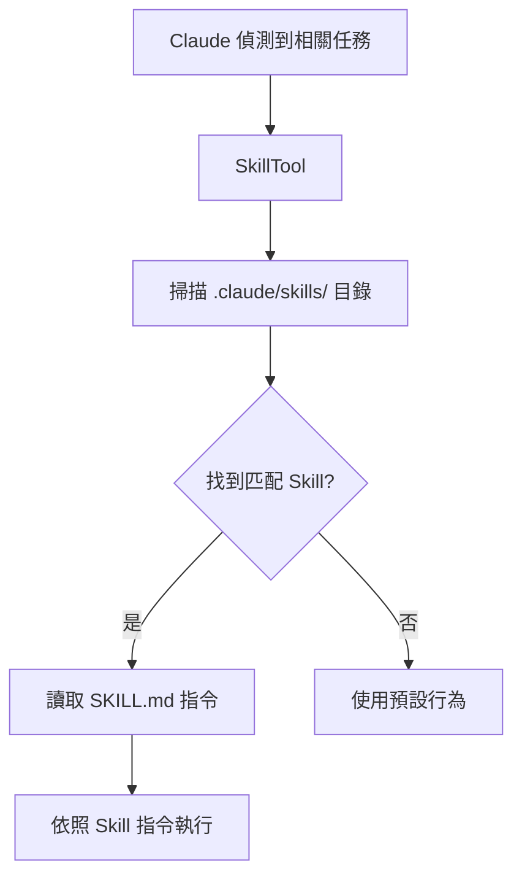

# Claude Code 的 Skills 系統

擴充套件能力

00

# Claude Code 的 Skills 系統

## 很多人把 Skill 想簡單了

第一次接觸 Claude Code 的人，通常會把 Skill 理解成：

- 一段寫好的 Prompt
- 一個 Slash Command 別名
- 或者一份放在倉庫裡的說明文件

這些理解都沾邊，但都不完整。

從原始碼看，Claude Code 裡的 Skill 更準確的定義是：

> 一套可以被系統載入、被模型發現、再由 `SkillTool` 正式執行的技能模組。

也就是說，Skill 不是普通文件。  
它在 Claude Code 裡有自己的載入鏈路、發現鏈路和執行鏈路。


## 先從直覺上理解：Skill 到底解決什麼問題

Claude Code 已經有很多工具了，為什麼還要單獨做一套 Skills？

因為很多複雜任務的問題，並不是“工具不夠”，而是模型不知道：

- 這類任務應該按什麼步驟做
- 這個團隊平時遵循什麼規則
- 某個場景下應該優先用哪些工具
- 哪些坑要提前避開

舉個很典型的例子：

- “幫我提交程式碼” 不是一個簡單命令
- “做一輪安全審計” 也不是一個單步動作
- “去線上排查問題” 更不是一句 Prompt 就能穩定完成的事

這些任務真正需要的是一套流程。  
而 Skill 乾的事情，就是把這套流程固化下來。

## 一個 Skill 檔案裡通常會寫什麼

Skill 最常見的載體就是 `SKILL.md`。  
Claude Code 會先讀 frontmatter，再讀正文內容。

frontmatter 裡常見的東西有：

- `description`
- `whenToUse`
- `allowedTools`
- `model`
- `context`
- `hooks`

正文部分則是這項技能真正的操作說明。

你可以把它理解成：

- frontmatter 負責告訴系統“這是什麼技能”
- 正文負責告訴模型“這個技能具體要怎麼做”

## 第一步：Claude Code 怎麼載入 Skills

原始碼裡真正負責這件事的核心檔案是 `skills/loadSkillsDir.ts`。

它做的事情並不複雜，但很工程化：

1. 去多個目錄掃描 `skills`
2. 找到每個 Skill 對應的 `SKILL.md`
3. 解析 frontmatter
4. 把它轉成內部的 `Command`
5. 放進當前 session 的可用 Skill 列表





原始碼裡能看到非常直接的一組函式：

```
parseSkillFrontmatterFields(...)
createSkillCommand(...)
getSkillDirCommands(...)
```

這幾個名字已經把邏輯說得很清楚了：

- 先解析欄位
- 再建立 Skill 對應的 command
- 最後統一返回這批 command

所以 Skill 在 Claude Code 內部的身份，不是“額外附件”，而是命令系統裡的一等成員。

## Skills 從哪些地方載入

`getSkillDirCommands()` 會從多個位置收集 Skills。

你不用死記具體路徑，理解優先順序就夠了：

- 平臺或策略下發的 Skills
- 使用者自己的 Skills
- 專案裡的 `.claude/skills`
- 額外指定目錄裡的 Skills
- 相容舊版 `commands` 目錄裡的 Skill 形式

這意味著 Skill 既可以是：

- 官方內建經驗
- 團隊共享經驗
- 個人工作流
- 某個專案專屬規則

這也是它比“普通 Prompt 收藏夾”強很多的地方。  
它從一開始就不是隻為個人設計的，而是帶著組織級複用能力去做的。

## Claude Code 不會一上來把所有 Skill 正文都塞給模型

這裡有個特別關鍵的設計。

很多人會以為：既然 Skills 已經載入進來了，那 Claude Code 每輪都把這些 Skill 全發給模型不就好了？

它沒有這麼做。

更合理的做法是：

- 先把 Skill 的名字、簡介、適用場景暴露出來
- 讓模型知道“有哪些技能可用”
- 等模型真的決定呼叫某個 Skill，再把完整內容展開進去

這就是“發現”和“執行”分離。

原始碼裡這一層的痕跡很明顯：

- `skill_discovery`
- `discoveredSkillNames`
- `invoked_skills`

`utils/messages.ts` 裡甚至直接把 skill discovery 變成一條系統提醒：

```
`Skills relevant to your task:\n\n${lines.join('\n')}\n\n` +
`These skills encode project-specific conventions. ` +
`Invoke via Skill("<name>") for complete instructions.`
```

這段提示說明得非常直接：

> 先告訴模型“這些 Skills 和你當前任務相關”，真正完整的說明，要等呼叫 `Skill(...)` 之後再展開。

## 第二步：模型是怎麼“發現” Skill 的

你可以把這一層理解成“推薦技能”。

當 Claude Code 判斷當前任務和某些 Skill 匹配時，它不會直接強塞一整篇 Skill 文字，而是先給模型一個簡短提示：

- 這個 Skill 叫什麼
- 它適合解決什麼問題
- 如果需要，應該透過 `SkillTool` 去呼叫它


這樣做有兩個好處：

1. 節省上下文
2. 讓模型只在真正需要時才進入某個 Skill 的詳細流程

這就是 Claude Code 的一貫風格：

> 先暴露能力概覽，再按需展開細節。

## 第三步：真正執行 Skill 的是 `SkillTool`

Skill 最終不是自動執行的。  
真正負責執行它的，是 `tools/SkillTool/SkillTool.ts`。

這個工具乾的事情大概可以概括成五步：

1. 根據名字找到對應 Skill
2. 校驗它是不是合法的 prompt 類 command
3. 檢查許可權規則
4. 展開 Skill 的完整內容
5. 決定是 inline 執行還是 fork 執行





原始碼裡最關鍵的兩個點非常清楚：

```
async function getAllCommands(context: ToolUseContext): Promise<Command[]> {
  const mcpSkills = context
    .getAppState()
    .mcp.commands.filter(
      cmd => cmd.type === 'prompt' && cmd.loadedFrom === 'mcp',
    )
  ...
}
```

這說明 `SkillTool` 找 Skill 時，不只看本地 Skill，連 MCP 暴露出來的 Skill 也一起納入查詢。

另一個關鍵點是：

```
async function executeForkedSkill(...) {
  ...
  for await (const message of runAgent({...})) {
    ...
  }
}
```

這說明 Skill 真正複雜起來時，不一定在主執行緒裡直接跑，完全可以 fork 成一個子 Agent 去執行。

## inline 和 fork，到底區別在哪

這是 Skills 系統裡最值得記住的一個點。

### `inline`

預設模式通常更接近這個。

意思是：

- Skill 內容直接展開到當前主流程
- 主 Agent 看完這套說明後，繼續在當前上下文裡往下做

適合：

- 比較輕量的流程
- 只是想補一段規則
- 不需要額外隔離上下文的任務

### `fork`

這是 Claude Code Skills 真正有意思的地方。

一旦某個 Skill 比較複雜，它可以不汙染當前主流程，而是：

- 開一個新的子 Agent
- 把 Skill 流程交給子 Agent 跑
- 子 Agent 跑完再把結果返回來

這樣做的好處非常實際：

- 主流程上下文更乾淨
- 複雜技能更容易隔離
- 某個 Skill 跑偏了，不會把整個主執行緒帶亂


所以你會發現：

> Claude Code 裡的 Skill，不只是“更長的 Prompt”，而是“可以在需要時開子 Agent 執行的一段流程”。

## Skills 和普通 Prompt 的區別

這個問題很關鍵。

如果只是臨時寫一段 Prompt，它的特點是：

- 這次會話裡有效
- 下次還得重新寫
- 系統並不知道它是什麼能力

但 Skill 不一樣。

Skill 是：

- 可儲存的
- 可複用的
- 可被系統載入的
- 可被模型發現的
- 可被 `SkillTool` 正式執行的

所以你可以把它理解成：

- Prompt 是一次性說明
- Skill 是固化下來的流程模組

## 為什麼說 Skills 是 Claude Code 平臺化的重要一步

因為 Skill 解決的不是“模型能力不夠”，而是“經驗不好複用”。

很多團隊真正想沉澱的東西並不是一個工具，而是：

- 某類任務應該怎麼做
- 某個倉庫要遵循什麼規範
- 某個流程裡先後順序是什麼
- 某種場景下該呼叫哪些工具

這些東西寫成文件，模型不一定會主動遵守。  
但做成 Skill，系統就能把它變成一項正式能力。

這就是它最值錢的地方。

## 小結

一句話總結：

> Claude Code 的 Skills，不是幾篇 Markdown 提示詞，而是一套“先載入、再發現、最後由 SkillTool 執行”的技能執行時。

理解了這一點，你就知道為什麼 Skills 在 Claude Code 裡不是邊角料，而是平臺化能力的一部分。