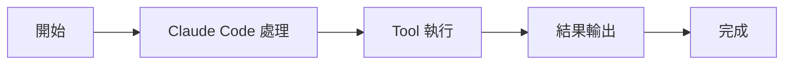

# 多 Agent 與子任務機制

擴充套件能力

00

# Claude Code 的多 Agent 與子任務機制

## 它早就不只是單執行緒助手了

如果只把 Claude Code 看成“一個主對話方塊裡的模型”，你會錯過它很重要的一條演化方向：  
它已經明顯在支援多 Agent、子任務和協作型執行。

從原始碼能看到幾個非常關鍵的訊號：

- `AgentTool`
- `SendMessageTool`
- `TeamCreateTool`
- `TaskCreateTool`
- `agentNameRegistry`
- `viewingAgentTaskId`

這已經不是單執行緒工具的思路了。

## 先看它在工具層的入口

```
export function getAllBaseTools(): Tools {
  return [
    AgentTool,
    ...
    ...(isTodoV2Enabled()
      ? [TaskCreateTool, TaskGetTool, TaskUpdateTool, TaskListTool]
      : []),
    getSendMessageTool(),
    ...(isAgentSwarmsEnabled()
      ? [getTeamCreateTool(), getTeamDeleteTool()]
      : []),
  ]
}
```

這段程式碼最重要的結論是：

> 多 Agent 能力不是隱藏實驗，而是被當成正式工具體系的一部分。

## 先看結構圖





## 狀態層已經為多 Agent 預留了很多位置

來看 `AppStateStore.ts` 裡的片段：

```
tasks: { [taskId: string]: TaskState }
agentNameRegistry: Map<string, AgentId>
foregroundedTaskId?: string
viewingAgentTaskId?: string
```

這幾個欄位很能說明問題：

- 系統內部有統一的任務表
- Agent 可以按名字註冊和路由
- 某個任務可以被 foreground
- 還可以單獨檢視某個 Agent 的轉錄

這說明 UI 層和執行時層都已經接受了“不是隻有一個主執行緒”的事實。

## 為什麼要做多 Agent

因為複雜工程任務經常天然可拆分，例如：

- 一個 Agent 查程式碼結構
- 一個 Agent 跑測試和日誌
- 一個 Agent 處理某個子模組
- 主執行緒最後彙總

如果所有事情都塞給一個上下文視窗，效率和穩定性都會下降。

## 它的本質不是“幾個模型聊天”，而是任務分工


也就是說，多 Agent 機制的目標不是炫技，而是把複雜任務拆成更穩定的小塊。

## 為什麼這裡一定要和狀態系統繫結

只要有多個 Agent，就會立刻出現這些問題：

- 哪個任務正在前臺顯示
- 哪個 Agent 正在被檢視
- 名稱如何路由到具體 Agent
- 任務怎麼暫停、恢復、後臺化

所以多 Agent 能力不可能只寫在工具層裡，它一定會深入狀態管理。

## 小結

Claude Code 的多 Agent 與子任務機制說明了一件事：

> 它已經不滿足於做一個單執行緒開發助手，而是在向“任務可拆分、角色可協作”的智慧體執行平臺演化。

這也是它和普通程式碼生成器越來越不一樣的地方。