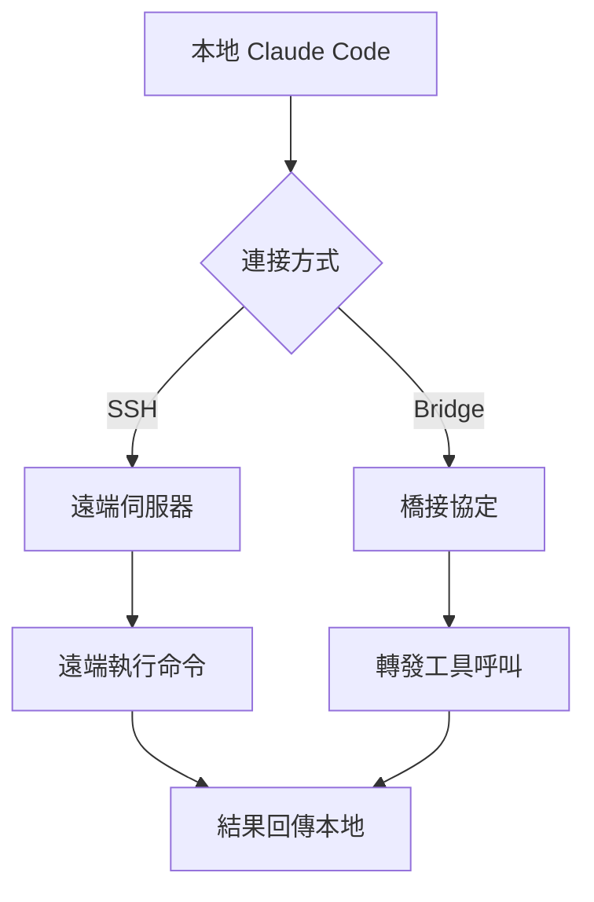

# 遠端會話與橋接能力

擴充套件能力

00

# Claude Code 的遠端會話與橋接能力

## 終端在本地，不代表執行一定在本地

從很多人的直覺看，Claude Code 是一個本地終端工具。  
但原始碼很清楚地表明，它已經內建了不少遠端能力：

- remote session
- direct connect
- bridge / remote-control
- SSH 相關流程

這意味著它的 UI、執行位置和會話位置可以分離。


## 先看入口層就知道這不是邊緣功能

`main.tsx` 裡直接有這些匯入：

```
import { createRemoteSessionConfig } from './remote/RemoteSessionManager.js';
import { createDirectConnectSession, DirectConnectError } from './server/createDirectConnectSession.js';
```

這說明遠端能力不是後面某個外掛臨時加的，而是入口層就正式考慮的執行形態。

## 先看遠端能力關係圖





## 狀態層已經明確建模了遠端狀態

在初始化 AppState 的時候，可以看到一整組遠端欄位：

```
remoteSessionUrl: undefined,
remoteConnectionStatus: 'connecting',
remoteBackgroundTaskCount: 0,
replBridgeEnabled: fullRemoteControl || ccrMirrorEnabled,
replBridgeExplicit: remoteControl,
replBridgeOutboundOnly: ccrMirrorEnabled,
replBridgeConnected: false,
replBridgeSessionActive: false,
replBridgeReconnecting: false,
replBridgeConnectUrl: undefined,
replBridgeSessionUrl: undefined,
replBridgeEnvironmentId: undefined,
replBridgeSessionId: undefined,
replBridgeError: undefined,
```

看到這一組欄位，基本可以確定兩件事：

1. 遠端能力已經不是一次性請求，而是長期連線狀態
2. 系統要處理連線、活躍、重連、橋接、環境 ID 等完整生命週期

## 為什麼 Claude Code 要做遠端

因為現實工程環境經常不是“本地終端 + 本地倉庫 + 本地執行”這麼簡單。

常見需求包括：

- 在遠端容器裡執行
- 在伺服器環境裡執行工具
- 用本地 UI 控制遠端 Agent
- 將任務交給遠端繼續跑

這些需求一旦出現，本地 REPL 就不夠了。

## 這會帶來什麼架構複雜度

一旦引入遠端能力，系統立刻要處理：

- 本地狀態和遠端狀態同步
- 遠端任務數統計
- 連線掉線與重連
- 許可權判斷在本地還是遠端
- 訊息流如何適配回本地 UI

這就是為什麼遠端相關程式碼會分散在：

- `main.tsx`
- `remote/*`
- `hooks/useRemoteSession.ts`
- `BridgeDialog`
- 各類 session manager

## 遠端會話和橋接不是一回事

一個直觀理解是：

- **Remote Session**：會話執行在遠端
- **Bridge / Remote Control**：本地會話和外部控制通道橋接


兩者都屬於“本地 UI 和執行位置分離”的範疇，但語義不完全相同。

## 小結

Claude Code 的遠端會話與橋接能力說明了一點：

> 它正在從“本地終端工具”擴充套件成“本地 UI + 多執行環境”的混合系統。

這一步非常關鍵，因為它決定了 Claude Code 不只是個人開發玩具，而可以進入更復雜的真實環境。