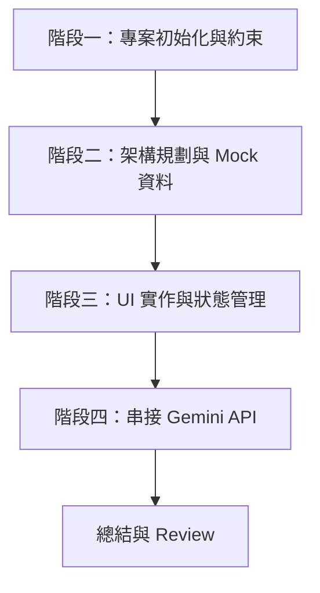

# 專案實戰：會議錄音轉逐字稿網站

在上一篇的貪食蛇實戰中，我們體驗了如何用 Claude Code 小步快跑完成一個純前端遊戲。本課程將難度升級，結合前述的 **Claude Code 進階工作流**與**核心命令**，帶你實戰開發一個結合外部 AI 模型（Gemini API）的「單頁會議錄音轉逐字稿網站」。我們將繼續貫徹「先規劃、分批實作、驗證後提交」的最佳實踐，確保在複雜需求下程式碼依然受控。

---

## 專案需求總覽

**技術棧**：React (單頁應用) + Tailwind CSS
**AI 模型**：Gemini API (`gemini-2.5-flash-preview-09-2025`)

### 核心功能需求

1.  **上傳會議錄音檔**
    -   支援拖曳上傳（Drag & Drop）。
    -   限制格式（mp3, wav, m4a）與大小（最大 20MB），若不符需顯示錯誤訊息。
    -   顯示上傳進度條、音檔名稱、大小與長度。
2.  **轉錄與狀態處理**
    -   輸入 Google API Key 欄位。
    -   開始轉錄按鈕與處理中 Loading 動畫。
    -   頁面切換：上傳頁與結果頁。
    -   使用 `localStorage` 儲存最近一次結果。
3.  **結果展示與操作（卡片式 UI）**
    -   **Summary 摘要**：顯示會議重點。
    -   **SRT 字幕**：標準 SRT 格式。
    -   **Detailed Transcript 逐字稿**：包含說話者 (無法辨識時顯示 Speaker 1/2)、時間區間、Original Transcript 與 Semantic Correction。
    -   一鍵複製各區塊內容，並支援下載 SRT。

---

## 開發工作流規劃

這是一個中型專案，我們將使用 [進階使用經驗分享](04_Claude_Code_進階使用經驗分享.md) 中的工作流，將任務拆解為四個階段：



---

## 階段一：專案初始化與約束定義

首先，我們需要建立專案並寫好 `CLAUDE.md`，讓 Claude Code 知道開發規範（參考：[如何寫好 CLAUDE.md](03_如何寫好_CLAUDE.md.md)）。

### 1. 建立專案
在你的終端機執行：
```bash
# 使用 Vite 建立 React 專案
npm create vite@latest transcript-app -- --template react
cd transcript-app
npm install
# 安裝 Tailwind CSS
npm install -D tailwindcss postcss autoprefixer
npx tailwindcss init -p
# 啟動 Claude Code
claude
```

### 2. 建立專案約束（Prompt）
在 Claude Code 中貼上以下 Prompt，請它建立專案約束：

```text
請幫我在專案根目錄建立一個 CLAUDE.md 檔案，包含以下約束：
1. 這是一個 React + Tailwind CSS 單頁應用專案。
2. 所有 UI 請使用卡片式設計，風格現代簡潔。
3. 嚴格遵守單頁應用架構，元件請拆分清晰。
4. 在我明確要求前，請勿隨意修改 Tailwind 設定檔或 package.json。
5. 嚴禁將 API Key 寫死在程式碼中，必須從 UI 輸入並存於 localStorage。
先輸出 CLAUDE.md 內容讓我確認。
```

執行後，你的 `CLAUDE.md` 大約會長這樣：

```markdown
# CLAUDE.md (專案規範)

## 專案目標
- 單頁會議錄音轉錄網站 (React + Tailwind)

## 開發規則
- **UI 風格**：現代簡潔的「卡片式」設計，注重響應式排版
- **狀態管理**：使用 React State 配合 localStorage 儲存最後一次結果
- **API 規範**：使用 Gemini API，嚴禁將 API Key 寫死在程式碼中
- **架構要求**：邏輯與 UI 需拆分清晰，API 呼叫統一封裝
- **工作流**：涉及大改動時，必須先使用 `/plan` 討論方案
```

> **驗證與收尾**：確認內容無誤後，輸入 `/commit` 提交這個設定。

---

## 階段二：架構規劃與 Mock 資料

這是一個大任務，我們使用 `/plan` 模式讓 Claude 先進行分析。

### 1. 進入 Plan Mode
輸入：
```text
/plan
```

### 2. 給予需求與規劃指令（Prompt）
在 Plan Mode 下貼上：

```text
我要開發一個「單頁會議錄音轉逐字稿網站」，請幫我分析需求並給出元件拆分方案。
需求如下：
1. 上傳區塊：拖曳上傳、格式(mp3/wav/m4a)與大小(20MB)驗證、顯示音檔資訊。
2. 結果區塊：Summary、SRT 字幕、詳細逐字稿（含說話者、時間、原文與語義修正）。
3. 操作：複製各區塊內容、下載 SRT。
4. 狀態：localStorage 儲存最後一次結果。
5. 開發方式：先使用 Mock data 模擬轉錄結果，確保 UI 流程順暢。

請給我：
1. 專案目錄結構規劃。
2. 需要哪些 React Components。
3. Mock data 的 JSON 結構範例。

先不要改程式碼，輸出方案即可。
```

> **進階技巧**：這裡實踐了「先讓 Claude 理解專案，輸出方案，不立刻改」的原則。如果方案不如預期，可以直接在這裡討論修改，而不用弄亂程式碼。

---

## 階段三：UI 實作與狀態管理

確認方案後，退出 Plan Mode（或直接下達指令），開始讓 Claude 實作**Mock 版本的 UI**。

### 1. 實作指令（Prompt）
```text
方案沒問題，我們可以開始改了。
請先實作上傳頁面、結果頁面，以及 localStorage 的狀態切換。
資料部分先使用剛才規劃的 Mock data 模擬 API 回傳，不要真的串接 API。
UI 記得使用 Tailwind 實作卡片式設計。

改完請提醒我執行 npm run dev 驗證。
```

### 2. 驗證與複查
實作完成後，務必在另一個終端機執行 `npm run dev` 看看網頁畫面是否正確。
接著在 Claude Code 中使用以下命令：

```text
/diff
```
檢查它到底改了哪些檔案。確認無誤後：

```text
/review
```
讓 Claude 自己檢查有沒有漏掉格式驗證（20MB, mp3/wav/m4a）或複製功能的 Bug。

確認沒問題後：
```text
/commit "feat: 實作錄音轉逐字稿網站 Mock UI 與狀態切換"
```

---

## 階段四：串接 Gemini API

最後一個階段，把 Mock data 換成真實的 Gemini API 呼叫。

### 1. 實作指令（Prompt）

```text
現在我們要把 Mock data 替換成真實的 Gemini API 呼叫。
需求：
1. 模型使用 `gemini-2.5-flash-preview-09-2025`。
2. UI 增加一個讓用戶輸入 Google API Key 的欄位（密碼遮罩，存入 localStorage）。
3. 點擊開始轉錄時，讀取音檔並發送給 Gemini API，同時顯示處理中 loading 動畫。
4. 要求模型回傳 JSON 格式，必須包含 summary, srt, detailedTranscript (含 speaker, timestamp, original, semanticCorrection)。

請先分析這個改動會影響哪些檔案，給出實作思路與可能風險（例如 API 回傳格式不穩定的錯誤處理或 CORS 問題），先不要改程式碼。
```

### 2. 確認後實作（Prompt）

```text
風險評估沒問題，請開始修改程式碼並處理好報錯機制。
```

### 3. 最終驗證閉環
測試上傳真實音檔，看看是否能成功轉出逐字稿。
最後執行標準收尾流程：
```text
/diff
/review
/commit "feat: 串接 Gemini 2.5 flash API 完成音檔轉錄"
```

---

## 總結

透過這個專案練習，你完整體驗了 Claude Code 最穩定的開發節奏：
1. **建立約束**：使用 `CLAUDE.md` 控制專案基調。
2. **大任務降維**：使用 `/plan` 拆解架構並制定 Mock 資料。
3. **分批實作**：先確保 UI 與狀態流程暢通，再處理複雜的 API 邏輯。
4. **驗證閉環**：頻繁使用 `/diff`、`/review` 與 `/commit`，確保每一步都踩得扎實。
