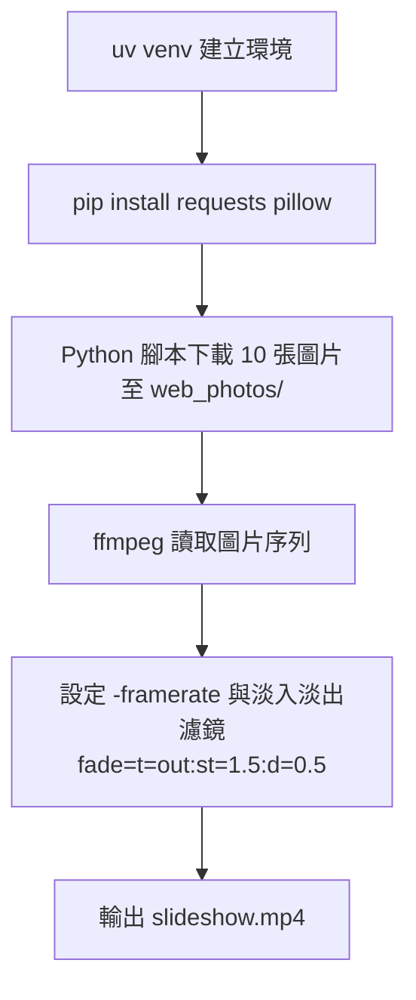
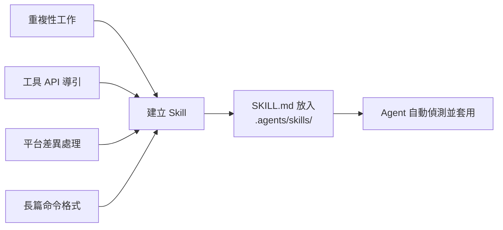

# Skills 撰寫與實戰範例

> **Skills** 是 Claude Code 的可重複使用指令模組。透過在專案中放置 `SKILL.md` 檔案，可以讓 Agent 學會特定的工具使用方式、命令格式或工作流程，無需每次重複說明。

---

## 參考資源

| 資源 | 連結 |
|------|------|
| 官方規格 | https://agentskills.io/specification |
| 社群範例集 | https://github.com/JimLiu/baoyu-skills |
| 影片工具包 | https://github.com/digitalsamba/claude-code-video-toolkit |

---

## Skill 目錄結構

```
skill-name/
├── SKILL.md          # 必要：元資料 + 指令說明
├── scripts/          # 可選：可執行的腳本
├── references/       # 可選：參考文件
├── assets/           # 可選：範本、資源檔
└── ...               # 任何其他目錄或檔案
```

### 安裝位置

```
# 全域 Skill（所有專案皆可使用）
~/.claude/skills/<skill-name>/SKILL.md

# 專案 Skill（僅限當前專案）
.agents/skills/<skill-name>/SKILL.md
```

### SKILL.md 基本格式

```markdown
---
name: skill-name
description: 一句話描述這個 Skill 的用途（Agent 透過此決定是否呼叫）
---

# Skill 名稱

詳細的使用說明、命令格式、注意事項...
```

> **description 欄位非常重要**：Agent 依此判斷何時應自動套用此 Skill，請寫得清晰具體。

---

## 範例一：抽籤 Skill（roll-dice）

**檔案路徑：** `.agents/skills/roll-dice/SKILL.md`

### 通用版本（跨平台）

```markdown
---
name: roll-dice
description: 使用隨機數字產生器擲骰子或抽籤。當被要求擲骰子（如 d6、d20 等）、從名單中隨機選人、或產生隨機結果時使用。
---

# Roll Dice（擲骰子 / 抽籤）

根據您的作業系統，請使用以下指令來產生隨機數字：

### Windows（PowerShell）
\```powershell
Get-Random -Minimum 1 -Maximum (<sides> + 1)
\```

### macOS
\```bash
jot -r 1 1 <sides>
\```

### Linux
\```bash
shuf -i 1-<sides> -n 1
\```

### 通用版本（Python）
如果安裝了 Python，可在任何系統執行：
\```bash
python3 -c "import random; print(random.randint(1, <sides>))"
\```

### 從名單中隨機選取
\```bash
python3 -c "import random; names = [<name_list>]; print(random.sample(names, <count>))"
\```

> [!NOTE]
> 請將 `<sides>` 替換為骰子面數（例如：全班 30 人抽籤則填入 30）。
> PowerShell 的 `-Maximum` 是不包含在內的（exclusive），抽 30 號上限需設為 31。
```

### Windows 專用版本

```markdown
---
name: roll-dice
description: 使用隨機數字產生器擲骰子。當被要求擲骰子（如 d6、d20 等）或產生隨機骰子點數時使用。
---

# Roll Dice（擲骰子）

若要擲骰子，請使用以下 Windows PowerShell 指令，它會產生一個從 1 到指定面數之間的隨機數字：

\```powershell
Get-Random -Minimum 1 -Maximum (<sides> + 1)
\```

請將 `<sides>` 替換為骰子的面數（例如：標準骰子為 6，d20 則為 20）。

例如，若要擲一個標準的 6 面骰，請執行：

\```powershell
Get-Random -Minimum 1 -Maximum 7
\```

> [!NOTE]
> 在 PowerShell 中，`-Maximum` 參數是不包含在內的（exclusive），因此若要得到 1 到 6 的結果，Maximum 必須設定為 7。
```

### 實際使用範例

**需求 1：全班抽班長**

```
我們班有 30 人，要選班長，來抽籤決定
```

Agent 執行過程：
```
Viewed SKILL.md:1-35
Ran command: python3 -c "import random; print(random.randint(1, 30))"
```

結果：
```
🎲 抽籤結果：13 號
恭喜 13 號同學成為班長！🎉
```

---

**需求 2：從名單中隨機抽出兩人**

```
抽籤 選出兩個 呂建篁 吳秋真 李超翊 陳婉之 譚聲全 杜宥蒨 蔡倚菱
```

Agent 執行過程：
```
Viewed SKILL.md:1-35
Ran command: python3 -c "import random; names = ['呂建篁', '吳秋真', '李超翊', '陳婉之', '譚聲全', '杜宥蒨', '蔡倚菱']; print(', '.join(random.sample(names, 2)))"
```

結果：
```
抽籤結果如下：
恭喜以下兩位被選中：
1. 吳秋真
2. 蔡倚菱
```

---

## 範例二：引導 Agent 使用外部 API（pokeapi）

這類 Skill 的核心概念是：**告訴 Agent API 的用途與端點格式，讓它知道何時應該呼叫**。

**檔案路徑：** `.agents/skills/pokeapi/SKILL.md`

```markdown
---
name: pokeapi
description: 查詢寶可夢（Pokémon）相關資訊，包含屬性、能力、身高體重、招式等。當用戶詢問任何寶可夢資料時使用。
---

# PokéAPI 使用指南

API 根網址：https://pokeapi.co/api/v2/

## 常用端點

| 查詢內容 | 端點格式 |
|----------|----------|
| 特定寶可夢資料 | `/pokemon/<name>` |
| 招式詳細資訊 | `/move/<name>` |
| 能力說明 | `/ability/<name>` |
| 進化鏈 | `/evolution-chain/<id>` |

## 使用方式

直接用 WebFetchTool 呼叫 API，例如：
- 查詢皮卡丘：`https://pokeapi.co/api/v2/pokemon/pikachu`
- 查詢雷丘：`https://pokeapi.co/api/v2/pokemon/raichu`

回應為 JSON 格式，重要欄位：
- `base_experience`：基礎經驗值
- `stats`：各項能力值（HP、攻擊、防禦等）
- `moves`：招式清單
- `height`、`weight`：身高、體重（單位分別為 dm、hg）
- `types`：屬性類型

> [!TIP]
> 所有名稱請使用英文小寫加連字號，例如 `mr-mime`、`ho-oh`。
```

### 實際使用範例

**查詢雷丘基礎經驗值：**
```
替我找找雷丘的基礎經驗值是多少？
```
→ Agent 呼叫 `https://pokeapi.co/api/v2/pokemon/raichu`，回傳：「雷丘的基礎經驗值是 **218**」

**查詢皮卡丘招式：**
```
皮卡丘會哪些招式（Moves）？請列出其中 3 個並附上招式效果
```
→ Agent 多次呼叫 API 取得招式詳細資訊，整理成表格回傳

---

## 範例三：影片處理 Skill（ffmpeg）

### 安裝

```bash
npx skills add https://github.com/digitalsamba/claude-code-video-toolkit --skill ffmpeg
```

### 能做什麼

#### 🎬 視覺效果類

| 功能 | 說明 |
|------|------|
| 縮時攝影（Timelapse） | 將大量照片合成為高畫質縮時影片 |
| 時光倒流（Reverse） | 將影片完全倒著播放 |
| 浮水印批量覆蓋 | 一次將 Logo 壓在所有影片的指定位置 |
| 畫中畫（PiP） | 將小影片疊加在主影片的角落 |
| 動態模糊 | 為快速移動的影片增加電影感動態模糊 |
| 影片防震修復 | 使用 `vidstab` 濾鏡穩定晃動畫面 |
| 綠幕去背（Chroma Key） | 將綠幕背景換成任意圖片或影片 |
| 九宮格監控牆 | 將 9 段影片拼成 3×3 大畫面 |

#### 🎵 音訊後製類

| 功能 | 說明 |
|------|------|
| 音訊波形視覺化 | 產生隨音樂跳動的動態波形影片 |
| 人聲增強 | 放大細微聲音、壓縮爆音 |
| 背景音樂混音 | 疊加背景音樂並自動調低音量 |
| 多語言音軌 | 為影片加入多條音軌（中/英/日等） |

#### 📱 格式轉換類

| 功能 | 說明 |
|------|------|
| 高畫質 GIF | 調色盤優化技術，色彩豐富流暢 |
| ASCII 藝術影片 | 將影片轉為文字符號風格 |
| 影片自動旋轉 | 修正手機拍攝的直式影片 |
| 臉部/車牌模糊 | 自動對特定區域打馬賽克 |

#### 🛠️ 工具與自動化類

| 功能 | 說明 |
|------|------|
| 每秒截圖 | 將長影片拆解成數百張圖片 |
| 元資料清理 | 刪除 GPS 位置、相機型號等隱私資訊 |
| 自動分段 | 按檔案大小（如每段 25MB）切割 |
| 燒錄字幕（Hardsub） | 將 .srt 字幕永久嵌入影片 |

### 實際使用範例

**Workspace Rule 設定（`.claude/CLAUDE.md`）：**
```
本系統已內建 `uv`，所有 Python 開發請先用 `uv` 建立 venv，並在該環境下操作。
```

**需求：下載圖片並製作投影片播放影片**

```
1. 請先用 uv 建立 venv，進行 Python 開發
2. 從網路隨機下載 10 張高品質圖片至本地資料夾 web_photos
3. 把 web_photos 製作成簡報播放影片，照片間隔 2 秒，轉場需有 0.5 秒淡出特效
```

Agent 執行流程：


對應 ffmpeg 命令參考：
```bash
ffmpeg -framerate 1/2 -pattern_type glob -i 'web_photos/*.jpg' \
  -vf "scale=1920:1080:force_original_aspect_ratio=decrease,pad=1920:1080:(ow-iw)/2:(oh-ih)/2,\
       fade=t=out:st=1.5:d=0.5" \
  -c:v libx264 -pix_fmt yuv420p slideshow.mp4
```

---

## 撰寫優質 Skill 的原則

### 1. Description 要精準

```markdown
# 差的寫法
description: 一個有用的工具

# 好的寫法
description: 查詢寶可夢資料（屬性、能力值、招式等）。當用戶詢問任何寶可夢相關問題時使用。
```

### 2. 跨平台指令要分開說明

若指令因 OS 不同而有差異，請分別列出 Windows / macOS / Linux 的版本。

### 3. 提供具體範例

Agent 最能理解「輸入 → 對應命令」的格式：

```markdown
## 範例

查詢 30 人班級中的一個號碼：
\```bash
python3 -c "import random; print(random.randint(1, 30))"
\```
```

### 4. 善用 NOTE / TIP

```markdown
> [!NOTE]
> PowerShell 的 -Maximum 是 exclusive，抽 30 號需設為 31

> [!TIP]
> 如果 python3 不可用，可改用 python（Windows 常見）
```

### 5. Skill 的適用時機



---

## 常見 Skill 類型整理

| 類型 | 說明 | 典型範例 |
|------|------|----------|
| **命令封裝** | 將複雜指令封裝為簡單呼叫 | roll-dice、ffmpeg 操作 |
| **API 導引** | 教 Agent 如何呼叫外部 API | pokeapi、GitHub API |
| **工作流程** | 定義多步驟的標準流程 | 測試→建置→部署 |
| **環境設定** | 告知專案的工具鏈與規範 | uv venv、Docker 使用規則 |
| **資料格式** | 說明輸入輸出的資料結構 | JSON 解析、CSV 處理 |

---

## 參考：在 CLAUDE.md 中啟用 Skills

在專案的 `CLAUDE.md` 加入：

```markdown
# Skills

本專案使用以下 Skills：
- `roll-dice`：抽籤與隨機選取
- `ffmpeg`：影片處理
- `pokeapi`：寶可夢資料查詢

Skills 位於 `.agents/skills/` 目錄下，Agent 會自動偵測並套用。
```
