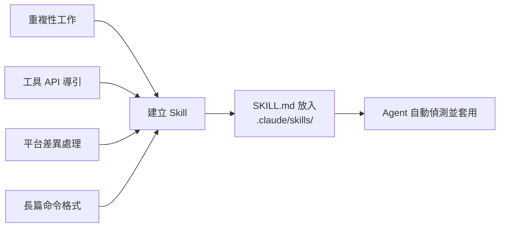

# Skills 撰寫與實戰範例：教 Claude 學會新把戲

恭喜你！你已經學會了如何讓 Claude Code 幫你寫出漂亮的 React 專案。但你有沒有想過，有些任務是 Claude 原本「不會」或「不敢做」的？

例如：
- **一鍵部署**：讓它輸入 `/deploy` 就自動跑完所有部署流程。
- **規則校對**：讓它自動檢查你的專案命名是否符合特定的技術規範。
- **專屬工具**：讓它學會如何操作你公司內部的特殊 CLI 工具。

這就是 **Skills** 存在的意義。它是 Claude Code 的「插件系統」。透過在專案中建立簡單的 Markdown 檔案（`SKILL.md`），你就能賦予 Claude **自定義的 Slash 命令**（例如 `/check-api`），讓它學會特定的工具使用方式或工作流程，無需每次重複說明。

---

## 參考資源

| 資源 | 連結 |
|------|------|
| 官方規格 | https://agentskills.io/specification |
| 社群範例集 | https://github.com/JimLiu/baoyu-skills |
| 影片工具包 | https://github.com/digitalsamba/claude-code-video-toolkit |

---

## Skill 目錄結構

```
skill-name/
├── SKILL.md          # 必要：元資料 + 指令說明
├── scripts/          # 可選：可執行的腳本
├── references/       # 可選：參考文件
├── assets/           # 可選：範本、資源檔
└── ...               # 任何其他目錄或檔案
```

### 安裝位置

```text
# 全域 Skill（所有專案皆可使用）
~/.claude/skills/<skill-name>/SKILL.md

# 專案 Skill（僅限當前專案）
.claude/skills/<skill-name>/SKILL.md     # Claude Code 預設
# 或 .agents/skills/<skill-name>/SKILL.md # 相容寫法
```

### SKILL.md 基本格式與重要欄位

```markdown
---
name: skill-name
description: 一句話描述這個 Skill 的用途（Agent 透過此決定是否呼叫）
# 其他進階欄位...
---

# Skill 名稱

詳細的使用說明、命令格式、注意事項...
```

**重要的 Frontmatter 欄位清單：**

| 欄位 | 說明 |
|------|------|
| `name` | Slash 命令名稱（小寫、連字號，例如 `/fix-issue`） |
| `description` | 讓 Claude 知道何時自動使用此 Skill。這欄非常重要，請寫得清晰具體。 |
| `disable-model-invocation`| 設為 `true` 可防止 Claude 自動觸發（適合 `/deploy` 等破壞性操作，僅限手動呼叫） |
| `arguments` | 具名參數陣列，例如 `[issue, branch]`，在內文中可用 `$issue` 取值 |
| `allowed-tools` | 預先授權的工具，例如 `Bash(git *) Read`，執行時就不會反覆詢問權限 |
| `context` | 設為 `fork` 可在隔離的子 agent 中執行 |
| `user-invocable` | 設為 `false` 可隱藏在 `/` 選單中 |

---

## 範例一：抽籤 Skill（roll-dice）

**檔案路徑：** `.claude/skills/roll-dice/SKILL.md`

### 通用版本（跨平台）

```markdown
---
name: roll-dice
description: 使用隨機數字產生器擲骰子或抽籤。當被要求擲骰子（如 d6、d20 等）、從名單中隨機選人、或產生隨機結果時使用。
---

# Roll Dice（擲骰子 / 抽籤）

根據您的作業系統，請使用以下指令來產生隨機數字：

### Windows（PowerShell）
\```powershell
Get-Random -Minimum 1 -Maximum (<sides> + 1)
\```

### macOS
\```bash
jot -r 1 1 <sides>
\```

### Linux
\```bash
shuf -i 1-<sides> -n 1
\```

### 通用版本（Python）
如果安裝了 Python，可在任何系統執行：
\```bash
python3 -c "import random; print(random.randint(1, <sides>))"
\```

### 從名單中隨機選取
\```bash
python3 -c "import random; names = [<name_list>]; print(random.sample(names, <count>))"
\```

> [!NOTE]
> 請將 `<sides>` 替換為骰子面數（例如：全班 30 人抽籤則填入 30）。
> PowerShell 的 `-Maximum` 是不包含在內的（exclusive），抽 30 號上限需設為 31。
```

### Windows 專用版本

```markdown
---
name: roll-dice
description: 使用隨機數字產生器擲骰子。當被要求擲骰子（如 d6、d20 等）或產生隨機骰子點數時使用。
---

# Roll Dice（擲骰子）

若要擲骰子，請使用以下 Windows PowerShell 指令，它會產生一個從 1 到指定面數之間的隨機數字：

\```powershell
Get-Random -Minimum 1 -Maximum (<sides> + 1)
\```

請將 `<sides>` 替換為骰子的面數（例如：標準骰子為 6，d20 則為 20）。

例如，若要擲一個標準的 6 面骰，請執行：

\```powershell
Get-Random -Minimum 1 -Maximum 7
\```

> [!NOTE]
> 在 PowerShell 中，`-Maximum` 參數是不包含在內的（exclusive），因此若要得到 1 到 6 的結果，Maximum 必須設定為 7。
```

### 實際使用範例

**需求 1：全班抽班長**

```
我們班有 30 人，要選班長，來抽籤決定
```

Agent 執行過程：
```
Viewed SKILL.md:1-35
Ran command: python3 -c "import random; print(random.randint(1, 30))"
```

結果：
```
🎲 抽籤結果：13 號
恭喜 13 號同學成為班長！🎉
```

---

**需求 2：從名單中隨機抽出兩人**

```
抽籤 選出兩個 呂建篁 吳秋真 李超翊 陳婉之 譚聲全 杜宥蒨 蔡倚菱
```

Agent 執行過程：
```
Viewed SKILL.md:1-35
Ran command: python3 -c "import random; names = ['呂建篁', '吳秋真', '李超翊', '陳婉之', '譚聲全', '杜宥蒨', '蔡倚菱']; print(', '.join(random.sample(names, 2)))"
```

結果：
```
抽籤結果如下：
恭喜以下兩位被選中：
1. 吳秋真
2. 蔡倚菱
```

---

## 範例二：引導 Agent 使用外部 API（pokeapi）

這類 Skill 的核心概念是：**告訴 Agent API 的用途與端點格式，讓它知道何時應該呼叫**。

**檔案路徑：** `.claude/skills/pokeapi/SKILL.md`

```markdown
---
name: pokeapi
description: 查詢寶可夢（Pokémon）相關資訊，包含屬性、能力、身高體重、招式等。當用戶詢問任何寶可夢資料時使用。
---

# PokéAPI 使用指南

API 根網址：https://pokeapi.co/api/v2/

## 常用端點

| 查詢內容 | 端點格式 |
|----------|----------|
| 特定寶可夢資料 | `/pokemon/<name>` |
| 招式詳細資訊 | `/move/<name>` |
| 能力說明 | `/ability/<name>` |
| 進化鏈 | `/evolution-chain/<id>` |

## 使用方式

直接用 WebFetchTool 呼叫 API，例如：
- 查詢皮卡丘：`https://pokeapi.co/api/v2/pokemon/pikachu`
- 查詢雷丘：`https://pokeapi.co/api/v2/pokemon/raichu`

回應為 JSON 格式，重要欄位：
- `base_experience`：基礎經驗值
- `stats`：各項能力值（HP、攻擊、防禦等）
- `moves`：招式清單
- `height`、`weight`：身高、體重（單位分別為 dm、hg）
- `types`：屬性類型

> [!TIP]
> 所有名稱請使用英文小寫加連字號，例如 `mr-mime`、`ho-oh`。
```

### 實際使用範例

**查詢雷丘基礎經驗值：**
```
替我找找雷丘的基礎經驗值是多少？
```
→ Agent 呼叫 `https://pokeapi.co/api/v2/pokemon/raichu`，回傳：「雷丘的基礎經驗值是 **218**」

**查詢皮卡丘招式：**
```
皮卡丘會哪些招式（Moves）？請列出其中 3 個並附上招式效果
```
→ Agent 多次呼叫 API 取得招式詳細資訊，整理成表格回傳

---

## 範例三：指令封裝（ffmpeg）

這類 Skill 的核心概念是：將複雜的終端機指令（如 `ffmpeg` 長串參數）封裝起來，讓 Agent 只要理解使用者的意圖，就能自動寫出正確的指令。

**安裝方式：**

```bash
npx skills add https://github.com/digitalsamba/claude-code-video-toolkit --skill ffmpeg
```

**適用情境：**
只要是終端使用者記不住、寫不好的長串指令（例如影片轉檔、壓浮水印、製作縮時攝影、燒錄字幕），都可以寫成這類 Skill 來輔助 Agent。

> [!TIP]
> 關於這項工具如何進行自動化影音後製的完整案例與指令清單，請參考進階實戰篇：
> 👉 **[`a06_專案實戰_影片自動化處理與特效_FFmpeg_Skill.md`](./a06_專案實戰_影片自動化處理與特效_FFmpeg_Skill.md)**

---

## 範例四：複雜工作流與範本應用（guizang-ppt-skill）

當 Skill 的任務不僅僅是執行單一指令，而是要產出整份專案或文件時，我們可以利用 `assets/` 與 `references/` 目錄來提供範本與查核清單。

**核心概念**：Agent 不用從零開始寫程式碼，而是**複製範本 → 讀取參考規範 → 填充內容 → 進行自我檢查**。

### 目錄結構運用

```text
guizang-ppt-skill/
├── SKILL.md              # 定義 6 步工作流與互動問答
├── assets/
│   └── template.html     # 完整可運行的網頁簡報範本（含 CSS / WebGL）
└── references/
    ├── layouts.md        # 提供 10 種版面 HTML 骨架供 Agent 挑選
    └── checklist.md      # P0~P3 的自我檢查清單（如：是否擅加未定義的 CSS）
```

### 實際使用範例與工作流

當使用者觸發 `幫我做一份雜誌風 PPT` 時，Agent 會根據 `SKILL.md` 的指示，展開結構化的工作流：

1. **需求澄清**：Agent 主動提問（受眾、時長、素材、主題色）。
2. **拷貝範本**：Agent 將 `assets/template.html` 複製到專案目錄。
3. **填充內容**：Agent 參考 `references/layouts.md`，挑選適合的版面骨架並填入文案。
4. **品質自檢**：Agent 打開 `references/checklist.md`，自行核對產出的程式碼是否符合 P0 級別的要求（例如：有沒有破壞響應式設計）。

> [!TIP]
> 這種設計模式大幅降低了 Agent 產生幻覺（Hallucination）的機率，因為它是在「受控的框架」與「標準作業程序（SOP）」下進行填空與修改。
> 
> 👉 **完整的實戰演練與教學，請參考系列文章：[`a05_專案實戰_使用Guizang_PPT_Skill製作雜誌風簡報.md`](./a05_專案實戰_使用Guizang_PPT_Skill製作雜誌風簡報.md)**

---

## 範例五：API 規範與帶參數的系統操作

透過進階的 Frontmatter 欄位，我們可以建立更強大、自動化的工作流。

### 1. 簡單規範 Skill（強制 API 慣例）

**檔案路徑：** `.claude/skills/api-conventions/SKILL.md`

```markdown
---
name: api-conventions
description: API 設計規範，當撰寫 API 端點時使用
---

1. 使用 RESTful 命名（GET /users, POST /users/:id/comments）
2. 統一錯誤格式：status、message、details
3. 所有輸入必須驗證，回傳 400 附帶欄位錯誤
```

### 2. 帶參數與授權工具的 Skill

這個範例展示了如何使用 `arguments` 傳遞變數，並透過 `allowed-tools` 預先授權 `gh` (GitHub CLI) 指令，讓 Agent 修復 Issue 時暢通無阻。

**檔案路徑：** `.claude/skills/fix-issue/SKILL.md`

```markdown
---
name: fix-issue
description: 依 issue 編號修復 GitHub issue
disable-model-invocation: true
arguments: [issue_number]
allowed-tools: Bash(gh *) Read Grep
---

修復 GitHub issue #$issue_number：
1. 執行 `gh issue view $issue_number`
2. 找到相關程式碼
3. 實作修復並寫測試
```

**呼叫方式：** 
由於設定了 `disable-model-invocation: true`，使用者需要手動呼叫，例如在提示字元輸入：
`/fix-issue 123`

---

## 撰寫優質 Skill 的原則

### 1. Description 要精準

```markdown
# 差的寫法
description: 一個有用的工具

# 好的寫法
description: 查詢寶可夢資料（屬性、能力值、招式等）。當用戶詢問任何寶可夢相關問題時使用。
```

### 2. 跨平台指令要分開說明

若指令因 OS 不同而有差異，請分別列出 Windows / macOS / Linux 的版本。

### 3. 提供具體範例

Agent 最能理解「輸入 → 對應命令」的格式：

```markdown
## 範例

查詢 30 人班級中的一個號碼：
\```bash
python3 -c "import random; print(random.randint(1, 30))"
\```
```

### 4. 善用 NOTE / TIP

```markdown
> [!NOTE]
> PowerShell 的 -Maximum 是 exclusive，抽 30 號需設為 31

> [!TIP]
> 如果 python3 不可用，可改用 python（Windows 常見）
```

### 5. Skill 的適用時機



---

## 常見 Skill 類型整理

| 類型 | 說明 | 典型範例 |
|------|------|----------|
| **命令封裝** | 將複雜指令封裝為簡單呼叫 | roll-dice、ffmpeg 操作 |
| **API 導引** | 教 Agent 如何呼叫外部 API | pokeapi、GitHub API |
| **工作流程** | 定義多步驟的標準流程 | 測試→建置→部署、guizang-ppt-skill |
| **環境設定** | 告知專案的工具鏈與規範 | uv venv、Docker 使用規則 |
| **資料格式** | 說明輸入輸出的資料結構 | JSON 解析、CSV 處理 |
| **模板生成** | 透過種子範本與規範生成複雜專案 | guizang-ppt-skill |

---

## 參考：在 CLAUDE.md 中啟用 Skills

在專案的 `CLAUDE.md` 加入：

```markdown
# Skills

本專案使用以下 Skills：
- `roll-dice`：抽籤與隨機選取
- `ffmpeg`：影片處理
- `pokeapi`：寶可夢資料查詢

Skills 位於 `.claude/skills/` 目錄下，Agent 會自動偵測並套用。
```
