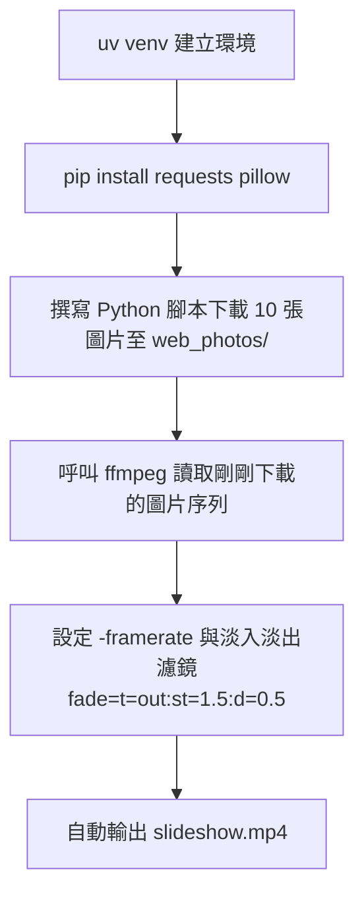

# 專案實戰：使用 FFmpeg Skill 打造影片自動化處理工作站

## 1. 課程簡介與學習目標

在日常工作與社群經營中，我們經常遇到需要大量處理影片或圖片的需求（例如：壓浮水印、轉成 GIF、擷取畫面）。透過 **FFmpeg Skill**，我們可以賦予 Agent 直接處理各種多媒體檔案的能力。

本堂課將帶領大家學習如何透過 Claude Code，利用對話的方式指揮 Agent 幫我們全自動完成這些繁瑣的影音後製工作。

### 學習目標：
*   了解如何安裝 `ffmpeg` 這個強大的影音處理工具包。
*   認識 FFmpeg Skill 能做到的四大類核心功能。
*   掌握引導 Agent 自動寫腳本、下載素材並結合 FFmpeg 進行混合式任務的技巧。

---

## 2. 準備與安裝

FFmpeg 是一個命令列工具，透過安裝對應的 Skill，我們能讓 Agent 理解該如何撰寫複雜的參數來完成任務。

### 安裝方式
請在你的命令列或 Claude Code 環境中執行以下指令：

```bash
npx skills add https://github.com/digitalsamba/claude-code-video-toolkit --skill ffmpeg
```

> [!NOTE]
> 在執行 Agent 任務前，請確保您的本機電腦（Windows/macOS/Linux）已經安裝了核心的 `ffmpeg` 執行檔，且已加入環境變數中。

---

## 3. FFmpeg Skill 的強大能力清單

安裝完成後，只要您的需求涉及以下範疇，Agent 就能自動規劃出對應的處理指令：

### 🎬 視覺效果類
| 功能 | 說明 |
|------|------|
| 縮時攝影（Timelapse） | 將大量照片合成為高畫質縮時影片 |
| 時光倒流（Reverse） | 將影片完全倒著播放 |
| 浮水印批量覆蓋 | 一次將 Logo 壓在所有影片的指定位置 |
| 畫中畫（PiP） | 將小影片疊加在主影片的角落 |
| 動態模糊 | 為快速移動的影片增加電影感動態模糊 |
| 綠幕去背（Chroma Key） | 將綠幕背景換成任意圖片或影片 |
| 九宮格監控牆 | 將 9 段影片拼成 3×3 大畫面 |

### 🎵 音訊後製類
| 功能 | 說明 |
|------|------|
| 音訊波形視覺化 | 產生隨音樂跳動的動態波形影片 |
| 人聲增強 | 放大細微聲音、壓縮爆音 |
| 背景音樂混音 | 疊加背景音樂並自動調低音量 |
| 多語言音軌 | 為影片加入多條音軌（中/英/日等） |

### 📱 格式轉換與編輯類
| 功能 | 說明 |
|------|------|
| 高畫質 GIF | 透過調色盤優化技術，製作色彩豐富的 GIF |
| 影片自動旋轉 | 修正手機拍攝的直式影片 |
| 自動分段 | 按檔案大小（如每段 25MB）切割影片 |
| 燒錄字幕（Hardsub） | 將 .srt 字幕永久嵌入影片 |
| 每秒截圖 | 將長影片拆解成數百張圖片 |

---

## 4. 實戰演練：全自動圖文簡報影片生成

在這項任務中，我們不只是單純下指令，而是讓 Agent **結合 Python 與 FFmpeg**，一條龍完成整個工作流。

**💬 我們的提示詞（Prompt）需求：**
> 1. 請先用 uv 建立 venv，進行 Python 開發
> 2. 從網路隨機下載 10 張高品質圖片至本地資料夾 `web_photos`
> 3. 把 `web_photos` 的圖片製作成簡報播放影片，每張照片間隔 2 秒，轉場需有 0.5 秒淡出特效

### Agent 的執行思維流程：

Agent 接收到需求後，會自動規劃以下步驟（並自行撰寫與執行所有程式碼）：



### 底層運作邏輯解析
對於想了解技術細節的同學，Agent 最終產生的 `ffmpeg` 核心指令如下：

```bash
ffmpeg -framerate 1/2 -pattern_type glob -i 'web_photos/*.jpg' \
  -vf "scale=1920:1080:force_original_aspect_ratio=decrease,pad=1920:1080:(ow-iw)/2:(oh-ih)/2,\
       fade=t=out:st=1.5:d=0.5" \
  -c:v libx264 -pix_fmt yuv420p slideshow.mp4
```
*   `-framerate 1/2`：確保每張照片顯示 2 秒。
*   `scale & pad`：自動補黑邊，確保不同尺寸的照片都能完美適應 1920x1080 的比例。
*   `fade`：處理畫面切換時的淡出特效。

---

## 5. 課後作業

請利用剛學會的技巧，給 Agent 下達以下指令：
1. 請 Agent 找一段任意的免版稅短影片（或使用您自己的影片）。
2. 請 Agent 將影片的**前 5 秒鐘**轉換為 **高品質的 GIF 動畫**（提示它使用調色盤技術確保畫質）。
3. 確認輸出的 GIF 是否正常播放。
